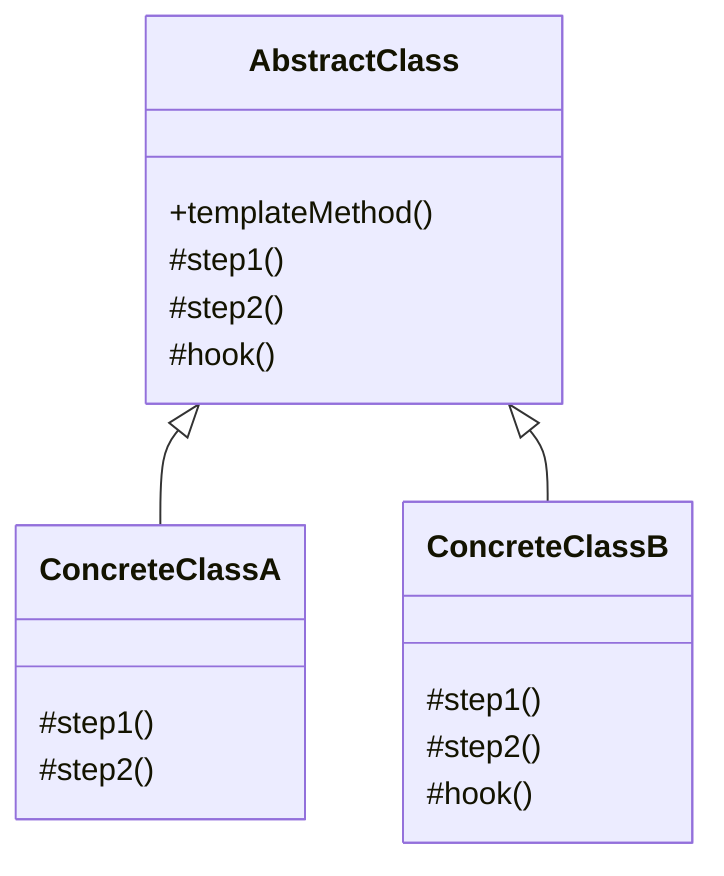
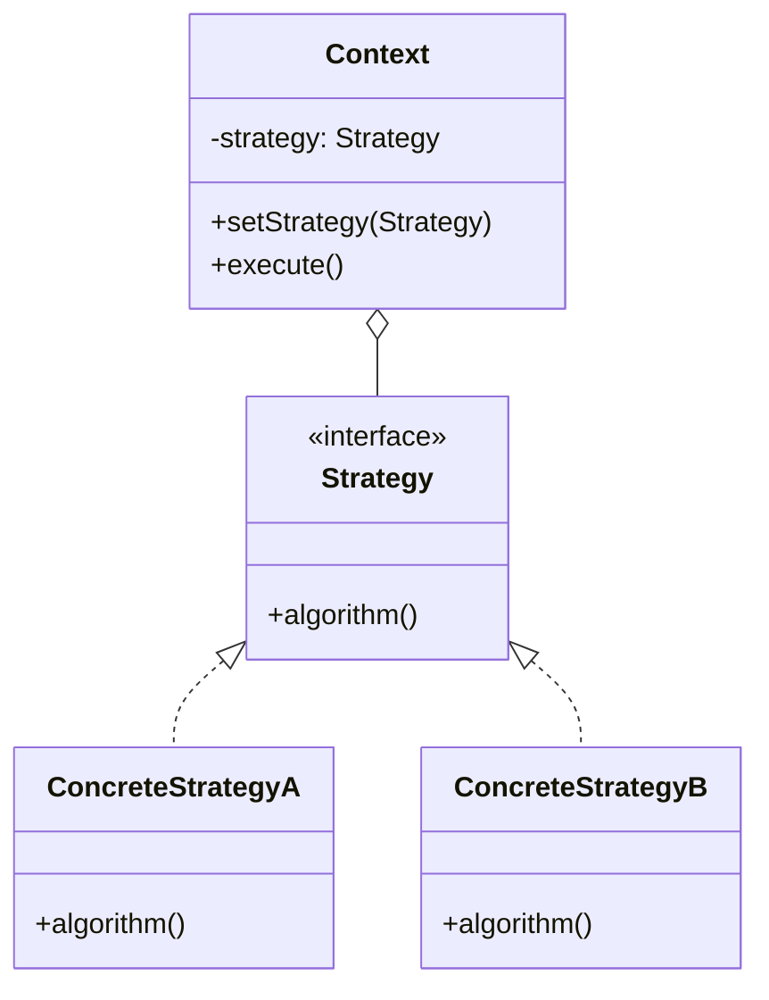
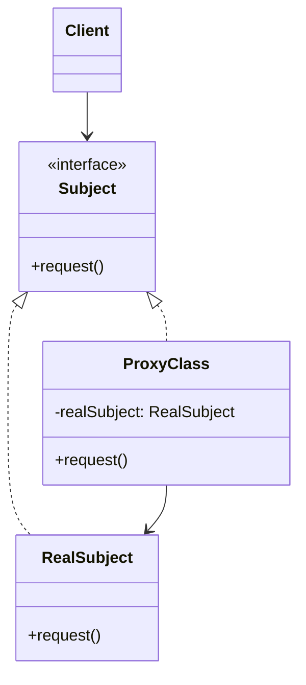
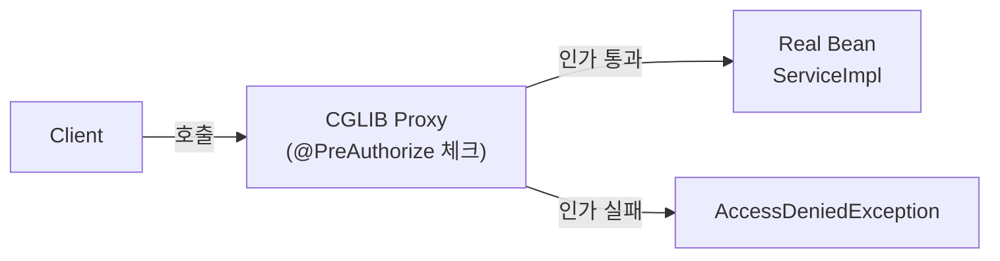
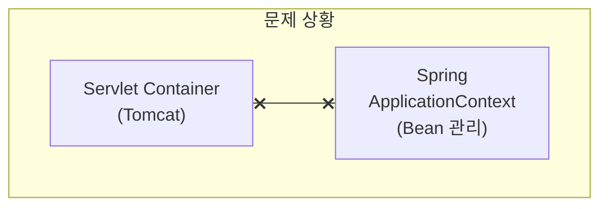
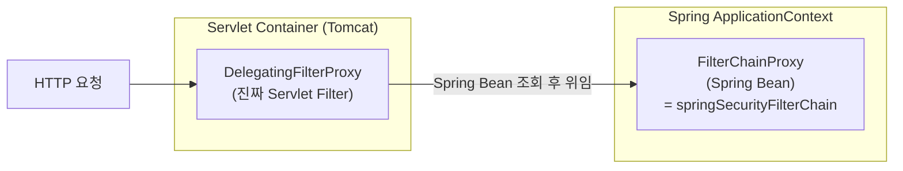
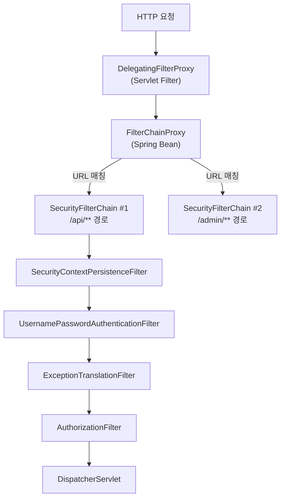
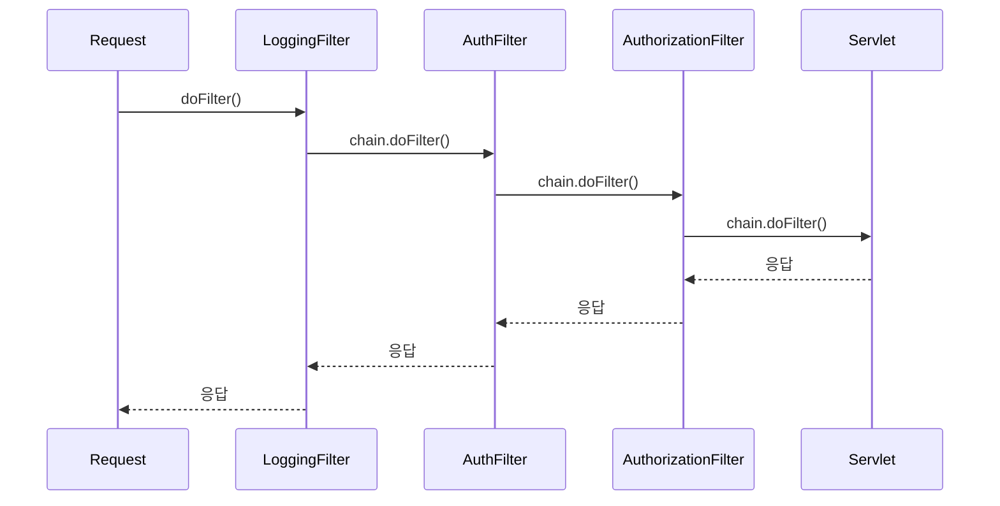

# WEEK 0: Spring Security를 이해하기 위한 Java 디자인 패턴

> **호환 버전**: Java 17+, Spring Boot 3.2.x, Spring Security 6.2.x ~ 7.0.x
>
> **대상 독자**: 서버 개발 경험이 있으나 Spring Security는 처음인 분, Authorization Code 흐름을 알지만 프레임워크 내부가 낯선 분

### 학습 목표

- Template Method, Strategy, Template Callback, Proxy 패턴의 의도와 구조를 이해한다.
- 각 디자인 패턴이 Spring Security 내부에서 어떤 클래스/인터페이스에 녹아 있는지 연결할 수 있다.
- Servlet Filter와 `DelegatingFilterProxy` 구조를 Proxy 패턴 관점에서 설명할 수 있다.
- Chain of Responsibility, Decorator, Observer 패턴이 필터 체인 동작에 어떻게 기여하는지 이해한다.

---

Spring Security는 단순한 라이브러리가 아니다. 수십 개의 클래스가 정교하게 얽혀 있는 프레임워크다. 코드를 처음 마주했을 때 "왜 이렇게 설계되었는가?"라는 질문에 답하지 못하면 설정 한 줄이 어떤 영향을 미치는지 추론하기 어렵다.

이 주차는 Spring Security 본 수업(WEEK 1~6)을 듣기 전에, 설계 언어를 익히는 시간이다. 디자인 패턴은 개발자들이 반복적으로 마주치는 문제를 해결하는 검증된 설계 방식이다. 이 문서에서 다루는 패턴들은 Spring Security 곳곳에 직접 적용되어 있다.

---

### 1. Template Method Pattern

#### 1.1 패턴 의도

알고리즘의 **골격(뼈대)** 을 부모 클래스(abstract class)에 정의하고, 알고리즘의 **구체적인 단계**는 자식 클래스가 구현하도록 위임한다. 전체 흐름은 부모가 제어하고, 세부 구현만 자식이 채운다.

> **핵심 질문**: "처리 순서는 고정하되, 각 단계의 구체적인 내용은 자식이 결정하게 하려면?"

#### 1.2 구조



- `templateMethod()` : `final`로 선언하여 자식이 순서를 바꾸지 못하게 한다
- `step1()`, `step2()` : `abstract` 또는 `protected`로 자식에게 구현을 맡긴다
- `hook()` : 기본 구현이 있지만 자식이 선택적으로 오버라이드할 수 있는 훅(hook) 메서드

#### 1.3 Java 예시

```java
public abstract class DataProcessor {

    // 템플릿 메서드 — 알고리즘 골격 고정
    public final void process() {
        readData();
        processData();
        writeData();
    }

    protected abstract void readData();
    protected abstract void processData();

    // hook — 기본 구현 제공, 자식이 오버라이드 가능
    protected void writeData() {
        System.out.println("기본 출력");
    }
}

public class CsvProcessor extends DataProcessor {
    @Override
    protected void readData() { System.out.println("CSV 읽기"); }
    @Override
    protected void processData() { System.out.println("CSV 파싱"); }
}
```

#### 1.4 Spring Security 연결

**`OncePerRequestFilter`** 가 대표적인 Template Method 패턴 적용 사례다.

```java
// Spring Framework 소스 (단순화)
public abstract class OncePerRequestFilter extends GenericFilterBean {

    // 템플릿 메서드 — 한 요청에 한 번만 실행되도록 뼈대 고정
    @Override
    public final void doFilter(ServletRequest request, ServletResponse response, FilterChain chain) {
        String alreadyFilteredAttributeName = getAlreadyFilteredAttributeName();
        if (request.getAttribute(alreadyFilteredAttributeName) != null) {
            chain.doFilter(request, response); // 이미 실행됨 → 건너뜀
        } else {
            request.setAttribute(alreadyFilteredAttributeName, Boolean.TRUE);
            doFilterInternal((HttpServletRequest) request, (HttpServletResponse) response, chain); // 자식 구현 호출
        }
    }

    // 자식 클래스가 구현해야 하는 추상 메서드
    protected abstract void doFilterInternal(HttpServletRequest request,
                                              HttpServletResponse response,
                                              FilterChain filterChain) throws ServletException, IOException;
}
```

WEEK 4에서 직접 만들 `JwtAuthenticationFilter`가 바로 `OncePerRequestFilter`를 상속해 `doFilterInternal`만 구현하는 방식이다.

> **초보자 Tip**: `doFilter`는 건드리지 말고 `doFilterInternal`만 구현하면 되는 이유가 바로 Template Method 패턴 덕분입니다. 부모가 "한 번만 실행" 로직을 이미 처리해주기 때문입니다.

---

### 2. Strategy Pattern

#### 2.1 패턴 의도

동일한 역할을 하는 알고리즘군을 **인터페이스로 캡슐화**하고, 클라이언트가 런타임에 원하는 알고리즘을 **교체**할 수 있도록 한다.

> **핵심 질문**: "알고리즘을 if-else 없이 교체하려면?"

#### 2.2 구조



Template Method와의 차이:

| | Template Method | Strategy |
|---|---|---|
| 확장 방식 | 상속 (subclass) | 합성 (composition) |
| 교체 시점 | 컴파일 타임 | 런타임 |
| 코드 관계 | IS-A | HAS-A |

#### 2.3 Java 예시

```java
// 전략 인터페이스
public interface SortStrategy {
    void sort(int[] data);
}

// 구체 전략
public class BubbleSort implements SortStrategy {
    @Override
    public void sort(int[] data) { /* 버블 정렬 */ }
}

public class QuickSort implements SortStrategy {
    @Override
    public void sort(int[] data) { /* 퀵 정렬 */ }
}

// 컨텍스트 — 전략을 주입받아 사용
public class Sorter {
    private SortStrategy strategy;

    public Sorter(SortStrategy strategy) {
        this.strategy = strategy;
    }

    public void sort(int[] data) {
        strategy.sort(data); // 전략에 위임
    }
}
```

#### 2.4 Spring Security 연결

Spring Security의 핵심 확장 지점 대부분이 Strategy 패턴이다.

| 인터페이스 (전략) | 역할 | 기본 구현체 |
|---|---|---|
| `AuthenticationProvider` | 인증 방식 (DB, LDAP, OAuth 등) | `DaoAuthenticationProvider` |
| `PasswordEncoder` | 비밀번호 해싱 알고리즘 | `BCryptPasswordEncoder` |
| `UserDetailsService` | 사용자 조회 방법 | 직접 구현 |
| `AccessDecisionManager` | 인가(권한 결정) 방식 | `AffirmativeBased` |

```java
// Spring Security가 AuthenticationManager에 전략을 주입하는 방식
@Bean
public AuthenticationManager authenticationManager(AuthenticationConfiguration config) throws Exception {
    return config.getAuthenticationManager();
}

// PasswordEncoder 전략을 Bean으로 등록 → 런타임에 교체 가능
@Bean
public PasswordEncoder passwordEncoder() {
    return new BCryptPasswordEncoder(); // SHA256으로 교체해도 코드 변경 없음
}
```

> **전문가 Tip**: `AuthenticationProvider`를 직접 구현하면 LDAP, 생체인증, 2FA 등 어떤 인증 방식도 Spring Security에 연결할 수 있습니다. WEEK 2에서 직접 구현해봅니다.

---

### 3. Template Callback Pattern

#### 3.1 패턴 의도

Template Method의 변형으로, 자식 클래스를 만드는 대신 **콜백(Callback)** 을 인자로 전달해서 알고리즘의 특정 단계를 채운다. Java 8 이후에는 람다 표현식이나 익명 클래스가 콜백 역할을 한다.

> **핵심 질문**: "상속 없이 Template Method의 유연함을 얻으려면?"

#### 3.2 Strategy vs Template Callback

Strategy 패턴은 여러 알고리즘을 클래스로 만들어 재사용하는 데 초점을 맞춘다. Template Callback은 **단발성 행위**를 람다/익명 클래스로 인라인 전달하는 데 초점을 맞춘다.

```java
// Strategy 패턴 — 클래스로 분리
SortStrategy quickSort = new QuickSort();
sorter.setStrategy(quickSort);

// Template Callback 패턴 — 람다로 인라인
sorter.sort(data, arr -> Arrays.sort(arr)); // 콜백을 그 자리에서 정의
```

#### 3.3 Spring의 xxxTemplate

Spring은 Template Callback 패턴을 광범위하게 사용한다.

```java
// JdbcTemplate — 쿼리 실행 골격은 JdbcTemplate이 관리
// 개발자는 SQL 매핑 콜백만 제공
List<User> users = jdbcTemplate.query(
    "SELECT * FROM users",
    (rs, rowNum) -> new User(rs.getLong("id"), rs.getString("name")) // 콜백 (RowMapper)
);

// TransactionTemplate
transactionTemplate.execute(status -> {
    userRepository.save(user); // 콜백 안에서 비즈니스 로직
    return null;
});
```

#### 3.4 Spring Security DSL 연결

Spring Security 6.x의 `SecurityFilterChain` 설정 방식이 바로 Template Callback 패턴이다.

```java
@Bean
public SecurityFilterChain filterChain(HttpSecurity http) throws Exception {
    http
        .csrf(csrf -> csrf.disable())                    // CsrfConfigurer 콜백
        .sessionManagement(session ->                     // SessionManagementConfigurer 콜백
            session.sessionCreationPolicy(SessionCreationPolicy.STATELESS)
        )
        .authorizeHttpRequests(auth ->                    // AuthorizeHttpRequestsConfigurer 콜백
            auth.requestMatchers("/public/**").permitAll()
               .anyRequest().authenticated()
        )
        .httpBasic(Customizer.withDefaults());            // 기본값 콜백
    return http.build();
}
```

각 `.csrf(...)`, `.sessionManagement(...)` 등은 `Customizer<T>` 함수형 인터페이스를 받는다. Spring Security가 각 설정 영역(Configurer)의 초기화 골격을 관리하고, 개발자는 콜백만 제공한다.

> **초보자 Tip**: Spring Security 5.x까지는 `.csrf().disable().and().sessionManagement()...` 처럼 메서드 체이닝 방식이었습니다. 6.x부터 람다 콜백 방식으로 변경되었으며, 5.x 방식은 deprecated입니다.

---

### 4. Proxy Pattern

#### 4.1 패턴 의도

실제 객체(Real Subject)와 **동일한 인터페이스**를 구현한 Proxy 객체가 클라이언트와 Real Subject 사이에 위치해, 클라이언트는 Proxy를 통해서만 Real Subject에 접근한다. Proxy는 접근 제어, 로깅, 지연 초기화, 트랜잭션 등 **부가 기능**을 투명하게 삽입한다.

> **핵심 질문**: "클라이언트 코드를 변경하지 않고 부가 기능을 삽입하려면?"

#### 4.2 구조



#### 4.3 Static Proxy vs Dynamic Proxy

| 구분 | Static Proxy | Dynamic Proxy |
|---|---|---|
| 생성 시점 | 컴파일 타임 | 런타임 |
| 방식 | 직접 클래스 작성 | JDK Proxy (인터페이스 기반) / CGLIB (클래스 기반) |
| 장점 | 명확, 단순 | 코드 중복 없음 |
| 단점 | 메서드 추가 시 Proxy도 수정 필요 | 디버깅 어려움 |
| Spring 사용 | - | Spring AOP, `@Transactional` |

```java
// Static Proxy 예시
public interface UserService {
    User findById(Long id);
}

public class UserServiceImpl implements UserService {
    @Override
    public User findById(Long id) {
        return db.query(id); // 실제 구현
    }
}

public class UserServiceLoggingProxy implements UserService {
    private final UserService target; // Real Subject

    public UserServiceLoggingProxy(UserService target) {
        this.target = target;
    }

    @Override
    public User findById(Long id) {
        System.out.println("[LOG] findById 호출: " + id); // 부가 기능
        User result = target.findById(id);               // 위임
        System.out.println("[LOG] 결과: " + result);
        return result;
    }
}
```

#### 4.4 JDK Dynamic Proxy

인터페이스가 있어야 하며 `java.lang.reflect.Proxy`가 런타임에 Proxy 클래스를 생성한다.

```java
UserService proxy = (UserService) Proxy.newProxyInstance(
    UserServiceImpl.class.getClassLoader(),
    new Class[]{UserService.class},
    (proxyObj, method, args) -> {
        System.out.println("[LOG] " + method.getName() + " 호출");
        return method.invoke(new UserServiceImpl(), args); // Real Subject에 위임
    }
);
```

#### 4.5 Spring Security 연결

Spring Security의 가장 핵심적인 Proxy 구조는 다음 절(5번)에서 다루고, AOP 관점에서는 `@PreAuthorize`, `@PostAuthorize` 어노테이션이 CGLIB Proxy를 통해 동작한다.



> **주의**: Spring Boot는 기본적으로 인터페이스 유무와 관계없이 CGLIB Proxy를 사용합니다(`spring.aop.proxy-target-class=true` 기본값). JDK Proxy를 사용하려면 이 설정을 `false`로 변경하고 인터페이스가 반드시 있어야 합니다.

---

### 5. Proxy 패턴으로 보는 Servlet Filter와 Spring Security 연결

이 섹션이 WEEK 0의 핵심이다. Spring Security가 Servlet Container와 어떻게 통합되는지, 그 구조 전체가 Proxy 패턴의 연속이다.

#### 5.1 Servlet Filter 기초

Servlet Filter는 `javax.servlet.Filter` (Jakarta EE는 `jakarta.servlet.Filter`) 인터페이스를 구현하며, HTTP 요청이 Servlet에 도달하기 전/후에 실행된다.

```java
public interface Filter {
    void doFilter(ServletRequest request, ServletResponse response, FilterChain chain)
        throws IOException, ServletException;
}
```

```java
// 직접 구현한 간단한 로깅 필터
public class LoggingFilter implements Filter {
    @Override
    public void doFilter(ServletRequest request, ServletResponse response, FilterChain chain)
            throws IOException, ServletException {
        System.out.println("[요청 전] URI: " + ((HttpServletRequest) request).getRequestURI());
        chain.doFilter(request, response); // 다음 필터 또는 Servlet으로 위임
        System.out.println("[응답 후]");
    }
}
```

`chain.doFilter()` 호출이 Chain of Responsibility 패턴의 핵심이다 (6.1절 참고).

#### 5.2 문제: Servlet Container는 Spring Bean을 모른다

Servlet Container(Tomcat)는 Spring ApplicationContext를 모른다. `Filter`를 `web.xml`이나 `@WebFilter`로 등록하면 Spring의 DI(의존성 주입)를 받을 수 없다.



#### 5.3 해결책: DelegatingFilterProxy — Proxy 패턴 적용

`DelegatingFilterProxy`는 **Servlet Filter인 척**하면서 실제 처리는 **Spring Bean에게 위임**하는 Proxy다.



```java
// DelegatingFilterProxy가 내부적으로 하는 일 (단순화)
public class DelegatingFilterProxy implements Filter {
    private String targetBeanName; // "springSecurityFilterChain"
    private Filter delegate;       // 실제 Spring Bean (FilterChainProxy)

    @Override
    public void doFilter(ServletRequest request, ServletResponse response, FilterChain chain) {
        if (this.delegate == null) {
            // Spring ApplicationContext에서 Bean 조회 (지연 초기화)
            this.delegate = applicationContext.getBean(targetBeanName, Filter.class);
        }
        delegate.doFilter(request, response, chain); // 위임
    }
}
```

#### 5.4 FilterChainProxy와 SecurityFilterChain

`FilterChainProxy`는 요청 URL에 맞는 `SecurityFilterChain`을 찾아서, 그 체인에 등록된 Security 필터들을 순서대로 실행한다.



> **초보자 Tip**: `SecurityFilterChain`을 여러 개 등록할 수 있습니다. `/api/**`는 JWT 인증, `/admin/**`은 별도 설정처럼 URL별로 다른 보안 정책을 적용할 때 유용합니다.

#### 5.5 전체 구조 요약

```
HTTP 요청
  └─ Servlet Container (Tomcat)
       └─ DelegatingFilterProxy          ← [Proxy Pattern] Servlet Filter인 척하는 Proxy
            └─ FilterChainProxy          ← [Chain of Responsibility] 체인 진입점
                 └─ SecurityFilterChain  ← [Chain of Responsibility] 실제 필터 체인
                      ├─ SecurityContextHolderFilter
                      ├─ UsernamePasswordAuthenticationFilter  ← [Template Method] OncePerRequestFilter 상속
                      ├─ BasicAuthenticationFilter
                      ├─ ExceptionTranslationFilter
                      └─ AuthorizationFilter
                           └─ DispatcherServlet (Spring MVC)
```

---

### 6. 추가 디자인 패턴

#### 6.1 Chain of Responsibility (책임 연쇄)

**의도**: 요청을 처리할 수 있는 객체가 여러 개일 때, 각 객체가 처리하거나 다음 객체로 넘기는 방식으로 체인을 형성한다.

**Servlet FilterChain 적용**:

```java
// FilterChain = 다음 필터(또는 Servlet)에 대한 참조를 캡슐화
chain.doFilter(request, response); // "나는 처리 끝, 다음으로 넘겨"
```

각 `Filter`는 자신의 역할(인증 확인, 로깅, CSRF 검증 등)만 처리하고 나머지는 `chain.doFilter()`로 위임한다. 이 패턴 덕분에 필터를 조합하고 순서를 변경해도 개별 필터는 수정할 필요가 없다.



#### 6.2 Decorator Pattern (데코레이터)

**의도**: 객체에 런타임에 동적으로 새로운 책임(기능)을 추가한다. 상속 대신 합성으로 기능을 확장한다.

**`HttpServletRequestWrapper` 적용**:

Spring Security는 요청 객체를 그대로 사용하는 대신 Wrapper(Decorator)로 감싸 기능을 추가한다.

```java
// SecurityContextHolderAwareRequestWrapper 예시
// 원본 HttpServletRequest를 감싸서 getUserPrincipal(), isUserInRole() 등을 Security 인증 정보와 연동
public class SecurityContextHolderAwareRequestWrapper extends HttpServletRequestWrapper {

    @Override
    public Principal getUserPrincipal() {
        Authentication auth = SecurityContextHolder.getContext().getAuthentication();
        return (auth == null) ? null : auth; // Security 인증 정보 반환
    }

    @Override
    public boolean isUserInRole(String role) {
        return isGranted(role); // Security 권한 체크
    }
}
```

#### 6.3 Observer / Event Pattern (관찰자)

**의도**: 객체의 상태 변화를 다른 객체들에게 자동으로 알린다. 발행자(Publisher)와 구독자(Subscriber)가 느슨하게 결합된다.

**Spring Security 인증 이벤트 적용**:

```java
// 로그인 성공/실패 이벤트 구독
@Component
public class AuthenticationEventListener {

    @EventListener
    public void onSuccess(AuthenticationSuccessEvent event) {
        String username = event.getAuthentication().getName();
        System.out.println("[이벤트] 로그인 성공: " + username);
        // 로그인 이력 DB 저장, 알림 발송 등
    }

    @EventListener
    public void onFailure(AbstractAuthenticationFailureEvent event) {
        String username = event.getAuthentication().getName();
        System.out.println("[이벤트] 로그인 실패: " + username);
        // 로그인 시도 횟수 증가, 계정 잠금 처리 등
    }
}
```

`AuthenticationEventPublisher`가 Publisher(발행자) 역할을 하고, `@EventListener` 메서드들이 Subscriber(구독자) 역할을 한다.

#### 6.4 함수형 인터페이스와 람다 (Java 8+)

Spring Security 6.x는 DSL 설정에서 함수형 인터페이스를 적극 활용한다. 이 문법에 익숙하지 않으면 설정 코드 해석이 어렵다.

**핵심 함수형 인터페이스**:

| 인터페이스 | 메서드 | 용도 |
|---|---|---|
| `Predicate<T>` | `boolean test(T t)` | 조건 판단 |
| `Function<T, R>` | `R apply(T t)` | 변환 |
| `Consumer<T>` | `void accept(T t)` | 소비 (반환값 없음) |
| `Supplier<T>` | `T get()` | 공급 (인자 없음) |
| `Customizer<T>` | `void customize(T t)` | Spring Security 설정 콜백 |

```java
// Customizer<T>는 Consumer<T>의 별칭
// http.csrf(csrf -> csrf.disable()) 에서 csrf -> csrf.disable() 이 Customizer<CsrfConfigurer>

// 실제 Spring Security 소스 (단순화)
public HttpSecurity csrf(Customizer<CsrfConfigurer<HttpSecurity>> csrfCustomizer) {
    csrfCustomizer.customize(getOrApply(new CsrfConfigurer<>())); // 콜백 호출
    return this;
}
```

> **초보자 Tip**: 람다 `csrf -> csrf.disable()`에서 `csrf`는 `CsrfConfigurer` 타입입니다. IDE에서 타입을 확인하면 어떤 메서드를 호출할 수 있는지 자동완성으로 볼 수 있습니다.

---

### 7. 패턴 한눈에 보기

| 패턴 | 핵심 의도 | Spring Security 적용 사례 |
|---|---|---|
| **Template Method** | 알고리즘 골격 고정, 세부 단계 위임 | `OncePerRequestFilter.doFilterInternal()` |
| **Strategy** | 알고리즘을 인터페이스로 교체 가능하게 | `AuthenticationProvider`, `PasswordEncoder`, `UserDetailsService` |
| **Template Callback** | 상속 없이 콜백으로 알고리즘 단계 채움 | `SecurityFilterChain` DSL 람다 설정 |
| **Proxy** | 부가 기능을 투명하게 삽입 | `DelegatingFilterProxy`, CGLIB Proxy (`@PreAuthorize`) |
| **Chain of Responsibility** | 처리 또는 다음으로 위임 | `FilterChain.doFilter()`, `SecurityFilterChain` 필터 순서 |
| **Decorator** | 동적으로 기능 추가 | `HttpServletRequestWrapper`, `SecurityContextHolderAwareRequestWrapper` |
| **Observer/Event** | 느슨한 결합으로 상태 변화 알림 | `AuthenticationEventPublisher`, `@EventListener` |

---

## FAQ

**Q: Template Method와 Strategy 패턴은 언제 선택해야 하나요?**

A: 알고리즘의 변형이 **컴파일 타임에 확정**되고 코드 상속이 자연스러운 경우에는 Template Method, **런타임에 교체**하거나 독립적인 알고리즘을 재사용해야 할 경우에는 Strategy를 선택합니다. Spring Security는 두 패턴을 함께 사용합니다. `OncePerRequestFilter`(Template Method)를 상속하면서, 내부에서 `AuthenticationProvider`(Strategy)에 위임하는 식입니다.

**Q: `DelegatingFilterProxy`가 없으면 어떻게 되나요?**

A: Spring Security 필터들이 Spring Bean으로 등록되어 있으면 `@Autowired` 등 DI를 받을 수 있지만, Servlet Container는 이 Bean을 Filter로 인식하지 못합니다. `DelegatingFilterProxy`는 Servlet Container와 Spring Container를 연결하는 다리 역할을 합니다. Spring Boot는 `SecurityFilterAutoConfiguration`이 자동으로 `DelegatingFilterProxy`를 등록해줍니다.

**Q: `FilterChainProxy`와 `SecurityFilterChain`의 차이는 무엇인가요?**

A: `FilterChainProxy`는 Spring Bean으로 등록된 단일 객체로, 모든 요청을 받아서 URL 패턴에 맞는 `SecurityFilterChain`을 찾아 실행합니다. `SecurityFilterChain`은 특정 URL 패턴에 적용되는 필터 목록입니다. 애플리케이션에 `SecurityFilterChain`은 여러 개 등록할 수 있지만 `FilterChainProxy`는 하나입니다.

**Q: 람다 콜백 방식과 메서드 체이닝 방식(구버전) 중 어떤 걸 써야 하나요?**

A: Spring Security 6.1부터 메서드 체이닝 방식(`.and()` 연결)이 deprecated, 6.3부터 제거 예정입니다. 새 코드는 반드시 람다 콜백 방식을 사용하세요.

**Q: `@PreAuthorize`는 어떤 패턴으로 동작하나요?**

A: Proxy 패턴 + AOP입니다. `@EnableMethodSecurity`를 활성화하면 Spring이 해당 Bean을 CGLIB Proxy로 감쌉니다. 메서드 호출 시 Proxy가 가로채어 `@PreAuthorize` 표현식을 평가하고, 통과하면 실제 메서드를 호출합니다. WEEK 4에서 자세히 다룹니다.

---

**다음 주차 예고**: WEEK 1에서는 이 문서에서 배운 패턴들이 Spring Security 실제 코드에 어떻게 조립되어 있는지 확인합니다. `SecurityFilterChain` 설정, `UserDetailsService` 구현, 인증 흐름 전체를 직접 손으로 만들어봅니다.

---

## 참고 자료

- [Spring Security 공식 문서 — Servlet Architecture](https://docs.spring.io/spring-security/reference/servlet/architecture.html)
- [Spring Framework 공식 문서 — OncePerRequestFilter](https://docs.spring.io/spring-framework/docs/current/javadoc-api/org/springframework/web/filter/OncePerRequestFilter.html)
- [Spring Security GitHub — CommonOAuth2Provider](https://github.com/spring-projects/spring-security/blob/main/config/src/main/java/org/springframework/security/config/oauth2/client/CommonOAuth2Provider.java)
- [GoF 디자인 패턴 — Erich Gamma et al., *Design Patterns: Elements of Reusable Object-Oriented Software* (1994)](https://www.oreilly.com/library/view/design-patterns-elements/0201633612/)
- [Oracle Java Tutorial — Lambda Expressions](https://docs.oracle.com/javase/tutorial/java/javaOO/lambdaexpressions.html)
- [Jakarta Servlet 6.0 스펙](https://jakarta.ee/specifications/servlet/6.0/)
- [Refactoring Guru — 디자인 패턴 시각화](https://refactoring.guru/design-patterns)
