# WEEK 1: Spring Security 기본 개념과 인증 흐름

> **호환 버전**: Spring Boot 3.2.x, Spring Security 6.2.x ~ 7.0.x

### 학습 목표
- Spring Security의 핵심 아키텍처와 인증 처리 흐름을 이해한다.
- `SecurityFilterChain`을 사용하여 URL 기반의 기본적인 보안 설정을 구성한다.
- `UserDetailsService`와 `PasswordEncoder`의 역할을 이해하고, 메모리 기반 사용자를 설정한다.

---

Spring Security는 Spring 기반 애플리케이션의 보안(인증과 권한 부여)을 담당하는 프레임워크다. 강력한 보안 기능을 제공하여 개발자가 비즈니스 로직에 더 집중할 수 있도록 한다. 이 문서는 Spring Security의 핵심 아키텍처와 기본 설정 방법을 설명한다.

---

### 0. 프로젝트 환경 설정 (Prerequisites)

#### 0.1 필수 도구
- **Java 17** 이상
- **Spring Boot 3.2.5**
- **Gradle** 또는 Maven
- IDE (IntelliJ IDEA, Eclipse, VS Code 등)

#### 0.2 의존성 추가

**build.gradle:**
```gradle
dependencies {
    implementation 'org.springframework.boot:spring-boot-starter-security'
    implementation 'org.springframework.boot:spring-boot-starter-web'
    testImplementation 'org.springframework.boot:spring-boot-starter-test'
    testImplementation 'org.springframework.security:spring-security-test'
}
```

**Maven (pom.xml):**
```xml
<dependencies>
    <dependency>
        <groupId>org.springframework.boot</groupId>
        <artifactId>spring-boot-starter-security</artifactId>
    </dependency>
    <dependency>
        <groupId>org.springframework.boot</groupId>
        <artifactId>spring-boot-starter-web</artifactId>
    </dependency>
</dependencies>
```

#### 0.3 Spring Security 기본 동작

Spring Security 의존성을 추가하면 **별도의 설정 없이도** 다음 기능이 자동으로 활성화된다:

- ✅ 모든 엔드포인트가 기본적으로 보호됨
- ✅ 기본 로그인 페이지(`/login`) 자동 생성
- ✅ 기본 사용자명: `user`
- ✅ 임시 비밀번호가 콘솔에 출력됨:
  ```
  Using generated security password: a1b2c3d4-e5f6-7890-abcd-ef1234567890
  ```

> **초보자 Tip**: 애플리케이션을 실행하고 `http://localhost:8080`에 접속하면 자동으로 로그인 페이지로 리디렉션됩니다. 위의 자동 생성된 비밀번호로 로그인해보세요!

---

### 0.5. Servlet Filter와 Spring Security의 Proxy 구조

Spring Security가 Servlet Container와 어떻게 통합되는지 이해하는 것은 매우 중요하다. 이 섹션에서는 DelegatingFilterProxy와 FilterChainProxy의 역할을 상세히 살펴본다.

#### 0.5.1. Servlet Container와 Spring Container의 관계

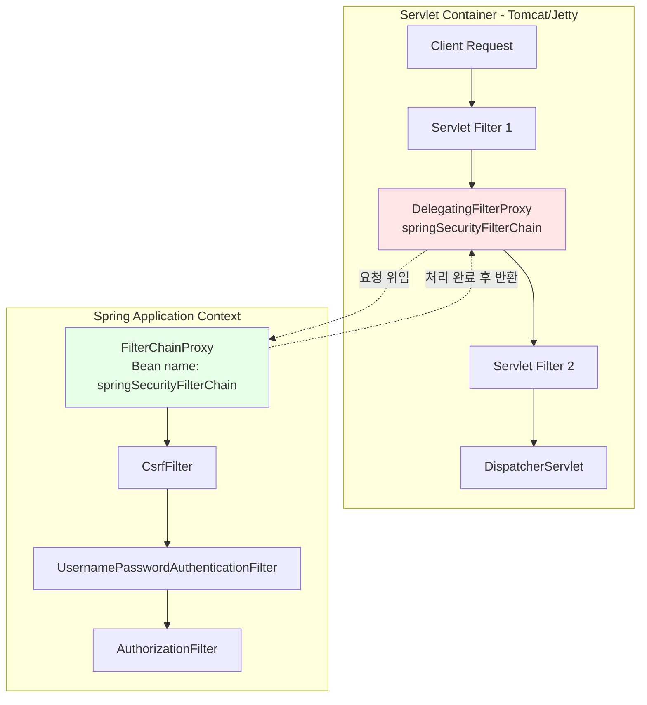

**핵심 개념:**
- **DelegatingFilterProxy**: Servlet Filter 스펙에 정의된 표준 필터로, Servlet Container에서 생성되고 관리됨
- **FilterChainProxy**: Spring Bean으로 등록된 필터로, Spring Container에서 생성되고 관리됨
- **연결 메커니즘**: DelegatingFilterProxy가 `springSecurityFilterChain` 이름의 Bean을 ApplicationContext에서 찾아 요청을 위임

#### 0.5.2. DelegatingFilterProxy 동작 원리

```java
// DelegatingFilterProxy의 핵심 로직 (간소화)
public class DelegatingFilterProxy extends GenericFilterBean {
    private String targetBeanName = "springSecurityFilterChain";
    private volatile Filter delegate;
    
    @Override
    public void doFilter(ServletRequest request, ServletResponse response, 
                         FilterChain chain) throws ServletException, IOException {
        // 1. 최초 요청 시 Spring Context에서 Bean 조회
        Filter delegateToUse = this.delegate;
        if (delegateToUse == null) {
            WebApplicationContext wac = findWebApplicationContext();
            delegateToUse = wac.getBean(targetBeanName, Filter.class);
            this.delegate = delegateToUse;
        }
        
        // 2. 실제 Spring Security Filter에 위임
        delegateToUse.doFilter(request, response, chain);
    }
}
```

**핵심 포인트:**
1. **지연 로딩(Lazy Loading)**: Servlet Container 시작 시점에는 Spring Context가 아직 초기화되지 않을 수 있으므로, 첫 요청 시 Bean 조회
2. **프록시 패턴**: 실제 보안 처리는 하지 않고 Spring Bean에 위임만 함
3. **이름 규칙**: Bean 이름은 `springSecurityFilterChain`으로 고정 (커스터마이징 가능하나 일반적으로 기본값 사용)

#### 0.5.3. FilterChainProxy의 역할

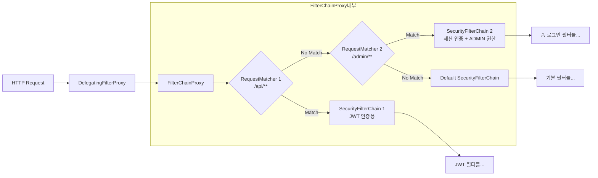

**FilterChainProxy의 핵심 기능:**
1. **다중 필터 체인 관리**: URL 패턴에 따라 다른 SecurityFilterChain 선택 (예: API용, Admin용)
2. **SecurityContext 초기화**: 요청 시작 시 SecurityContext 설정, 종료 시 정리
3. **예외 처리 일원화**: 모든 Spring Security 예외를 한 곳에서 처리
4. **디버깅 지원**: 필터 체인 실행 과정을 로깅

#### 0.5.4. 실제 초기화 과정

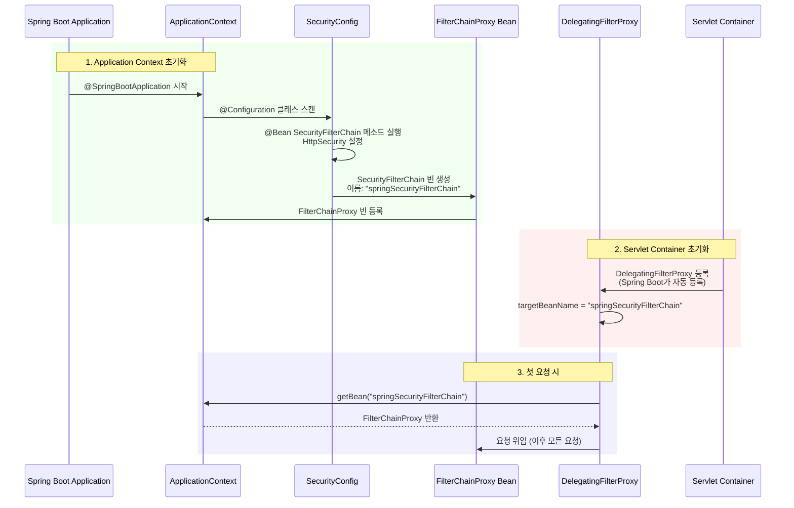

#### 0.5.5. 왜 DelegatingFilterProxy가 필요한가?

| 문제 상황 | 해결 방법 |
|----------|----------|
| Servlet Filter는 Spring Bean을 주입받을 수 없음 | DelegatingFilterProxy가 중개자 역할 |
| Servlet Container 초기화 시점 ≠ Spring Context 초기화 시점 | 지연 로딩으로 해결 |
| 여러 SecurityFilterChain을 동적으로 관리 필요 | FilterChainProxy가 RequestMatcher로 선택 |
| Spring의 AOP, DI 등 기능을 Filter에서 사용 불가 | Spring Bean으로 관리되는 FilterChainProxy에서 가능 |

---

### 1. Spring Security 아키텍처

#### 1.1. 서블릿(Servlet)과 필터(Filter)
Spring Security는 서블릿 필터(Servlet Filter)를 기반으로 동작한다. 클라이언트의 요청은 서블릿에 도달하기 전에 여러 필터 체인(Filter Chain)을 거치게 되며, 각 필터는 특정 보안 작업을 수행한다.

- **서블릿 컨테이너 (Servlet Container)**: HTTP 요청을 자바 객체(`HttpServletRequest`, `HttpServletResponse`)로 변환해주는 중개자다. (예: Tomcat)
- **필터 (Filter)**: 서블릿에 요청이 전달되기 전/후에 요청을 가로채어 추가적인 작업을 수행한다. Spring Security는 이 필터들을 엮어 보안 로직을 처리한다.

#### Spring Security 필터 체인 구조

```mermaid
graph LR
    Client[Client Request] --> SC[Servlet Container]
    SC --> DelegatingFilterProxy[DelegatingFilterProxy]
    DelegatingFilterProxy --> FilterChainProxy[FilterChainProxy]
    FilterChainProxy --> SecurityFilterChain[SecurityFilterChain]
    SecurityFilterChain --> F1[Filter 1: CSRF]
    F1 --> F2[Filter 2: Authentication]
    F2 --> F3[Filter 3: Authorization]
    F3 --> DispatcherServlet[DispatcherServlet]
    DispatcherServlet --> Controller[Controller]
```

**핵심 개념:**
- **DelegatingFilterProxy**: Spring Bean으로 등록된 필터를 서블릿 컨테이너와 연결하는 다리 역할
- **FilterChainProxy**: Spring Security의 모든 필터를 관리하는 중앙 관리자
- **SecurityFilterChain**: 실제 보안 필터들의 체인. 우리가 설정하는 부분이 바로 이것!

#### 1.2. 인증(Authentication) 처리 흐름
사용자가 로그인을 시도할 때 Spring Security 내부에서는 다음과 같은 인증 절차가 진행된다.

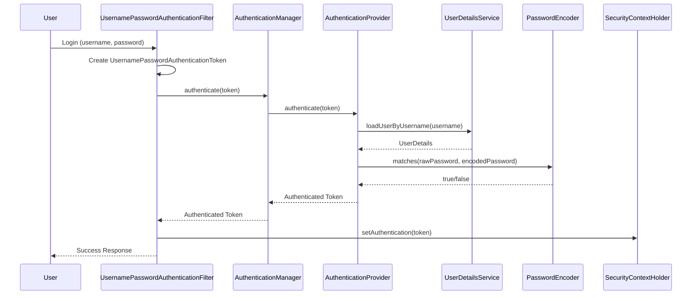

**단계별 설명:**

1.  **사용자 요청**: 사용자가 아이디와 비밀번호를 입력하여 로그인을 요청한다.
2.  **`UsernamePasswordAuthenticationFilter`**: 이 필터는 HTTP 요청에서 아이디와 비밀번호를 추출하여 `UsernamePasswordAuthenticationToken` (미인증 상태의 `Authentication` 객체)을 생성한다.
3.  **`AuthenticationManager`**: 생성된 `Authentication` 객체를 `AuthenticationManager`(주로 `ProviderManager` 구현체)에게 전달하여 인증을 위임한다.
4.  **`AuthenticationProvider`**: `AuthenticationManager`는 등록된 여러 `AuthenticationProvider` 중 현재 인증을 처리할 수 있는 Provider(주로 `DaoAuthenticationProvider`)를 선택한다.
5.  **`UserDetailsService`**: `DaoAuthenticationProvider`는 `UserDetailsService`의 `loadUserByUsername()` 메소드를 호출하여 저장소(DB, 메모리 등)에서 사용자 정보를 조회한다.
6.  **`PasswordEncoder`**: `DaoAuthenticationProvider`는 `PasswordEncoder`를 사용하여 요청받은 비밀번호와 저장소의 암호화된 비밀번호를 비교한다.
7.  **인증 완료**: 인증에 성공하면, `AuthenticationProvider`는 사용자 정보와 권한(`Authorities`)을 담은 인증된 `Authentication` 객체를 `AuthenticationManager`에게 반환한다.
8.  **`SecurityContextHolder`**: `AuthenticationManager`는 인증된 `Authentication` 객체를 `SecurityContextHolder`의 `SecurityContext`에 저장한다. 이로써 사용자는 애플리케이션 내에서 인증된 상태로 간주되며, 세션이 유지되는 동안 동일한 사용자의 후속 요청은 이 `SecurityContext`를 참조하여 재인증을 생략한다.

#### 1.3. Spring Security 표준 필터 체인의 완전한 순서

Spring Security는 요청을 처리하기 위해 여러 필터를 순차적으로 실행한다. 각 필터의 순서와 역할을 이해하면 디버깅과 커스터마이징이 훨씬 쉬워진다.

##### 1.3.1. 전체 표준 필터 순서 및 역할

아래는 Spring Security에서 제공하는 표준 필터의 **실행 순서**다. 설정에 따라 일부 필터는 활성화되지 않을 수 있다.

| 순서 | 필터 이름 | 역할 | 활성화 조건 |
|------|----------|------|------------|
| 1 | **DisableEncodingFilter** | 요청 인코딩 처리 방지 | 기본 활성화 |
| 2 | **WebAsyncManagerIntegrationFilter** | SecurityContext를 비동기 요청에서도 사용 가능하게 함 | 기본 활성화 |
| 3 | **SecurityContextHolderFilter** | SecurityContext를 요청 시작 시 로드하고 종료 시 저장 (Spring Security 6.0+) | 기본 활성화 |
| 4 | **HeaderWriterFilter** | 보안 관련 HTTP 헤더 추가 (X-Frame-Options, X-XSS-Protection 등) | 기본 활성화 |
| 5 | **CorsFilter** | CORS Pre-flight 요청 처리 | `.cors()` 설정 시 |
| 6 | **CsrfFilter** | CSRF 토큰 검증 | 기본 활성화 (`.csrf().disable()` 하지 않은 경우) |
| 7 | **LogoutFilter** | 로그아웃 요청 처리 | `.logout()` 설정 시 (기본 활성화) |
| 8 | **OAuth2AuthorizationRequestRedirectFilter** | OAuth2 인증 요청 리디렉션 | `.oauth2Login()` 설정 시 |
| 9 | **UsernamePasswordAuthenticationFilter** | 폼 로그인 처리 (POST /login) | `.formLogin()` 설정 시 |
| 10 | **DefaultLoginPageGeneratingFilter** | 기본 로그인 페이지 생성 | `.formLogin()` + 커스텀 로그인 페이지 미설정 시 |
| 11 | **DefaultLogoutPageGeneratingFilter** | 기본 로그아웃 페이지 생성 | `.logout()` + 커스텀 로그아웃 페이지 미설정 시 |
| 12 | **BasicAuthenticationFilter** | HTTP Basic 인증 처리 | `.httpBasic()` 설정 시 |
| 13 | **OAuth2LoginAuthenticationFilter** | OAuth2 Authorization Code 교환 및 로그인 | `.oauth2Login()` 설정 시 |
| 14 | **RequestCacheAwareFilter** | 인증 전 요청 URL 저장/복원 | 기본 활성화 |
| 15 | **SecurityContextHolderAwareRequestFilter** | HttpServletRequest를 Spring Security 래퍼로 감싸 `getRemoteUser()` 등 지원 | 기본 활성화 |
| 16 | **RememberMeAuthenticationFilter** | Remember-Me 쿠키 기반 자동 로그인 | `.rememberMe()` 설정 시 |
| 17 | **AnonymousAuthenticationFilter** | 인증되지 않은 사용자에게 익명(Anonymous) 권한 부여 | 기본 활성화 |
| 18 | **OAuth2AuthorizationCodeGrantFilter** | OAuth2 Authorization Code Grant 처리 (Client 역할) | OAuth2 Client 설정 시 |
| 19 | **SessionManagementFilter** | 세션 고정 보호, 동시 세션 제어 | `.sessionManagement()` 설정 (기본 활성화) |
| 20 | **ExceptionTranslationFilter** | 인증/인가 예외 처리 (401, 403 응답 생성) | 기본 활성화 |
| 21 | **AuthorizationFilter** | URL 기반 권한 검사 (`.requestMatchers()`) | 기본 활성화 (Spring Security 5.5+) |
| 22 | **FilterSecurityInterceptor** | 구버전 권한 검사 필터 | Spring Security 5.4 이하 또는 명시적 사용 시 |

> **Spring Security 6.0+ 변경사항**: `FilterSecurityInterceptor` → `AuthorizationFilter`로 대체됨

##### 1.3.2. 필터 체인 전체 시각화

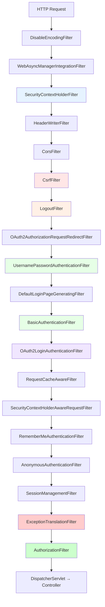

**색상 범례:**
- 🔵 파란색: SecurityContext 관리
- 🔴 빨간색: CSRF 보호
- 🟠 주황색: 로그아웃
- 🟢 초록색: 인증 필터 (폼, Basic, OAuth2)
- 🟣 보라색: OAuth2 특화
- 빨강(진함): 예외 처리
- 초록(진함): 권한 검사

#### 1.4. SecurityFilterChain 설정과 내부 필터 매핑

`SecurityFilterChain` 설정 메소드와 실제로 활성화되는 필터의 관계를 이해하는 것은 매우 중요하다.

##### 1.4.1. 필터 체인 기본 구조 표

| SecurityFilterChain 설정 | 활성화되는 주요 필터 | 역할 |
|-------------------------|-------------------|------|
| `.formLogin()` | UsernamePasswordAuthenticationFilter | 폼 로그인 처리 |
| `.httpBasic()` | BasicAuthenticationFilter | HTTP Basic 인증 |
| `.authorizeHttpRequests()` | AuthorizationFilter | URL 기반 권한 검사 |
| `.csrf()` (기본 활성화) | CsrfFilter | CSRF 토큰 검증 |
| `.logout()` | LogoutFilter | 로그아웃 처리 |
| `.cors()` | CorsFilter | CORS 요청 처리 |
| `.oauth2Login()` | OAuth2AuthorizationRequestRedirectFilter, OAuth2LoginAuthenticationFilter | OAuth2 로그인 |
| `.oauth2ResourceServer(jwt())` | BearerTokenAuthenticationFilter | JWT 검증 |
| `.sessionManagement()` | SessionManagementFilter | 세션 관리 |

##### 1.4.2. 설정 추가 전/후 비교 예제

**최소 설정 (기본 필터들만):**
```java
@Bean
SecurityFilterChain minimalChain(HttpSecurity http) throws Exception {
    http.authorizeHttpRequests(auth -> auth.anyRequest().authenticated());
    return http.build();
}
// → 활성화되는 필터:
// SecurityContextHolderFilter, HeaderWriterFilter, CsrfFilter, 
// LogoutFilter, RequestCacheAwareFilter, SecurityContextHolderAwareRequestFilter,
// AnonymousAuthenticationFilter, SessionManagementFilter, 
// ExceptionTranslationFilter, AuthorizationFilter
```

**formLogin 추가 후:**
```java
@Bean
SecurityFilterChain withFormLogin(HttpSecurity http) throws Exception {
    http
        .authorizeHttpRequests(auth -> auth.anyRequest().authenticated())
        .formLogin(withDefaults());
    return http.build();
}
// → 추가되는 필터:
// UsernamePasswordAuthenticationFilter (순서 9)
// DefaultLoginPageGeneratingFilter (순서 10)
// DefaultLogoutPageGeneratingFilter (순서 11)
```

**httpBasic 추가 후:**
```java
@Bean
SecurityFilterChain withHttpBasic(HttpSecurity http) throws Exception {
    http
        .authorizeHttpRequests(auth -> auth.anyRequest().authenticated())
        .httpBasic(withDefaults());
    return http.build();
}
// → 추가되는 필터:
// BasicAuthenticationFilter (순서 12)
```

**CSRF 비활성화 후:**
```java
@Bean
SecurityFilterChain withoutCsrf(HttpSecurity http) throws Exception {
    http
        .csrf(csrf -> csrf.disable())
        .authorizeHttpRequests(auth -> auth.anyRequest().authenticated())
        .formLogin(withDefaults());
    return http.build();
}
// → 제거되는 필터:
// CsrfFilter (순서 6) - 완전히 제거됨
```

**JWT 기반 Stateless 설정:**
```java
@Bean
SecurityFilterChain jwtStateless(HttpSecurity http) throws Exception {
    http
        .csrf(csrf -> csrf.disable())  // CsrfFilter 제거
        .sessionManagement(session -> 
            session.sessionCreationPolicy(SessionCreationPolicy.STATELESS)
        )  // SessionManagementFilter 비활성화
        .authorizeHttpRequests(auth -> auth.anyRequest().authenticated())
        .addFilterBefore(new JwtAuthenticationFilter(), UsernamePasswordAuthenticationFilter.class);
    return http.build();
}
// → 변경사항:
// - CsrfFilter 제거
// - SessionManagementFilter 비활성화 (세션 생성 안 함)
// - JwtAuthenticationFilter 추가 (순서 9 이전)
```

##### 1.4.3. 필터 체인 실행 순서 시각화 (기본 설정)

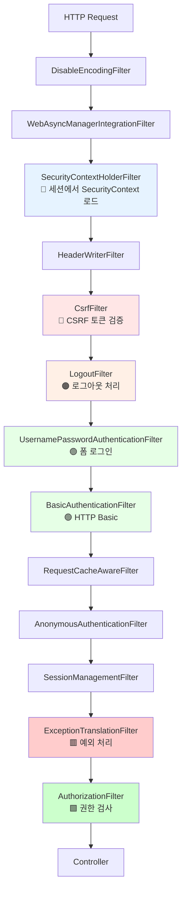

##### 1.4.4. 다중 SecurityFilterChain 예제

URL 패턴에 따라 다른 필터 체인을 적용할 수 있다:

```java
@Configuration
public class MultiSecurityConfig {
    
    // API 요청용 (JWT, Stateless)
    @Bean
    @Order(1)  // 우선순위 높음
    SecurityFilterChain apiFilterChain(HttpSecurity http) throws Exception {
        http
            .securityMatcher("/api/**")  // /api/** 경로에만 적용
            .csrf(csrf -> csrf.disable())
            .sessionManagement(session -> 
                session.sessionCreationPolicy(SessionCreationPolicy.STATELESS))
            .authorizeHttpRequests(auth -> auth.anyRequest().authenticated())
            .addFilterBefore(jwtAuthenticationFilter(), UsernamePasswordAuthenticationFilter.class);
        return http.build();
    }
    
    // 관리자 페이지용 (폼 로그인, Stateful)
    @Bean
    @Order(2)
    SecurityFilterChain adminFilterChain(HttpSecurity http) throws Exception {
        http
            .securityMatcher("/admin/**")  // /admin/** 경로에만 적용
            .authorizeHttpRequests(auth -> auth
                .anyRequest().hasRole("ADMIN")
            )
            .formLogin(form -> form
                .loginPage("/admin/login")
                .defaultSuccessUrl("/admin/dashboard")
            );
        return http.build();
    }
    
    // 기본 설정 (나머지 모든 경로)
    @Bean
    @Order(3)  // 우선순위 낮음 (마지막)
    SecurityFilterChain defaultFilterChain(HttpSecurity http) throws Exception {
        http
            .authorizeHttpRequests(auth -> auth
                .requestMatchers("/", "/public/**").permitAll()
                .anyRequest().authenticated()
            )
            .formLogin(withDefaults());
        return http.build();
    }
}
```

> **전문가 Tip**: 다중 SecurityFilterChain을 사용하면 API와 웹 페이지에 서로 다른 보안 전략을 적용할 수 있습니다. `@Order` 애노테이션으로 우선순위를 지정하며, 먼저 매칭되는 체인이 실행됩니다.

---
- **`UserDetails`**: 저장소에 저장된 사용자의 핵심 정보(아이디, 암호화된 비밀번호, 권한 등)를 표현하는 인터페이스. `User` 클래스가 주요 구현체다.
- **`UserDetailsService`**: `loadUserByUsername()` 메소드를 통해 저장소에서 `UserDetails`를 조회하는 역할을 한다.
- **`PasswordEncoder`**: 비밀번호를 안전하게 암호화하고 비교하는 역할을 한다. `BCryptPasswordEncoder`가 권장 표준이다.
- **`SecurityContextHolder`**: 현재 실행 중인 스레드의 보안 컨텍스트(`SecurityContext`)를 관리하며, 이 컨텍스트 안에 `Authentication` 객체가 저장된다.

---

### 1.5. 주요 필터 상세 분석

필터 체인에서 가장 핵심적인 4개 필터를 깊이 있게 분석한다.

#### 1.5.1. SecurityContextHolderFilter (Spring Security 6.0+)

> **변경 이력**: Spring Security 5.x에서는 `SecurityContextPersistenceFilter`였으나, 6.0부터 `SecurityContextHolderFilter`로 교체되었다.

**역할:**
- 요청 시작: `SecurityContextRepository`에서 `SecurityContext`를 로드하여 `SecurityContextHolder`에 저장
- 요청 종료: 인증 완료 시 `SecurityContext`를 다시 Repository에 저장 (세션 등)

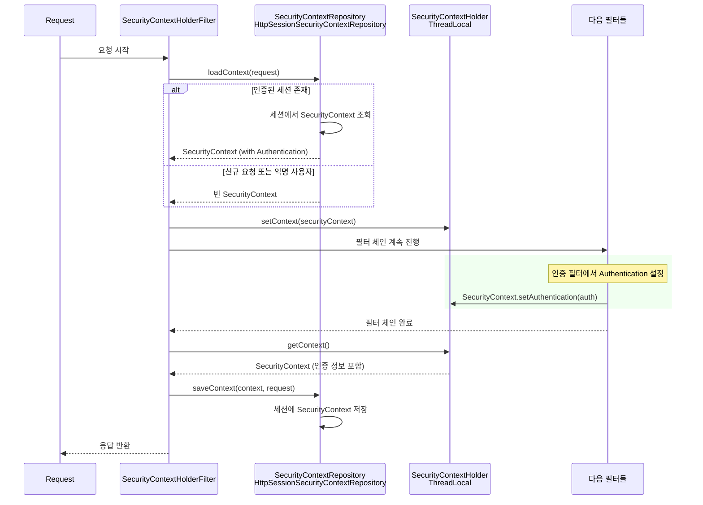

**핵심 코드 구조:**

```java
public class SecurityContextHolderFilter extends OncePerRequestFilter {
    
    private SecurityContextRepository securityContextRepository = 
        new HttpSessionSecurityContextRepository();
    
    @Override
    protected void doFilterInternal(HttpServletRequest request, 
                                     HttpServletResponse response, 
                                     FilterChain filterChain) throws ServletException, IOException {
        // 1. SecurityContext 로드
        SecurityContext context = securityContextRepository.loadDeferredContext(request).get();
        
        try {
            // 2. ThreadLocal에 저장
            SecurityContextHolder.setContext(context);
            
            // 3. 다음 필터로 진행
            filterChain.doFilter(request, response);
        } finally {
            // 4. 요청 종료 후 정리
            SecurityContextHolder.clearContext();
        }
    }
}
```

**SecurityContextHolder와 SecurityContext 관계:**

```java
// SecurityContextHolder (Wrapper)
public class SecurityContextHolder {
    private static SecurityContextHolderStrategy strategy = 
        new ThreadLocalSecurityContextHolderStrategy(); // 기본 전략
    
    public static SecurityContext getContext() {
        return strategy.getContext();
    }
    
    public static void setContext(SecurityContext context) {
        strategy.setContext(context);
    }
}

// ThreadLocal 기반 저장소
class ThreadLocalSecurityContextHolderStrategy implements SecurityContextHolderStrategy {
    private static final ThreadLocal<SecurityContext> contextHolder = new ThreadLocal<>();
    
    public SecurityContext getContext() {
        SecurityContext ctx = contextHolder.get();
        if (ctx == null) {
            ctx = createEmptyContext();
            contextHolder.set(ctx);
        }
        return ctx;
    }
}
```

**전역 접근 가능 이유**: `ThreadLocal` 덕분에 같은 스레드(= 같은 HTTP 요청) 내 어디서든 `SecurityContextHolder.getContext()`로 인증 정보 접근 가능

#### 1.5.2. LogoutFilter

**역할:** 로그아웃 요청을 감지하고 처리 (세션 무효화, 쿠키 삭제, SecurityContext 정리)

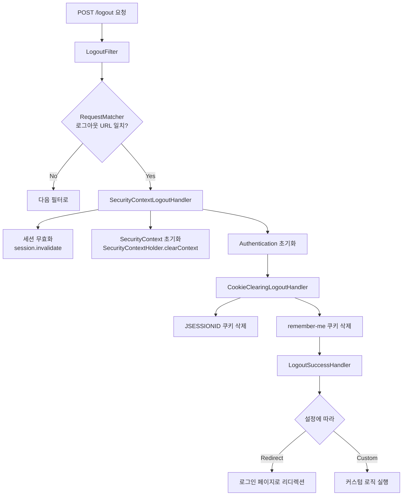

**설정 예제:**

```java
@Bean
SecurityFilterChain securityFilterChain(HttpSecurity http) throws Exception {
    http
        .logout(logout -> logout
            .logoutUrl("/api/logout")                    // 로그아웃 URL (기본: /logout)
            .logoutSuccessUrl("/login?logout")           // 성공 후 리디렉션
            .deleteCookies("JSESSIONID", "remember-me")  // 삭제할 쿠키 지정
            .invalidateHttpSession(true)                 // 세션 무효화 (기본: true)
            .clearAuthentication(true)                   // Authentication 정리 (기본: true)
            .addLogoutHandler(customLogoutHandler())     // 커스텀 핸들러 추가
            .logoutSuccessHandler(customSuccessHandler()) // 커스텀 성공 핸들러
        );
    return http.build();
}
```

#### 1.5.3. UsernamePasswordAuthenticationFilter

**역할:** 폼 기반 로그인 요청(`POST /login`)에서 username, password를 추출하여 인증 처리

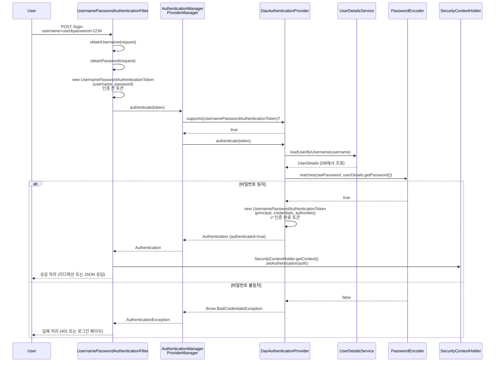

**핵심 메소드:**

```java
public class UsernamePasswordAuthenticationFilter extends AbstractAuthenticationProcessingFilter {
    
    // 기본 로그인 URL
    public UsernamePasswordAuthenticationFilter() {
        super(new AntPathRequestMatcher("/login", "POST"));
    }
    
    @Override
    public Authentication attemptAuthentication(HttpServletRequest request, 
                                                 HttpServletResponse response) 
                                                 throws AuthenticationException {
        // POST 메소드만 허용
        if (this.postOnly && !request.getMethod().equals("POST")) {
            throw new AuthenticationServiceException(
                "Authentication method not supported: " + request.getMethod());
        }
        
        // 1. request에서 파라미터 추출
        String username = obtainUsername(request);  // request.getParameter("username")
        String password = obtainPassword(request);  // request.getParameter("password")
        
        username = (username != null) ? username.trim() : "";
        password = (password != null) ? password : "";
        
        // 2. 인증 전 토큰 생성
        UsernamePasswordAuthenticationToken authRequest = 
            UsernamePasswordAuthenticationToken.unauthenticated(username, password);
        
        // 3. AuthenticationManager에 인증 위임
        return this.getAuthenticationManager().authenticate(authRequest);
    }
}
```

**중요 포인트:**
- **Content-Type**: 기본적으로 `application/x-www-form-urlencoded` 형식만 처리
- **JSON 로그인**: REST API에서 JSON 요청 본문을 처리하려면 **커스텀 필터 구현 필요** (`http.formLogin().disable()` 후 직접 작성)

#### 1.5.4. ExceptionTranslationFilter

**역할:** 필터 체인에서 발생하는 `AuthenticationException`(인증 예외)과 `AccessDeniedException`(인가 예외)를 캐치하여 적절한 응답 생성

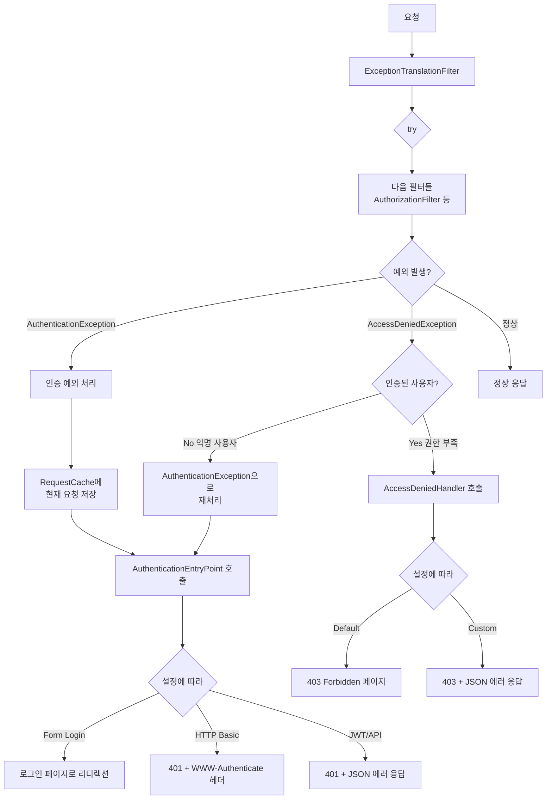

**핵심 코드 구조:**

```java
public class ExceptionTranslationFilter extends GenericFilterBean {
    
    private AuthenticationEntryPoint authenticationEntryPoint;  // 인증 실패 시
    private AccessDeniedHandler accessDeniedHandler;            // 인가 실패 시
    private RequestCache requestCache = new HttpSessionRequestCache();
    
    @Override
    public void doFilter(ServletRequest request, ServletResponse response, FilterChain chain) 
            throws IOException, ServletException {
        try {
            // 다음 필터들 실행
            chain.doFilter(request, response);
        } catch (AuthenticationException ex) {
            // 1. 인증 예외 처리
            handleAuthenticationException(request, response, ex);
        } catch (AccessDeniedException ex) {
            // 2. 인가 예외 처리
            handleAccessDeniedException(request, response, ex);
        }
    }
    
    private void handleAuthenticationException(HttpServletRequest request, 
                                                 HttpServletResponse response, 
                                                 AuthenticationException ex) throws IOException {
        // 현재 요청 정보 저장 (로그인 후 원래 페이지로 돌아가기 위함)
        requestCache.saveRequest(request, response);
        
        // AuthenticationEntryPoint 호출 (로그인 페이지 리디렉션 또는 401 응답)
        authenticationEntryPoint.commence(request, response, ex);
    }
    
    private void handleAccessDeniedException(HttpServletRequest request, 
                                              HttpServletResponse response, 
                                              AccessDeniedException ex) throws IOException {
        Authentication authentication = SecurityContextHolder.getContext().getAuthentication();
        
        if (authentication == null || authentication instanceof AnonymousAuthenticationToken) {
            // 익명 사용자의 접근 거부 → 인증 필요로 간주
            handleAuthenticationException(request, response, 
                new InsufficientAuthenticationException("Full authentication is required"));
        } else {
            // 인증된 사용자지만 권한 부족 → 403 Forbidden
            accessDeniedHandler.handle(request, response, ex);
        }
    }
}
```

**RequestCache와 SavedRequest의 역할:**

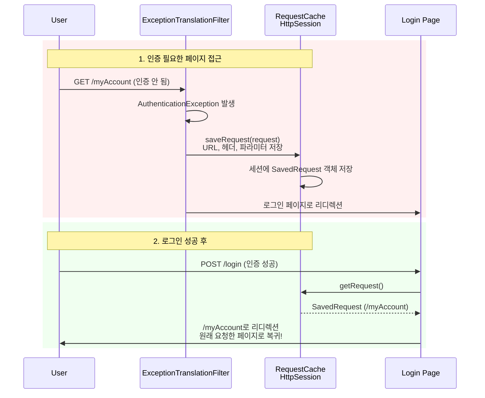

**커스텀 AuthenticationEntryPoint 예제 (JWT API용):**

```java
@Component
public class JwtAuthenticationEntryPoint implements AuthenticationEntryPoint {
    
    @Override
    public void commence(HttpServletRequest request, 
                          HttpServletResponse response,
                          AuthenticationException authException) throws IOException {
        // JSON 에러 응답 반환 (로그인 페이지 리디렉션 대신)
        response.setContentType("application/json");
        response.setStatus(HttpServletResponse.SC_UNAUTHORIZED);
        response.getWriter().write(
            "{\"error\": \"Unauthorized\", \"message\": \"" + 
            authException.getMessage() + "\"}"
        );
    }
}

// SecurityConfig에 등록
http.exceptionHandling(ex -> ex
    .authenticationEntryPoint(new JwtAuthenticationEntryPoint())
);
```

---

### 1.6. 필터 체인 디버깅 방법

Spring Security 필터 체인의 동작을 이해하고 문제를 해결하기 위한 디버깅 방법을 소개한다.

#### 1.6.1. 로깅 레벨 설정

`application.properties` 또는 `application.yml`에 추가:

```properties
# Spring Security 필터 체인 상세 로그
logging.level.org.springframework.security.web.FilterChainProxy=DEBUG

# 인증/인가 디버깅
logging.level.org.springframework.security=DEBUG
```

**출력 예시:**
```
DEBUG o.s.security.web.FilterChainProxy - Securing POST /login
DEBUG o.s.security.web.FilterChainProxy - /login at position 1 of 15 in additional filter chain; firing Filter: 'WebAsyncManagerIntegrationFilter'
DEBUG o.s.security.web.FilterChainProxy - /login at position 2 of 15 in additional filter chain; firing Filter: 'SecurityContextHolderFilter'
...
DEBUG o.s.s.w.a.UsernamePasswordAuthenticationFilter - Set SecurityContextHolder to UsernamePasswordAuthenticationToken [Principal=user@example.com, Credentials=[PROTECTED], Authenticated=true, Details=WebAuthenticationDetails, Granted Authorities=[ROLE_USER]]
```

#### 1.6.2. @EnableWebSecurity(debug = true)

개발 환경에서만 사용:

```java
@Configuration
@EnableWebSecurity(debug = true)  // ⚠️ 운영 환경에서는 절대 사용 금지
public class SecurityConfig {
    // ...
}
```

**효과:**
- 모든 요청마다 필터 체인 전체 출력
- SecurityContext 상태 출력
- 인증/인가 결정 과정 출력

**출력 예시:**
```
Request received for GET '/myAccount':

org.apache.catalina.connector.RequestFacade@5c647e05

servletPath:/myAccount
pathInfo:null
headers: 
host: localhost:8080
connection: keep-alive
accept: text/html
...

Security filter chain: [
  WebAsyncManagerIntegrationFilter
  SecurityContextHolderFilter
  HeaderWriterFilter
  CsrfFilter
  LogoutFilter
  UsernamePasswordAuthenticationFilter
  RequestCacheAwareFilter
  SecurityContextHolderAwareRequestFilter
  AnonymousAuthenticationFilter
  SessionManagementFilter
  ExceptionTranslationFilter
  AuthorizationFilter
]
```

#### 1.6.3. 커스텀 디버깅 필터 추가

특정 시점에 인증 상태를 확인하고 싶을 때 커스텀 필터를 추가할 수 있다:

```java
import org.slf4j.Logger;
import org.slf4j.LoggerFactory;
import org.springframework.security.core.Authentication;
import org.springframework.security.core.context.SecurityContextHolder;
import org.springframework.web.filter.OncePerRequestFilter;

import jakarta.servlet.FilterChain;
import jakarta.servlet.ServletException;
import jakarta.servlet.http.HttpServletRequest;
import jakarta.servlet.http.HttpServletResponse;
import java.io.IOException;

public class DebugFilter extends OncePerRequestFilter {
    
    private static final Logger log = LoggerFactory.getLogger(DebugFilter.class);
    
    @Override
    protected void doFilterInternal(HttpServletRequest request, 
                                     HttpServletResponse response, 
                                     FilterChain filterChain) 
                                     throws ServletException, IOException {
        Authentication auth = SecurityContextHolder.getContext().getAuthentication();
        
        log.info("========== DEBUG FILTER ==========");
        log.info("Request URI: {} {}", request.getMethod(), request.getRequestURI());
        log.info("Authentication: {}", auth != null ? auth.getName() : "null");
        log.info("Authorities: {}", auth != null ? auth.getAuthorities() : "null");
        log.info("Authenticated: {}", auth != null && auth.isAuthenticated());
        log.info("==================================");
        
        filterChain.doFilter(request, response);
    }
}
```

**SecurityConfig에 추가:**

```java
@Bean
SecurityFilterChain defaultSecurityFilterChain(HttpSecurity http) throws Exception {
    http
        .authorizeHttpRequests(requests -> requests
            .requestMatchers("/myAccount/**").authenticated()
            .anyRequest().permitAll()
        )
        // BasicAuthenticationFilter 이후에 디버깅 필터 추가
        .addFilterAfter(new DebugFilter(), BasicAuthenticationFilter.class)
        .formLogin(withDefaults())
        .httpBasic(withDefaults());
    return http.build();
}
```

#### 1.6.4. 필터 체인 확인 엔드포인트 (개발 전용)

개발 시 현재 활성화된 필터 체인을 확인하는 엔드포인트를 만들 수 있다:

```java
import org.springframework.beans.factory.annotation.Autowired;
import org.springframework.security.web.FilterChainProxy;
import org.springframework.security.web.SecurityFilterChain;
import org.springframework.web.bind.annotation.GetMapping;
import org.springframework.web.bind.annotation.RestController;

import java.util.List;
import java.util.stream.Collectors;

@RestController
public class SecurityDebugController {
    
    @Autowired
    private FilterChainProxy filterChainProxy;
    
    @GetMapping("/debug/filters")
    public List<String> getFilters() {
        return filterChainProxy.getFilterChains().stream()
            .flatMap(chain -> ((SecurityFilterChain) chain).getFilters().stream())
            .map(filter -> filter.getClass().getSimpleName())
            .collect(Collectors.toList());
    }
}
```

> **보안 주의사항**: 이러한 디버깅 엔드포인트는 **개발 환경에서만** 사용하고, 운영 환경에 배포 시 반드시 제거하거나 접근을 제한해야 한다.

---

### 2. 기본 보안 설정

Spring Security의 보안 규칙은 `SecurityFilterChain` 타입의 Bean을 등록하여 설정한다. `HttpSecurity` 객체를 사용하여 URL 패턴별 접근 제어, 로그인 방식 등을 구성할 수 있다.

#### 2.1. URL 기반 접근 제어
`requestMatchers`를 사용하여 특정 URL 패턴에 대한 접근 권한을 설정한다.

- `authenticated()`: 인증된 사용자만 접근을 허용한다.
- `permitAll()`: 모든 사용자의 접근을 허용한다.
- `denyAll()`: 모든 사용자의 접근을 거부한다.

#### 2.2. Java 설정 예제 (`SecurityFilterChain`)
다음은 특정 URL은 인증을 요구하고, 다른 URL은 모두에게 허용하는 기본 설정 예제다.

```java
import org.springframework.context.annotation.Bean;
import org.springframework.context.annotation.Configuration;
import org.springframework.security.config.annotation.web.builders.HttpSecurity;
import org.springframework.security.web.SecurityFilterChain;

import static org.springframework.security.config.Customizer.withDefaults;

@Configuration
public class SecurityConfig {

    @Bean
    SecurityFilterChain defaultSecurityFilterChain(HttpSecurity http) throws Exception {
        http
            .authorizeHttpRequests(requests -> requests
                // /myAccount, /myBalance, /myLoans, /myCards 경로는 인증된 사용자만 접근 가능
                .requestMatchers("/myAccount", "/myBalance", "/myLoans", "/myCards").authenticated()
                // /notices, /contact 경로는 누구나 접근 가능
                .requestMatchers("/notices", "/contact").permitAll()
            )
            .formLogin(withDefaults()) // 기본 폼 로그인 페이지 사용
            .httpBasic(withDefaults()); // HTTP Basic 인증 사용
        return http.build();
    }
}
```
> **전문가 Tip**: `anyRequest().authenticated()`를 설정 체인의 마지막에 추가하면, 명시적으로 지정되지 않은 모든 요청에 대해 인증을 요구하게 되어 보안을 강화할 수 있다.

---

### 3. 사용자 정보 관리

애플리케이션에서 사용자를 인증하려면 사용자 정보를 어딘가에 저장하고, Spring Security가 이를 조회할 수 있도록 연결해야 한다.

#### 3.1. `PasswordEncoder`의 역할과 중요성
보안의 가장 기본 원칙은 **비밀번호를 절대 평문으로 저장해서는 안 된다**는 것이다. `PasswordEncoder`는 비밀번호를 안전한 해시(Hash) 값으로 암호화하고, 로그인 시 입력된 비밀번호와 저장된 해시 값을 비교하는 역할을 담당한다. Spring Security는 개발자가 반드시 `PasswordEncoder` 구현체를 Bean으로 등록하도록 강제하여 보안 수준을 높인다.

- **`BCryptPasswordEncoder`**: 현재 가장 널리 사용되는 표준 구현체다. 강력한 해시 알고리즘과 무차별 대입 공격을 늦추기 위한 메커니즘이 내장되어 있다.

#### 3.2. 메모리 기반 사용자 설정 예제 (`InMemoryUserDetailsManager`)
개발 및 테스트 목적으로, 데이터베이스 연결 없이 `InMemoryUserDetailsManager`를 사용하여 메모리에 사용자를 등록할 수 있다. `User.builder()`를 통해 사용자를 생성하면, Spring Security는 등록된 `PasswordEncoder` Bean을 자동으로 사용하여 비밀번호를 암호화한다.

```java
import org.springframework.context.annotation.Bean;
import org.springframework.context.annotation.Configuration;
import org.springframework.security.core.userdetails.User;
import org.springframework.security.core.userdetails.UserDetails;
import org.springframework.security.core.userdetails.UserDetailsService;
import org.springframework.security.crypto.bcrypt.BCryptPasswordEncoder;
import org.springframework.security.crypto.password.PasswordEncoder;
import org.springframework.security.provisioning.InMemoryUserDetailsManager;

@Configuration
public class SecurityConfig {

    // ... SecurityFilterChain 설정은 위와 동일 ...

    /**
     * PasswordEncoder Bean: 비밀번호 암호화 방식을 BCrypt로 지정한다.
     * 이 Bean이 등록되어 있어야 Spring Security가 비밀번호를 안전하게 처리할 수 있다.
     */
    @Bean
    public PasswordEncoder passwordEncoder() {
        return new BCryptPasswordEncoder();
    }

    /**
     * UserDetailsService Bean: 메모리 기반의 사용자 정보를 설정한다.
     * 운영 환경에서는 JDBC나 JPA를 이용한 UserDetailsService 구현체를 사용해야 한다.
     */
    @Bean
    public UserDetailsService userDetailsService() {
        // "admin" 사용자를 생성하고 "admin" 권한을 부여한다.
        UserDetails admin = User.builder()
                .username("admin")
                .password("12345") // 평문으로 입력해도 passwordEncoder()에 의해 암호화된다.
                .authorities("admin")
                .build();
        
        // "user" 사용자를 생성하고 "read" 권한을 부여한다.
        UserDetails user = User.builder()
                .username("user")
                .password("12345")
                .authorities("read")
                .build();

        // InMemoryUserDetailsManager를 사용하여 메모리에 사용자 정보를 로드한다.
        return new InMemoryUserDetailsManager(admin, user);
    }
}
```
> **주의**: `User.withDefaultPasswordEncoder()`나 `NoOpPasswordEncoder`는 보안에 취약하므로 실제 프로젝트에서는 절대 사용하지 않아야 한다. 항상 `BCryptPasswordEncoder`와 같은 강력한 구현체를 사용해야 한다.

---

### 3.3. Bean과 Filter 매핑: 인증 Bean들이 필터 체인에 미치는 영향

Spring Security에서 Bean을 등록하면 내부적으로 자동으로 생성되고 연결되는 컴포넌트들이 있다. 특정 Bean이 어떤 필터에 영향을 주는지 이해하는 것은 디버깅과 커스터마이징에 매우 중요하다.

#### 3.3.1. 핵심 Bean-Filter 매핑 구조

```mermaid
graph TB
    subgraph UserBeans[사용자가 등록하는 Bean]
        UDS[UserDetailsService<br/>@Bean]
        PE[PasswordEncoder<br/>@Bean]
    end
    
    subgraph AutoGenerated[Spring Security가 자동 생성]
        DAO[DaoAuthenticationProvider<br/>자동 생성]
        AM[AuthenticationManager<br/>ProviderManager]
    end
    
    subgraph Filters[필터 체인의 인증 필터들]
        UPF[UsernamePasswordAuthenticationFilter<br/>폼 로그인]
        BAF[BasicAuthenticationFilter<br/>HTTP Basic]
    end
    
    UDS -->|주입| DAO
    PE -->|주입| DAO
    DAO -->|등록| AM
    AM -->|사용| UPF
    AM -->|사용| BAF
    
    style UDS fill:#ffe6e6
    style PE fill:#ffe6e6
    style DAO fill:#e6ffe6
    style UPF fill:#e6f3ff
    style BAF fill:#e6f3ff
```

#### 3.3.2. Bean 등록에 따른 필터 체인 변화

| Bean 타입 | 자동 생성/활성화되는 컴포넌트 | 영향받는 필터 | 역할 |
|----------|--------------------------|------------|------|
| **PasswordEncoder** | `DaoAuthenticationProvider`에 주입 | `UsernamePasswordAuthenticationFilter`<br/>`BasicAuthenticationFilter` | 로그인 시 비밀번호 검증에 사용됨 |
| **UserDetailsService** | `DaoAuthenticationProvider` 자동 생성 및 주입 | `UsernamePasswordAuthenticationFilter`<br/>`BasicAuthenticationFilter` | DB/메모리에서 사용자 조회 |
| **AuthenticationProvider**<br/>(커스텀) | `DaoAuthenticationProvider` 대체 | `UsernamePasswordAuthenticationFilter`<br/>`BasicAuthenticationFilter` | 인증 로직 전체를 직접 제어 |

#### 3.3.3. PasswordEncoder Bean의 영향 범위

`PasswordEncoder` Bean을 등록하면:

```java
@Bean
public PasswordEncoder passwordEncoder() {
    return new BCryptPasswordEncoder();
}
```

**자동으로 일어나는 일:**
1. Spring Security가 `DaoAuthenticationProvider`를 생성할 때 이 Bean을 자동 주입
2. `UsernamePasswordAuthenticationFilter`가 폼 로그인 요청을 받으면:
   - `AuthenticationManager` → `DaoAuthenticationProvider` 호출
   - `DaoAuthenticationProvider`가 `PasswordEncoder.matches()` 호출하여 비밀번호 검증
3. `BasicAuthenticationFilter`가 HTTP Basic 인증 요청을 받아도 동일한 흐름

**영향받는 필터 체인:**
```
HTTP 요청
  ↓
SecurityContextHolderFilter
  ↓
CsrfFilter
  ↓
LogoutFilter
  ↓
UsernamePasswordAuthenticationFilter ← PasswordEncoder가 여기서 사용됨
  ↓
BasicAuthenticationFilter ← 여기서도 사용됨
  ↓
...
```

#### 3.3.4. UserDetailsService Bean의 영향 범위

`UserDetailsService` Bean을 등록하면:

```java
@Bean
public UserDetailsService userDetailsService() {
    return new InMemoryUserDetailsManager(admin, user);
}
```

**자동으로 일어나는 일:**
1. Spring Security가 `DaoAuthenticationProvider`를 자동 생성
2. `UserDetailsService` Bean을 `DaoAuthenticationProvider`에 자동 주입
3. 로그인 요청 시:
   - `DaoAuthenticationProvider.authenticate()` 호출
   - `UserDetailsService.loadUserByUsername()` 호출하여 사용자 정보 조회
   - `PasswordEncoder`로 비밀번호 검증
   - 성공 시 `Authentication` 객체 생성

**시퀀스 다이어그램:**

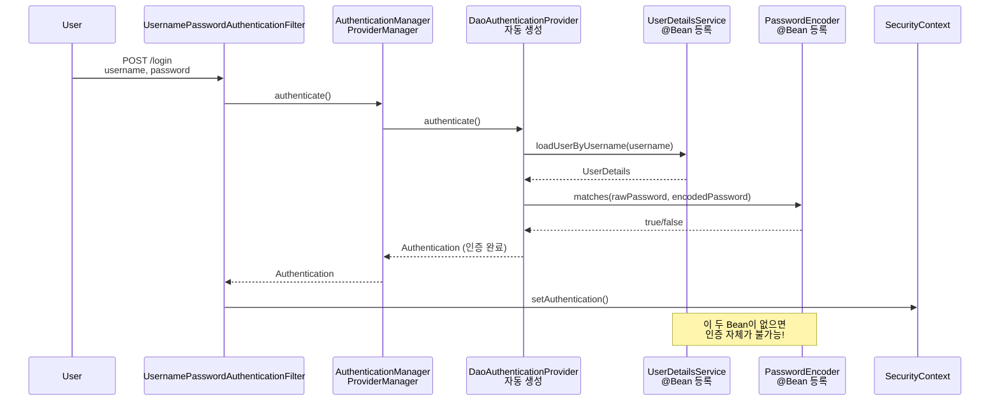

#### 3.3.5. Bean 미등록 시 발생하는 문제

| Bean 미등록 | 발생하는 문제 | 에러 메시지 예시 |
|-----------|------------|---------------|
| `PasswordEncoder` | 인증 시도 시 예외 발생 | `IllegalArgumentException: There is no PasswordEncoder mapped for the id "null"` |
| `UserDetailsService` | 기본 사용자만 사용 가능 (콘솔 출력) | `Using generated security password: ...` (임시 비밀번호) |
| 둘 다 미등록 | 기본 사용자 + 비밀번호 평문 저장 (⚠️ 보안 취약) | 로그인은 되지만 보안상 매우 위험 |

#### 3.3.6. 실전 팁: Bean 등록 순서와 디버깅

**권장 등록 순서:**
```java
@Configuration
public class SecurityConfig {
    
    // 1. 먼저 PasswordEncoder를 등록
    @Bean
    public PasswordEncoder passwordEncoder() {
        return new BCryptPasswordEncoder();
    }
    
    // 2. UserDetailsService는 PasswordEncoder에 의존하지 않으므로 순서 무관
    @Bean
    public UserDetailsService userDetailsService() {
        // PasswordEncoder는 User.builder()가 아닌 
        // 인증 시점에 DaoAuthenticationProvider가 사용
        return new InMemoryUserDetailsManager(...);
    }
    
    // 3. SecurityFilterChain 설정
    @Bean
    SecurityFilterChain defaultSecurityFilterChain(HttpSecurity http) throws Exception {
        // 여기서 formLogin(), httpBasic() 설정 시
        // 위에서 등록한 Bean들이 자동으로 연결됨
        return http.build();
    }
}
```

**디버깅 방법:**
```java
// 어떤 AuthenticationProvider가 사용되는지 확인
@Bean
public AuthenticationManager authenticationManager(AuthenticationConfiguration config) throws Exception {
    AuthenticationManager am = config.getAuthenticationManager();
    System.out.println("AuthenticationManager: " + am.getClass().getName());
    
    if (am instanceof ProviderManager) {
        ProviderManager pm = (ProviderManager) am;
        pm.getProviders().forEach(provider -> {
            System.out.println("Provider: " + provider.getClass().getName());
            // 출력 예: "DaoAuthenticationProvider"
        });
    }
    return am;
}
```

> **전문가 Tip**: `UserDetailsService` Bean만 등록하면 Spring Security가 자동으로 `DaoAuthenticationProvider`를 생성하여 `AuthenticationManager`에 등록합니다. 이것이 Spring Boot의 "자동 설정(Auto-configuration)" 마법입니다. 이 구조를 이해하면 커스텀 `AuthenticationProvider`를 만들 때 (WEEK 2)도 쉽게 적용할 수 있습니다.

---

### 4. SecurityContext 활용하기

인증된 사용자 정보를 애플리케이션 코드에서 어떻게 접근하고 사용하는지 이해하는 것은 매우 중요하다.

#### 4.1. SecurityContextHolder를 통한 접근

```java
import org.springframework.security.core.Authentication;
import org.springframework.security.core.context.SecurityContextHolder;
import org.springframework.security.core.GrantedAuthority;
import org.springframework.web.bind.annotation.GetMapping;
import org.springframework.web.bind.annotation.RestController;

import java.util.Collection;

@RestController
public class UserController {

    @GetMapping("/user-info")
    public String getUserInfo() {
        // 현재 인증된 사용자의 Authentication 객체를 가져온다
        Authentication authentication = SecurityContextHolder.getContext().getAuthentication();
        
        if (authentication != null && authentication.isAuthenticated()) {
            String username = authentication.getName();
            Collection<? extends GrantedAuthority> authorities = authentication.getAuthorities();
            
            return "User: " + username + ", Authorities: " + authorities;
        }
        
        return "No authenticated user";
    }
}
```

#### 4.2. @AuthenticationPrincipal 어노테이션 활용 (권장)

Spring MVC는 더 간편한 방법을 제공한다:

```java
import org.springframework.security.core.annotation.AuthenticationPrincipal;
import org.springframework.security.core.userdetails.UserDetails;
import org.springframework.web.bind.annotation.GetMapping;
import org.springframework.web.bind.annotation.RestController;

@RestController
public class UserController {

    @GetMapping("/user-info")
    public String getUserInfo(@AuthenticationPrincipal UserDetails userDetails) {
        if (userDetails != null) {
            return "Username: " + userDetails.getUsername() + 
                   ", Authorities: " + userDetails.getAuthorities();
        }
        return "No authenticated user";
    }
}
```

> **전문가 Tip**: `@AuthenticationPrincipal`을 사용하면 코드가 더 깔끔해지고, 테스트하기도 쉬워집니다. `SecurityContextHolder`를 직접 사용하는 것보다 이 방법을 권장합니다.

---

## FAQ

**Q: Spring Security를 추가했더니 모든 페이지가 로그인을 요구합니다. 특정 페이지만 보호하려면?**  
A: `SecurityFilterChain`에서 `.requestMatchers("/public/**").permitAll()`과 같이 설정하여 공개 페이지를 명시하세요.

**Q: 기본 로그인 페이지가 아닌 내가 만든 커스텀 로그인 페이지를 사용하려면?**  
A: `.formLogin(form -> form.loginPage("/my-login").permitAll())`로 설정하세요. 이는 WEEK 2에서 다룹니다.

**Q: 비밀번호가 계속 틀렸다고 나옵니다.**  
A: `PasswordEncoder` Bean이 등록되어 있는지 확인하세요. 또한 메모리/DB에 저장된 비밀번호가 BCrypt로 암호화되어 있어야 합니다 (`$2a$` 또는 `$2b$`로 시작).

**Q: `User.builder().password("12345")`로 설정했는데 평문으로 저장되나요?**  
A: 아닙니다! Spring Security가 자동으로 등록된 `PasswordEncoder`를 사용하여 암호화합니다. 단, `PasswordEncoder` Bean이 반드시 등록되어 있어야 합니다.

**Q: 인증과 인가의 차이가 무엇인가요?**  
A: 
- **인증(Authentication)**: "당신은 누구인가?" - 신원 확인 (로그인)
- **인가(Authorization)**: "당신은 무엇을 할 수 있는가?" - 권한 확인 (접근 제어)

인가에 대해서는 WEEK 3에서 자세히 다룹니다.

---

**다음 주차 예고**: WEEK 2에서는 데이터베이스와 연동하여 실제 사용자를 관리하고, 커스텀 인증 로직을 구현하는 방법을 학습합니다!
