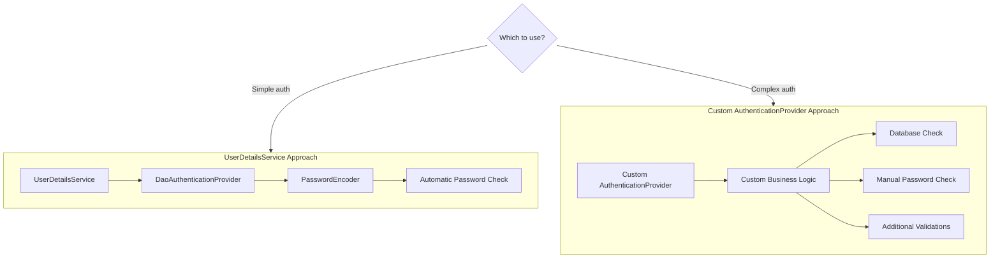
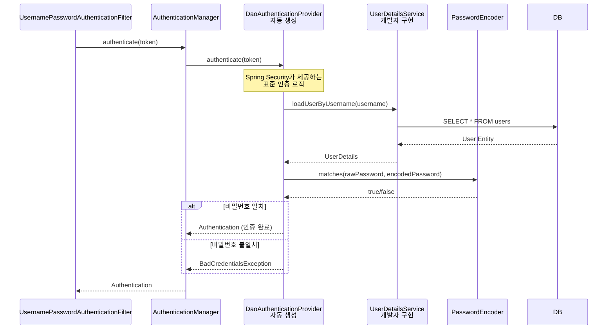
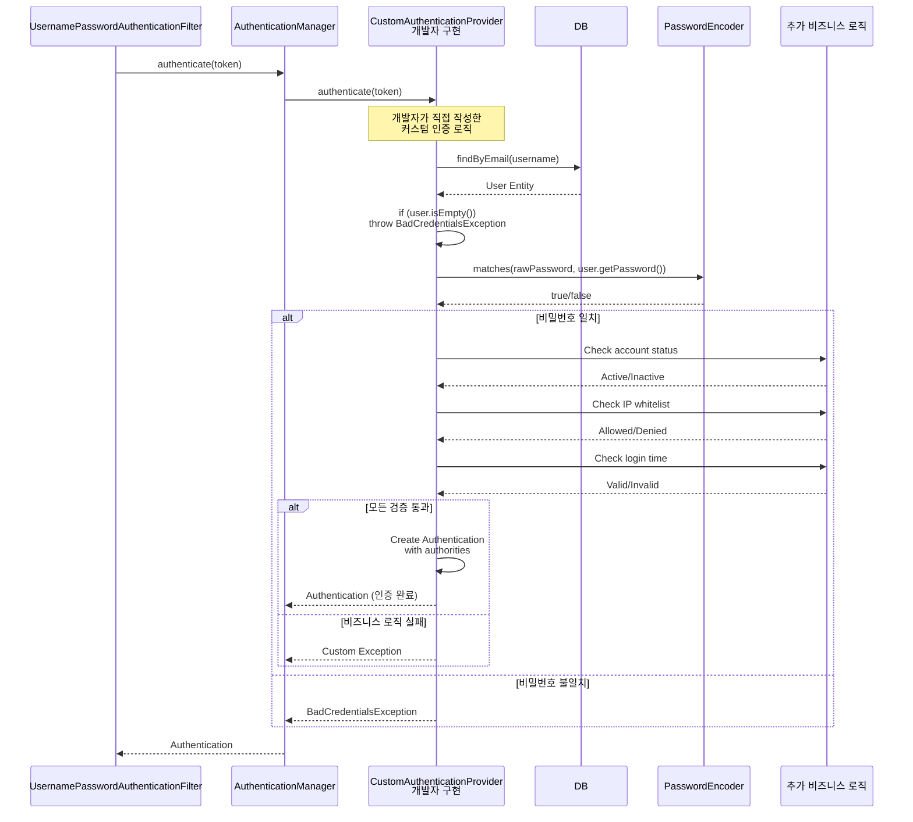
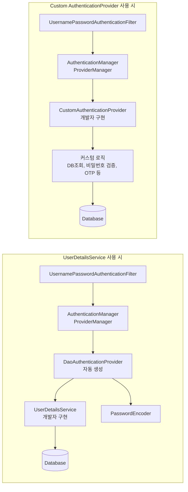
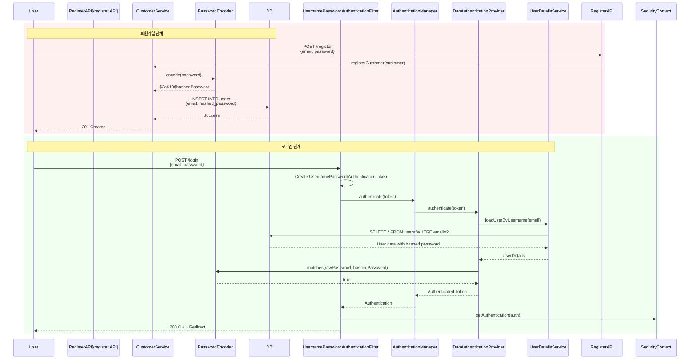
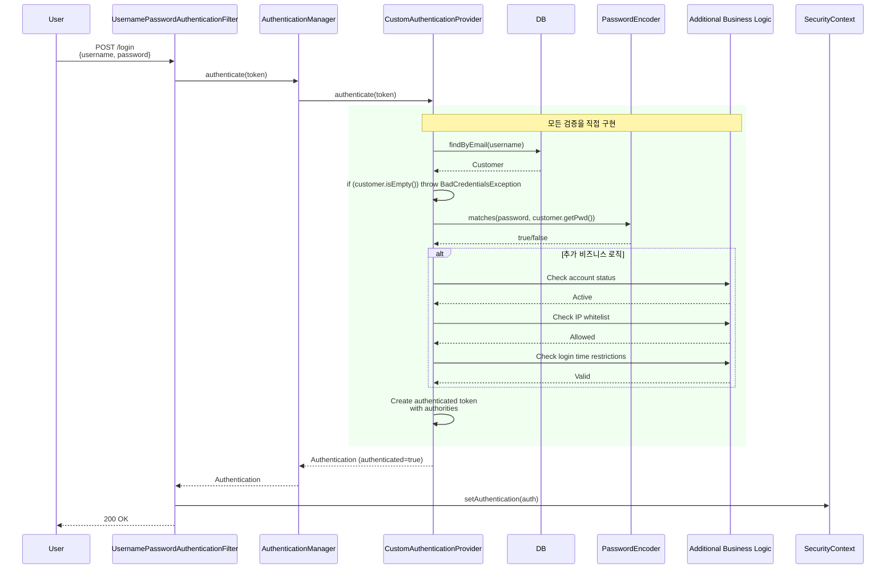

# WEEK 2: DB 연동 인증과 비밀번호 암호화

> **호환 버전**: Spring Boot 3.2.x, Spring Security 6.2.x ~ 7.0.x

### 학습 목표
- `JdbcUserDetailsManager`와 맞춤형 `UserDetailsService`를 통해 DB 연동 인증을 구현한다.
- `PasswordEncoder`의 중요성을 이해하고, `BCrypt`를 사용하여 안전하게 비밀번호를 관리한다.
- `AuthenticationProvider`를 직접 구현하여 비즈니스 로직이 포함된 인증 과정을 커스터마이징한다.

---

Week 1에서는 메모리 기반의 사용자로 인증을 처리했다. 이번 주차에서는 실제 애플리케이션의 요구사항에 맞춰, 데이터베이스에 사용자 정보를 저장하고 이를 Spring Security와 연동하는 방법, 그리고 가장 중요한 비밀번호를 안전하게 관리하는 방법에 대해 학습한다.

---

### 1. 데이터베이스 연동 인증

영구적인 사용자 정보 관리를 위해 데이터베이스 연동은 필수적이다. Spring Security는 데이터베이스로부터 사용자 정보를 조회하기 위한 두 가지 주요 방법을 제공한다.

#### 1.1. 방법 1: `JdbcUserDetailsManager` (기본 제공 방식)
Spring Security가 제공하는 기본 구현체로, 정해진 스키마에 따라 사용자 정보를 관리할 때 빠르게 인증 기능을 구축할 수 있다.

- **요구사항**: `users` 테이블과 `authorities` 테이블이라는 정해진 이름과 구조의 테이블이 필요하다.
- **설정**: `DataSource` Bean만 `JdbcUserDetailsManager`의 생성자에 주입하면 된다.

```java
import org.springframework.context.annotation.Bean;
import org.springframework.context.annotation.Configuration;
import org.springframework.security.core.userdetails.UserDetailsService;
import org.springframework.security.provisioning.JdbcUserDetailsManager;
import javax.sql.DataSource;

@Configuration
public class SecurityConfig {

    @Bean
    public UserDetailsService userDetailsService(DataSource dataSource) {
        // JdbcUserDetailsManager는 정해진 DB 스키마를 요구하므로 유연성이 떨어진다.
        return new JdbcUserDetailsManager(dataSource);
    }
    
    // ... 기타 설정 ...
}
```
**장점**: 간단한 설정.  
**단점**: 비즈니스 요구사항에 맞는 테이블 구조를 설계하기 어렵고, 확장성이 부족하다.

#### 1.2. 방법 2: 맞춤형 `UserDetailsService` 구현 (권장 방식)
실제 대부분의 프로젝트에서 사용하는 방식으로, 어떤 데이터베이스 스키마에도 적용할 수 있는 유연한 방법이다.

**구현 단계:**
1.  **JPA Entity 생성**: 비즈니스 요구사항에 맞는 사용자 테이블(e.g., `Customer`)에 매핑될 Entity 클래스를 정의한다.
2.  **JPA Repository 생성**: 해당 Entity에 접근하기 위한 `JpaRepository` 인터페이스를 생성한다.
3.  **`UserDetailsService` 구현**: `UserDetailsService` 인터페이스를 구현하는 서비스 클래스를 만들고, `loadUserByUsername()` 메소드를 오버라이드한다.

**코드 예제:**
`Customer` Entity와 `CustomerRepository`가 이미 정의되어 있다고 가정한다.

```java
import org.springframework.beans.factory.annotation.Autowired;
import org.springframework.security.core.GrantedAuthority;
import org.springframework.security.core.authority.SimpleGrantedAuthority;
import org.springframework.security.core.userdetails.User;
import org.springframework.security.core.userdetails.UserDetails;
import org.springframework.security.core.userdetails.UserDetailsService;
import org.springframework.security.core.userdetails.UsernameNotFoundException;
import org.springframework.stereotype.Service;

import java.util.ArrayList;
import java.util.List;

@Service
public class CustomUserDetailsService implements UserDetailsService {

    @Autowired
    private CustomerRepository customerRepository;

    @Override
    public UserDetails loadUserByUsername(String username) throws UsernameNotFoundException {
        List<Customer> customers = customerRepository.findByEmail(username);
        if (customers.isEmpty()) {
            throw new UsernameNotFoundException("User not found with email: " + username);
        }
        
        Customer customer = customers.get(0);
        
        List<GrantedAuthority> authorities = new ArrayList<>();
        authorities.add(new SimpleGrantedAuthority(customer.getRole()));

        // DB에서 조회한 정보로 Spring Security가 사용하는 UserDetails 객체를 생성하여 반환한다.
        return new User(customer.getEmail(), customer.getPwd(), authorities);
    }
}
```
이후 `SecurityConfig`에서 `JdbcUserDetailsManager` Bean을 제거하면, Spring Security는 자동으로 `@Service`로 등록된 `CustomUserDetailsService`를 사용한다.

#### 1.3. UserDetailsService vs AuthenticationProvider 비교

두 가지 접근 방식의 차이를 이해하는 것이 중요하다:



**언제 어떤 것을 사용할까?**
- **UserDetailsService**: 단순히 DB에서 사용자를 조회하고, 비밀번호 검증만 필요한 경우
- **AuthenticationProvider**: 추가적인 비즈니스 로직(예: IP 체크, 로그인 시간 제한, OTP 검증 등)이 필요한 경우

---

### 2. 안전한 비밀번호 관리 (`PasswordEncoder`)

사용자의 비밀번호를 절대 일반 텍스트로 저장해서는 안 된다. 해싱(Hashing)은 비밀번호를 복구 불가능한 형태로 변환하여 저장하는 표준 방식이다.

#### 2.1. 해싱(Hashing)이란?
해싱은 임의의 길이의 데이터를 고정된 길이의 데이터(해시 값)로 매핑하는 단방향 함수다. 원본 데이터를 절대 역추적할 수 없어야 좋은 해시 함수다. 로그인 시에는 사용자가 입력한 비밀번호를 동일한 방식으로 해싱하여 DB에 저장된 해시 값과 비교한다.

#### 2.2. `PasswordEncoder` 인터페이스
Spring Security는 비밀번호 암호화를 위해 `PasswordEncoder` 인터페이스를 제공한다.
- `String encode(CharSequence rawPassword)`: 회원가입 시 비밀번호를 해싱한다.
- `boolean matches(CharSequence rawPassword, String encodedPassword)`: 로그인 시 입력된 비밀번호와 저장된 해시 값을 비교한다.

#### 2.3. `PasswordEncoder` 구현체
- **`BCryptPasswordEncoder`**: 현재 가장 널리 사용되는 구현체. `Bcrypt`라는 강력한 해싱 알고리즘을 사용하며, 의도적으로 연산 비용을 높여 무차별 대입 공격(Brute-force attack)을 어렵게 만든다. **이것을 사용하는 것을 강력히 권장한다.**
- `SCryptPasswordEncoder`, `Argon2PasswordEncoder`: `BCrypt`보다 더 강력하지만 더 많은 메모리와 CPU 자원을 요구한다.
- `NoOpPasswordEncoder`: 비밀번호를 전혀 암호화하지 않는 구현체. 테스트 목적으로만 사용해야 하며, **운영 환경에서는 절대 사용하면 안된다.**

#### 2.4. 구현 예제

1.  **`PasswordEncoder` Bean 등록**: `BCryptPasswordEncoder`를 Bean으로 등록한다.
    ```java
    @Configuration
    public class SecurityConfig {
        @Bean
        public PasswordEncoder passwordEncoder() {
            return new BCryptPasswordEncoder();
        }
        // ... 기타 설정 ...
    }
    ```

2.  **회원가입 시 비밀번호 암호화**: 사용자를 등록하는 로직에서 `passwordEncoder.encode()`를 호출하여 비밀번호를 해싱한 후 저장한다.
    ```java
    @RestController
    public class RegistrationController {

        @Autowired
        private CustomerRepository customerRepository;

        @Autowired
        private PasswordEncoder passwordEncoder;

        @PostMapping("/register")
        public ResponseEntity<String> registerUser(@RequestBody Customer customer) {
            try {
                // 사용자가 입력한 비밀번호를 해싱한다.
                String hashedPwd = passwordEncoder.encode(customer.getPwd());
                customer.setPwd(hashedPwd);
                
                // 해싱된 비밀번호를 DB에 저장한다.
                Customer savedCustomer = customerRepository.save(customer);
                
                return ResponseEntity.status(HttpStatus.CREATED)
                    .body("User registered successfully with id: " + savedCustomer.getId());
            } catch (Exception ex) {
                return ResponseEntity.status(HttpStatus.INTERNAL_SERVER_ERROR)
                    .body("An error occurred: " + ex.getMessage());
            }
        }
    }
    ```
이제 로그인 시 `DaoAuthenticationProvider`는 자동으로 등록된 `BCryptPasswordEncoder`를 사용하여 `matches()` 메소드로 비밀번호를 안전하게 비교한다.

#### 2.5. 회원가입 전체 흐름 예제

실제 프로젝트의 전체 구조를 이해하기 위한 완전한 예제:

**Entity (Customer.java):**
```java
import jakarta.persistence.*;
import lombok.Data;

@Entity
@Table(name = "customers")
@Data
public class Customer {
    
    @Id
    @GeneratedValue(strategy = GenerationType.IDENTITY)
    private Long id;
    
    @Column(nullable = false, unique = true)
    private String email;
    
    @Column(nullable = false)
    private String pwd;
    
    @Column(nullable = false)
    private String role; // e.g., "ROLE_USER", "ROLE_ADMIN"
    
    private String name;
}
```

**Repository (CustomerRepository.java):**
```java
import org.springframework.data.jpa.repository.JpaRepository;
import org.springframework.stereotype.Repository;
import java.util.List;

@Repository
public interface CustomerRepository extends JpaRepository<Customer, Long> {
    List<Customer> findByEmail(String email);
}
```

**Service (CustomerService.java):**
```java
import org.springframework.beans.factory.annotation.Autowired;
import org.springframework.security.crypto.password.PasswordEncoder;
import org.springframework.stereotype.Service;

@Service
public class CustomerService {
    
    @Autowired
    private CustomerRepository customerRepository;
    
    @Autowired
    private PasswordEncoder passwordEncoder;
    
    public Customer registerCustomer(Customer customer) {
        // 비밀번호 암호화
        customer.setPwd(passwordEncoder.encode(customer.getPwd()));
        
        // 기본 역할 설정
        if (customer.getRole() == null || customer.getRole().isEmpty()) {
            customer.setRole("ROLE_USER");
        }
        
        return customerRepository.save(customer);
    }
}
```

**Controller (RegistrationController.java):**
```java
import org.springframework.beans.factory.annotation.Autowired;
import org.springframework.http.HttpStatus;
import org.springframework.http.ResponseEntity;
import org.springframework.web.bind.annotation.*;

@RestController
@RequestMapping("/api")
public class RegistrationController {
    
    @Autowired
    private CustomerService customerService;
    
    @PostMapping("/register")
    public ResponseEntity<?> registerUser(@RequestBody Customer customer) {
        try {
            Customer savedCustomer = customerService.registerCustomer(customer);
            return ResponseEntity.status(HttpStatus.CREATED)
                .body("User registered successfully");
        } catch (Exception ex) {
            return ResponseEntity.status(HttpStatus.BAD_REQUEST)
                .body("Registration failed: " + ex.getMessage());
        }
    }
}
```

**Security Configuration:**
```java
@Configuration
public class SecurityConfig {
    
    @Bean
    SecurityFilterChain defaultSecurityFilterChain(HttpSecurity http) throws Exception {
        http
            .csrf(csrf -> csrf
                .ignoringRequestMatchers("/api/register") // 회원가입은 CSRF 제외
            )
            .authorizeHttpRequests(requests -> requests
                .requestMatchers("/api/register").permitAll()
                .requestMatchers("/myAccount/**").authenticated()
                .anyRequest().permitAll()
            )
            .formLogin(withDefaults())
            .httpBasic(withDefaults());
        return http.build();
    }
    
    @Bean
    public PasswordEncoder passwordEncoder() {
        return new BCryptPasswordEncoder();
    }
}
```

---

### 3. 맞춤형 인증 논리 (`AuthenticationProvider`)

기본적인 `DaoAuthenticationProvider`가 수행하는 '사용자 조회 -> 비밀번호 비교' 이상의 복잡한 인증 로직이 필요할 때, `AuthenticationProvider`를 직접 구현할 수 있다.

- **사용 시나리오**:
  - 아이디/비밀번호 외에 OTP, 인증서 등 추가 인증 수단이 필요한 경우
  - 특정 국가의 사용자만 로그인을 허용하는 등 비즈니스 규칙이 포함된 인증이 필요한 경우

**구현 단계:**
1.  `AuthenticationProvider` 인터페이스를 구현하는 클래스를 만든다.
2.  `supports()`: 이 Provider가 처리할 `Authentication` 토큰 타입을 지정한다 (보통 `UsernamePasswordAuthenticationToken`).
3.  `authenticate()`: 실질적인 인증 로직을 작성한다. DB 조회, 비밀번호 비교, 추가 인증 규칙 검사를 모두 이 메소드 안에서 수행한다.

**코드 예제:**

```java
import org.springframework.beans.factory.annotation.Autowired;
import org.springframework.security.authentication.AuthenticationProvider;
import org.springframework.security.authentication.BadCredentialsException;
import org.springframework.security.authentication.UsernamePasswordAuthenticationToken;
import org.springframework.security.core.Authentication;
import org.springframework.security.core.AuthenticationException;
import org.springframework.security.core.GrantedAuthority;
import org.springframework.security.core.authority.SimpleGrantedAuthority;
import org.springframework.security.crypto.password.PasswordEncoder;
import org.springframework.stereotype.Component;

import java.util.ArrayList;
import java.util.List;

@Component
public class CustomAuthenticationProvider implements AuthenticationProvider {

    @Autowired
    private CustomerRepository customerRepository;

    @Autowired
    private PasswordEncoder passwordEncoder;

    @Override
    public Authentication authenticate(Authentication authentication) throws AuthenticationException {
        String username = authentication.getName();
        String pwd = authentication.getCredentials().toString();

        List<Customer> customers = customerRepository.findByEmail(username);
        if (customers.isEmpty()) {
            throw new BadCredentialsException("No user registered with this details!");
        }

        Customer customer = customers.get(0);
        
        // 비밀번호 검증
        if (passwordEncoder.matches(pwd, customer.getPwd())) {
            List<GrantedAuthority> authorities = new ArrayList<>();
            authorities.add(new SimpleGrantedAuthority(customer.getRole()));
            
            // 추가 비즈니스 로직 예시: 계정 상태 확인
            // if (!customer.isActive()) {
            //     throw new BadCredentialsException("Account is disabled!");
            // }
            
            // 인증 성공 시, 인증된 Authentication 객체를 생성하여 반환한다.
            return new UsernamePasswordAuthenticationToken(username, pwd, authorities);
        } else {
            throw new BadCredentialsException("Invalid password!");
        }
    }

    @Override
    public boolean supports(Class<?> authentication) {
        // 이 Provider가 UsernamePasswordAuthenticationToken 타입의 인증을 처리함을 명시한다.
        return (UsernamePasswordAuthenticationToken.class.isAssignableFrom(authentication));
    }
}
```
> **전문가 Tip**: `@Component`로 등록된 맞춤형 `AuthenticationProvider`는 `DaoAuthenticationProvider`를 대체하는 강력한 대안이다. 특히 단순한 자격 증명 확인을 넘어, 비즈니스 규칙(계정 상태, 특정 조건 등)에 따른 복잡한 인증 로직이 필요할 때, 관련 로직을 `authenticate()` 메소드 내에 모두 캡슐화할 수 있다. 이는 `UserDetailsService`를 사용하는 것보다 더 응집력 있고 명확한 코드를 만들 수 있게 해준다.

---

### 3.4. Bean 선택에 따른 필터 체인 변화: UserDetailsService vs AuthenticationProvider

Week 1에서 `UserDetailsService`와 `PasswordEncoder` Bean이 필터 체인에 미치는 영향을 학습했다. Week 2에서는 더 나아가 `AuthenticationProvider`를 직접 구현했을 때 필터 체인이 어떻게 달라지는지 비교한다.

#### 3.4.1. Bean 등록에 따른 AuthenticationManager 구성 변화

```mermaid
graph TB
    subgraph Approach1[방법 1: UserDetailsService Bean 등록]
        UDS1[UserDetailsService<br/>@Bean 등록]
        PE1[PasswordEncoder<br/>@Bean 등록]
        DAO1[DaoAuthenticationProvider<br/>✅ 자동 생성]
        AM1[AuthenticationManager<br/>ProviderManager]
        
        UDS1 -->|자동 주입| DAO1
        PE1 -->|자동 주입| DAO1
        DAO1 -->|자동 등록| AM1
    end
    
    subgraph Approach2[방법 2: AuthenticationProvider Bean 등록]
        CAP[CustomAuthenticationProvider<br/>@Component 등록]
        AM2[AuthenticationManager<br/>ProviderManager]
        PE2[PasswordEncoder<br/>@Bean 등록]
        
        PE2 -.->|개발자가 직접 주입| CAP
        CAP -->|자동 등록| AM2
        
        Note1[DaoAuthenticationProvider<br/>❌ 생성되지 않음]
        style Note1 fill:#ffe6e6,stroke:#ff0000
    end
    
    subgraph Filters[공통: 영향받는 필터]
        UPF[UsernamePasswordAuthenticationFilter]
        BAF[BasicAuthenticationFilter]
    end
    
    AM1 --> Filters
    AM2 --> Filters
    
    style DAO1 fill:#e6ffe6
    style CAP fill:#ffe6cc
```

#### 3.4.2. 필터 체인 실행 흐름 비교

**UserDetailsService 방식:**



**AuthenticationProvider 방식:**



#### 3.4.3. 상세 비교표

| 특성 | UserDetailsService 방식 | AuthenticationProvider 방식 |
|------|------------------------|---------------------------|
| **자동 생성 컴포넌트** | `DaoAuthenticationProvider` 자동 생성 | 자동 생성 없음 (직접 구현) |
| **비밀번호 검증** | `DaoAuthenticationProvider`가 자동 처리 | 개발자가 직접 `PasswordEncoder.matches()` 호출 필요 |
| **DB 조회** | `loadUserByUsername()` 메소드만 구현 | `authenticate()` 메소드 내에서 직접 Repository 호출 |
| **추가 검증 로직** | 불가능 (UserDetails 반환만 가능) | 자유롭게 추가 가능 (IP 체크, 시간 제한, OTP 등) |
| **예외 처리** | Spring Security가 표준 예외 발생 | 커스텀 예외 메시지 및 타입 설정 가능 |
| **코드 복잡도** | 낮음 (간단함) | 높음 (모든 로직 직접 구현) |
| **유연성** | 낮음 | 높음 |
| **영향받는 필터** | `UsernamePasswordAuthenticationFilter`<br/>`BasicAuthenticationFilter` | 동일 |

#### 3.4.4. 실전 예제: Bean 등록에 따른 필터 동작 변화

**시나리오 1: UserDetailsService만 등록**

```java
@Configuration
public class SecurityConfig {
    
    @Bean
    public PasswordEncoder passwordEncoder() {
        return new BCryptPasswordEncoder();
    }
    
    @Bean
    public UserDetailsService userDetailsService() {
        return new CustomUserDetailsService(); // 개발자 구현
    }
    
    // AuthenticationProvider는 등록하지 않음
}
```

**결과:**
- `DaoAuthenticationProvider` 자동 생성 ✅
- `UsernamePasswordAuthenticationFilter`에서 표준 인증 흐름 사용
- 비밀번호 검증은 Spring Security가 자동 처리

**시나리오 2: AuthenticationProvider 등록 (UserDetailsService 무시됨)**

```java
@Configuration
public class SecurityConfig {
    
    @Bean
    public PasswordEncoder passwordEncoder() {
        return new BCryptPasswordEncoder();
    }
    
    @Bean
    public UserDetailsService userDetailsService() {
        return new CustomUserDetailsService(); // ❌ 무시됨!
    }
    
    @Component
    public class CustomAuthenticationProvider implements AuthenticationProvider {
        // 개발자가 직접 인증 로직 구현
    }
}
```

**결과:**
- `DaoAuthenticationProvider` 생성되지 않음 ❌
- `UserDetailsService` Bean이 있어도 **사용되지 않음**
- `CustomAuthenticationProvider`가 모든 인증 처리
- 비밀번호 검증을 직접 코드로 구현해야 함

> **⚠️ 주의**: `AuthenticationProvider` Bean이 등록되면 `UserDetailsService`는 **완전히 무시**됩니다. 두 방식은 배타적(Exclusive)입니다!

#### 3.4.5. 필터 체인 레벨에서의 차이점

두 방식 모두 동일한 필터들을 사용하지만, 내부 처리가 다르다:

```java
// UsernamePasswordAuthenticationFilter의 핵심 로직
public Authentication attemptAuthentication(HttpServletRequest request, ...) {
    String username = obtainUsername(request);
    String password = obtainPassword(request);
    
    UsernamePasswordAuthenticationToken authRequest = 
        UsernamePasswordAuthenticationToken.unauthenticated(username, password);
    
    // AuthenticationManager에 위임
    // → 여기서 UserDetailsService 방식과 AuthenticationProvider 방식이 갈림
    return this.getAuthenticationManager().authenticate(authRequest);
}
```

**AuthenticationManager 내부에서:**

```java
// ProviderManager.authenticate() 간소화
public Authentication authenticate(Authentication authentication) {
    for (AuthenticationProvider provider : getProviders()) {
        if (!provider.supports(authentication.getClass())) {
            continue;
        }
        
        try {
            // UserDetailsService 방식: DaoAuthenticationProvider 호출
            // AuthenticationProvider 방식: CustomAuthenticationProvider 호출
            return provider.authenticate(authentication);
        } catch (AuthenticationException e) {
            lastException = e;
        }
    }
    throw lastException;
}
```

#### 3.4.6. 언제 어떤 방식을 선택할까?

| 사용 사례 | 추천 방식 | 이유 |
|---------|---------|------|
| 단순 DB 조회 + 비밀번호 검증 | UserDetailsService | 간단하고 Spring Security 표준 활용 |
| 추가 인증 수단 (OTP, 인증서) | AuthenticationProvider | 커스텀 로직 자유롭게 추가 |
| IP 기반 접근 제어 | AuthenticationProvider | 요청 정보(IP 등) 접근 필요 |
| 시간대별 로그인 제한 | AuthenticationProvider | 비즈니스 규칙 구현 |
| 다중 인증 방식 (폼 + LDAP) | 여러 AuthenticationProvider | 각 방식별로 Provider 구현 |
| 학습 목적 | UserDetailsService | Spring Security 기본 동작 이해 |

#### 3.4.7. 디버깅 팁: 어떤 Provider가 사용되는지 확인

```java
import org.springframework.boot.CommandLineRunner;
import org.springframework.security.authentication.AuthenticationManager;
import org.springframework.security.authentication.ProviderManager;
import org.springframework.security.config.annotation.authentication.configuration.AuthenticationConfiguration;
import org.springframework.stereotype.Component;

@Component
public class AuthenticationDebugger implements CommandLineRunner {
    
    private final AuthenticationConfiguration authConfig;
    
    public AuthenticationDebugger(AuthenticationConfiguration authConfig) {
        this.authConfig = authConfig;
    }
    
    @Override
    public void run(String... args) throws Exception {
        AuthenticationManager am = authConfig.getAuthenticationManager();
        
        if (am instanceof ProviderManager) {
            ProviderManager pm = (ProviderManager) am;
            System.out.println("========== Authentication Providers ==========");
            pm.getProviders().forEach(provider -> {
                System.out.println("Provider: " + provider.getClass().getName());
                // UserDetailsService 방식: DaoAuthenticationProvider
                // AuthenticationProvider 방식: CustomAuthenticationProvider
            });
            System.out.println("===============================================");
        }
    }
}
```

**출력 예시:**

```
// UserDetailsService 등록 시:
========== Authentication Providers ==========
Provider: org.springframework.security.authentication.dao.DaoAuthenticationProvider
===============================================

// AuthenticationProvider 등록 시:
========== Authentication Providers ==========
Provider: com.example.security.CustomAuthenticationProvider
===============================================
```

> **전문가 Tip**: 실무에서는 대부분 `UserDetailsService` 방식으로 충분합니다. 하지만 복잡한 비즈니스 요구사항(예: 특정 시간대에만 로그인 허용, IP 화이트리스트 등)이 있다면 `AuthenticationProvider`를 직접 구현하여 완전한 제어권을 가져가는 것이 유리합니다. 두 방식은 **배타적**이므로 프로젝트 초기에 신중히 선택해야 합니다.

---

### 4. 인증 실패 예외 처리

실무에서는 사용자에게 적절한 피드백을 제공하기 위해 인증 실패를 처리하는 것이 중요하다.

#### 4.1. 주요 예외 타입
- `UsernameNotFoundException`: 사용자를 찾을 수 없을 때
- `BadCredentialsException`: 비밀번호가 일치하지 않을 때
- `DisabledException`: 계정이 비활성화되었을 때
- `LockedException`: 계정이 잠겼을 때
- `AccountExpiredException`: 계정이 만료되었을 때

#### 4.2. 커스텀 실패 핸들러

```java
import org.springframework.security.web.authentication.AuthenticationFailureHandler;
import jakarta.servlet.ServletException;
import jakarta.servlet.http.HttpServletRequest;
import jakarta.servlet.http.HttpServletResponse;
import org.springframework.security.core.AuthenticationException;
import java.io.IOException;

@Component
public class CustomAuthenticationFailureHandler implements AuthenticationFailureHandler {
    
    @Override
    public void onAuthenticationFailure(HttpServletRequest request, 
                                       HttpServletResponse response,
                                       AuthenticationException exception) 
            throws IOException, ServletException {
        
        response.setStatus(HttpServletResponse.SC_UNAUTHORIZED);
        response.setContentType("application/json");
        
        String errorMessage = "Authentication failed: " + exception.getMessage();
        
        response.getWriter().write(
            "{\"error\": \"" + errorMessage + "\"}"
        );
    }
}
```

**SecurityConfig에 적용:**
```java
@Autowired
private CustomAuthenticationFailureHandler failureHandler;

@Bean
SecurityFilterChain defaultSecurityFilterChain(HttpSecurity http) throws Exception {
    http
        .formLogin(form -> form
            .failureHandler(failureHandler)
        )
        // ... 기타 설정 ...
    ;
    return http.build();
}
```

---

### 5. 인증 Provider와 필터 체인의 관계

`UserDetailsService`와 `AuthenticationProvider`가 필터 체인과 어떻게 상호작용하는지 이해하는 것이 중요하다.

#### 5.1. UserDetailsService vs AuthenticationProvider가 필터 체인에 미치는 영향



#### 5.2. AuthenticationManager 설정 변화

| 설정 방식 | AuthenticationManager 구성 | 장점 | 단점 |
|----------|--------------------------|------|------|
| UserDetailsService Bean 등록 | DaoAuthenticationProvider 자동 생성 | 간단함, Spring Security가 비밀번호 검증 자동 처리 | 비밀번호 검증 + 사용자 조회만 가능 |
| AuthenticationProvider Bean 등록 | 커스텀 Provider 직접 사용 | 유연한 로직, 추가 검증 가능 | 코드 복잡도 증가, 모든 검증 직접 구현 |

#### 5.3. 회원가입 → 로그인 전체 필터 플로우



**핵심 포인트:**
1. **회원가입**: `PasswordEncoder`로 비밀번호를 해싱하여 DB에 저장
2. **로그인**: 
   - `UsernamePasswordAuthenticationFilter`가 요청 가로채기
   - `AuthenticationManager` → `DaoAuthenticationProvider` 호출
   - `UserDetailsService`로 DB에서 사용자 조회
   - `PasswordEncoder.matches()`로 비밀번호 검증
   - 성공 시 `SecurityContext`에 인증 정보 저장

#### 5.4. Custom AuthenticationProvider 사용 시 플로우 변화



**Custom AuthenticationProvider의 장점:**
- ✅ 모든 인증 로직을 한 곳에서 관리
- ✅ 비즈니스 요구사항에 따른 유연한 검증
- ✅ 추가 인증 수단(OTP, 인증서 등) 통합 용이
- ✅ 인증 실패 시 상세한 예외 메시지 제공

**단점:**
- ❌ 코드 복잡도 증가
- ❌ 비밀번호 검증 등 Spring Security가 제공하는 기능을 직접 구현해야 함
- ❌ 유지보수 책임 증가

---

## FAQ

**Q: DB에 비밀번호를 저장할 때 암호화를 두 번 하는 것 같은데요?**  
A: 아닙니다. `User.builder().password(rawPassword).build()`는 평문을 받고, 실제 암호화는 Bean으로 등록된 `PasswordEncoder`가 한 번만 수행합니다.

**Q: `UserDetailsService`와 `AuthenticationProvider` 중 어느 것을 사용해야 하나요?**  
A: 
- 단순 인증만 필요: `UserDetailsService` 구현
- 복잡한 인증 로직(OTP, IP 체크 등) 필요: `AuthenticationProvider` 구현

**Q: 비밀번호가 BCrypt로 암호화되었는지 어떻게 확인하나요?**  
A: DB에 저장된 비밀번호가 `$2a$` 또는 `$2b$`로 시작하면 BCrypt로 암호화된 것입니다. 길이는 약 60자입니다.

**Q: 회원가입할 때 CSRF 토큰 에러가 발생합니다.**  
A: REST API의 경우 `.csrf().ignoringRequestMatchers("/api/register")`로 회원가입 엔드포인트를 제외하거나, 클라이언트가 CSRF 토큰을 함께 전송하도록 해야 합니다. CSRF에 대해서는 WEEK 3에서 자세히 다룹니다.

**Q: 같은 이메일로 중복 가입이 되는 것을 막으려면?**  
A: 
1. DB 테이블의 email 컬럼에 `UNIQUE` 제약 조건 추가
2. Service 레이어에서 `customerRepository.findByEmail()`로 중복 체크 후 예외 발생

**Q: 로그인 성공 후 특정 페이지로 리디렉션하려면?**  
A: `.formLogin(form -> form.defaultSuccessUrl("/dashboard", true))`로 설정하세요.

---

**다음 주차 예고**: WEEK 3에서는 CORS, CSRF와 같은 웹 보안 취약점을 방어하고, 역할 기반의 권한 부여(Authorization)를 구현하는 방법을 학습합니다!
