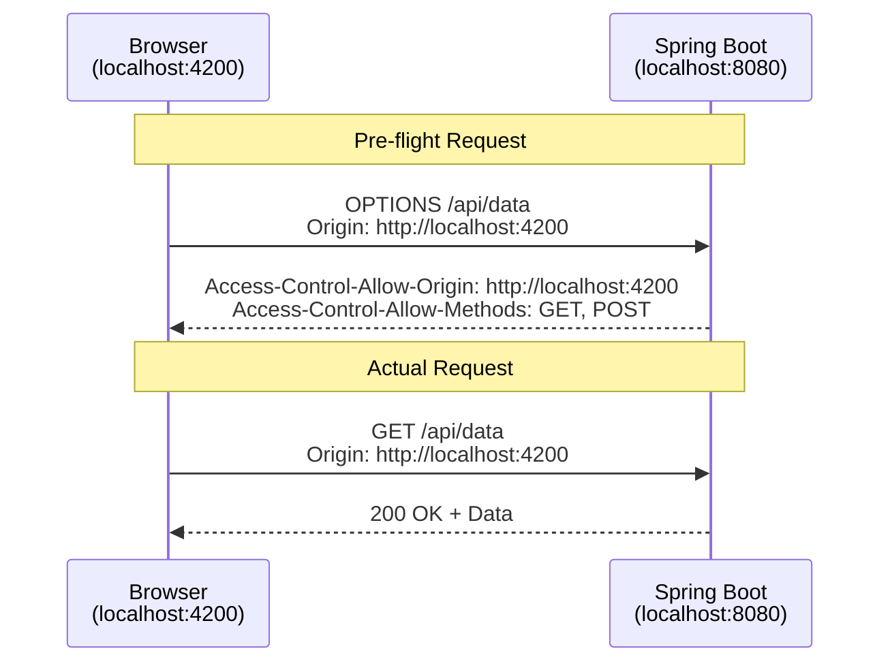
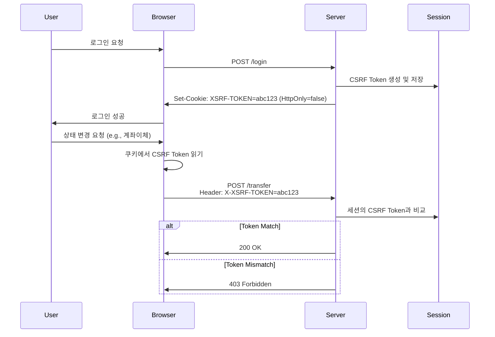
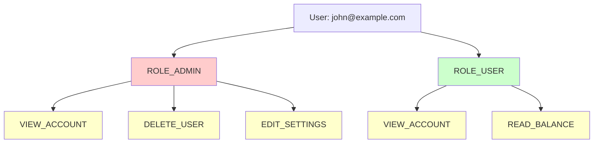
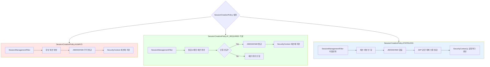
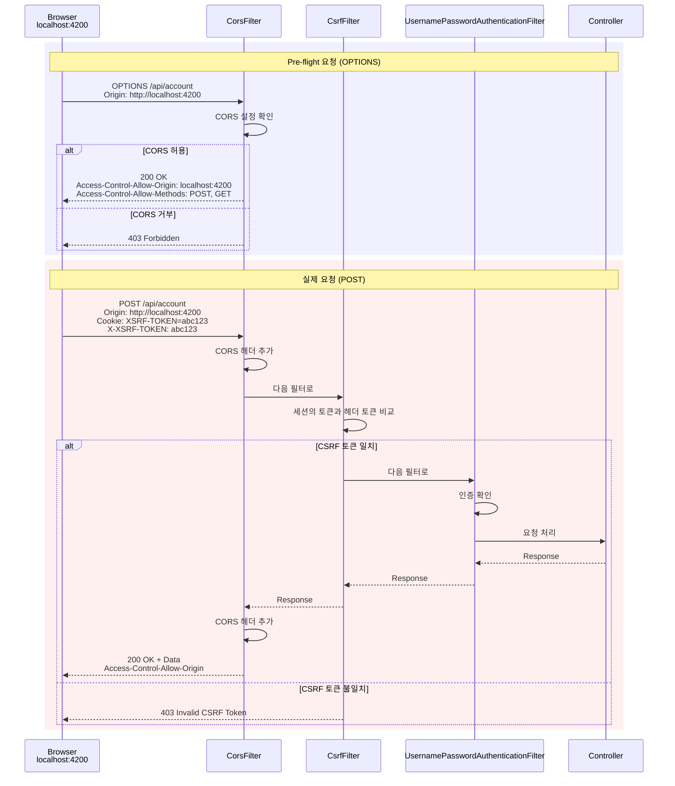
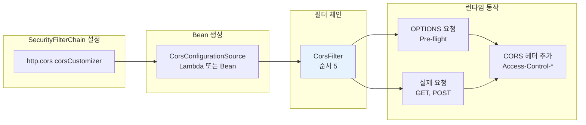
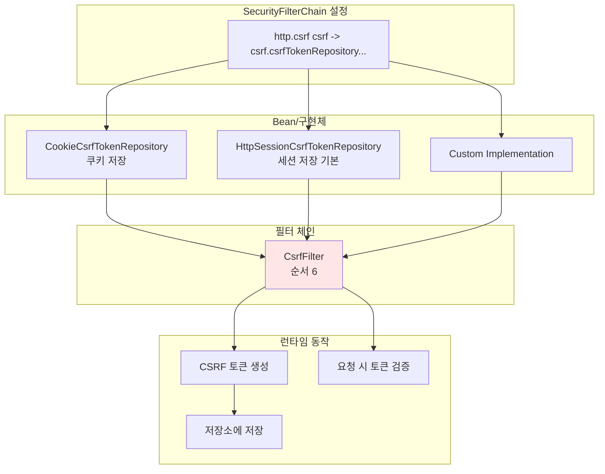
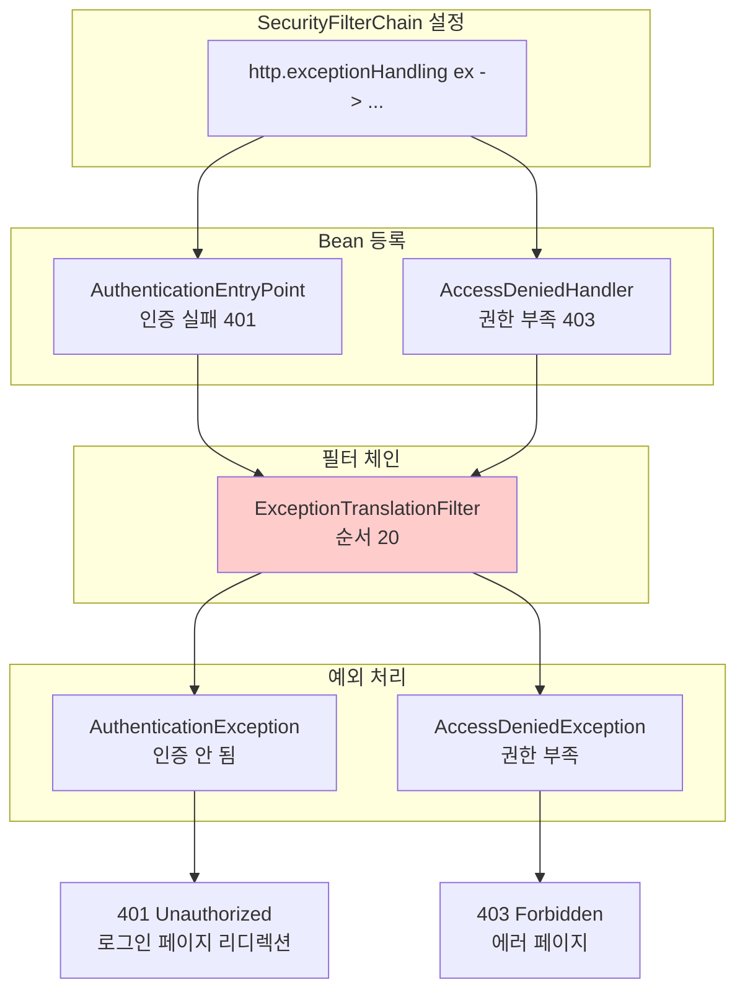

# WEEK 3: CORS, CSRF 보안 및 권한 부여(Authorization)

> **호환 버전**: Spring Boot 3.2.x, Spring Security 6.2.x ~ 7.0.x

### 학습 목표
- CORS(Cross-Origin Resource Sharing)의 개념을 이해하고 Spring Security에서 설정하는 방법을 학습한다.
- CSRF(Cross-Site Request Forgery) 공격의 원리를 이해하고, 동기화 토큰 패턴을 이용한 방어 전략을 구현한다.
- 인증(Authentication)과 인가(Authorization)의 차이를 명확히 하고, 역할(Role)과 권한(Authority)에 기반한 URL 접근 제어를 설정한다.

---

Week 2까지 사용자 인증과 비밀번호 관리에 대해 학습했다. 이번 주차에서는 웹 애플리케이션에서 반드시 다뤄야 할 두 가지 주요 보안 주제인 CORS와 CSRF, 그리고 인증된 사용자의 접근을 제어하는 권한 부여(Authorization)에 대해 학습한다.

---

### 1. CORS (Cross-Origin Resource Sharing) 설정

#### 1.1. CORS란?
CORS는 '교차 출처 리소스 공유'를 의미한다. 브라우저는 보안상의 이유로 스크립트에서 시작하는 교차 출처(Cross-Origin) HTTP 요청을 제한한다. '출처(Origin)'는 프로토콜, 도메인, 포트 번호의 조합으로 결정되며, 이 중 하나라도 다르면 교차 출처로 간주된다.

예를 들어, 프론트엔드(React, Angular 등)가 `http://localhost:4200`에서 실행되고 백엔드 API가 `http://localhost:8080`에서 실행될 때, 포트 번호가 다르므로 브라우저는 이 둘 간의 통신을 CORS 정책 위반으로 차단한다.

**CORS 에러 예시:**
```
Access to XMLHttpRequest at 'http://localhost:8080/api/data' from origin 
'http://localhost:4200' has been blocked by CORS policy: No 
'Access-Control-Allow-Origin' header is present on the requested resource.
```

#### 1.2. Pre-flight 요청
실제 요청(GET, POST 등)을 보내기 전에, 브라우저는 `OPTIONS` HTTP 메소드를 사용하여 'Pre-flight' 요청을 먼저 보낸다. 서버는 이 요청에 대한 응답으로 어떤 출처, 메소드, 헤더를 허용하는지 알려주어야 하며, 브라우저는 이 응답을 보고 실제 요청을 보낼지 결정한다.



#### 1.3. Spring Security를 이용한 CORS 설정
가장 권장되는 방법은 `SecurityFilterChain` 내에서 CORS 관련 설정을 중앙 관리하는 것이다.

```java
import org.springframework.context.annotation.Bean;
import org.springframework.context.annotation.Configuration;
import org.springframework.security.config.annotation.web.builders.HttpSecurity;
import org.springframework.security.web.SecurityFilterChain;
import org.springframework.web.cors.CorsConfiguration;
import org.springframework.web.cors.CorsConfigurationSource;

import jakarta.servlet.http.HttpServletRequest;
import java.util.Collections;
import java.util.Arrays;

@Configuration
public class SecurityConfig {

    @Bean
    SecurityFilterChain defaultSecurityFilterChain(HttpSecurity http) throws Exception {
        http
            .cors(corsCustomizer -> corsCustomizer.configurationSource(new CorsConfigurationSource() {
                @Override
                public CorsConfiguration getCorsConfiguration(HttpServletRequest request) {
                    CorsConfiguration config = new CorsConfiguration();
                    // 허용할 프론트엔드 출처를 지정한다.
                    config.setAllowedOrigins(Collections.singletonList("http://localhost:4200"));
                    // 모든 HTTP 메소드를 허용한다.
                    config.setAllowedMethods(Collections.singletonList("*"));
                    // 인증 정보(쿠키 등)를 포함한 요청을 허용한다.
                    config.setAllowCredentials(true);
                    // 모든 헤더를 허용한다.
                    config.setAllowedHeaders(Collections.singletonList("*"));
                    // Pre-flight 요청의 결과를 캐시할 시간을 설정한다.
                    config.setMaxAge(3600L);
                    return config;
                }
            }))
            // ... 기타 설정 ...
        ;
        return http.build();
    }
}
```

#### 1.4. 실제 프론트엔드 연동 시나리오

**React 예제 (fetch API):**
```javascript
// React 컴포넌트 (http://localhost:4200에서 실행)
fetch('http://localhost:8080/api/myAccount', {
    method: 'GET',
    credentials: 'include', // 쿠키를 함께 전송
    headers: {
        'Content-Type': 'application/json',
    }
})
.then(response => response.json())
.then(data => console.log(data))
.catch(error => console.error('Error:', error));
```

**Spring Boot 백엔드:**
```java
@RestController
@RequestMapping("/api")
public class AccountController {
    
    @GetMapping("/myAccount")
    public ResponseEntity<Account> getAccount(@AuthenticationPrincipal UserDetails user) {
        // CORS가 올바르게 설정되어 있으면 localhost:4200에서 호출 가능
        Account account = accountService.getAccountByEmail(user.getUsername());
        return ResponseEntity.ok(account);
    }
}
```

> **초보자 Tip**: 개발 환경에서는 `setAllowedOrigins(Collections.singletonList("*"))`로 모든 출처를 허용할 수 있지만, **운영 환경에서는 절대 사용하지 마세요!** 반드시 실제 프론트엔드 도메인만 명시해야 합니다.

---

### 2. CSRF (Cross-Site Request Forgery) 방어

#### 2.1. CSRF 공격이란?
CSRF는 사용자가 자신의 의지와는 무관하게 공격자가 의도한 행위(수정, 등록, 삭제 등)를 특정 웹사이트에 요청하게 만드는 공격이다. 사용자가 이미 로그인된 상태라면, 브라우저는 요청 시 자동으로 세션 쿠키를 포함하므로 서버는 이 요청을 정상적인 사용자의 요청으로 착각하게 된다.

**CSRF 공격 시나리오:**
1. 사용자가 은행 사이트(`bank.com`)에 로그인
2. 사용자가 악성 사이트(`evil.com`)를 방문
3. `evil.com`의 숨겨진 폼이 자동으로 `bank.com/transfer`에 계좌이체 요청을 보냄
4. 브라우저가 자동으로 `bank.com`의 세션 쿠키를 포함하여 전송
5. 은행 서버는 정상 요청으로 착각하고 계좌이체 처리

Spring Security는 기본적으로 `GET`을 제외한 모든 상태 변경 요청에 대해 CSRF 방어를 활성화한다.

#### 2.2. 해결책: 동기화 토큰 패턴 (Synchronizer Token Pattern)
Spring Security는 CSRF 공격을 방어하기 위해 '동기화 토큰 패턴'을 사용한다.



**동작 원리:**
1.  **토큰 생성 및 전달**: 사용자가 인증되면, 서버는 예측 불가능한 임의의 'CSRF 토큰'을 생성하여 사용자 세션에 저장하고, 동일한 토큰을 클라이언트에게 전달한다. (주로 `HttpOnly`가 아닌 쿠키를 통해 전달)
2.  **토큰 포함 요청**: 클라이언트는 상태를 변경하는 모든 요청(`POST`, `PUT` 등) 시, 쿠키에서 읽은 CSRF 토큰을 HTTP 헤더(예: `X-XSRF-TOKEN`)에 담아 서버로 전송한다.
3.  **토큰 검증**: 서버는 요청 헤더의 토큰 값과 서버 세션에 저장된 토큰 값을 비교하여 일치할 경우에만 요청을 처리한다.

공격자는 사용자의 쿠키를 훔쳐볼 수 없으므로(Same-Origin Policy), 헤더에 올바른 CSRF 토큰을 담아 보낼 수 없어 공격이 실패하게 된다.

#### 2.3. Spring Security CSRF 설정 예제
`CookieCsrfTokenRepository`를 사용하여 토큰을 쿠키로 관리하고, 특정 필터를 추가하여 UI가 토큰을 쉽게 사용할 수 있도록 설정한다.

```java
import org.springframework.security.config.http.SessionCreationPolicy;
import org.springframework.security.web.authentication.www.BasicAuthenticationFilter;
import org.springframework.security.web.csrf.CookieCsrfTokenRepository;
import org.springframework.security.web.csrf.CsrfTokenRequestAttributeHandler;
// ... (기존 import)

@Configuration
public class SecurityConfig {

    @Bean
    SecurityFilterChain defaultSecurityFilterChain(HttpSecurity http) throws Exception {
        CsrfTokenRequestAttributeHandler requestHandler = new CsrfTokenRequestAttributeHandler();
        requestHandler.setCsrfRequestAttributeName("_csrf");

        http
            // 세션을 필요에 따라 생성 (Spring Security 7.0 권장 방식)
            .sessionManagement(session -> session
                .sessionCreationPolicy(SessionCreationPolicy.IF_REQUIRED)
            )
            .csrf(csrf -> csrf
                .csrfTokenRequestHandler(requestHandler)
                .ignoringRequestMatchers("/contact", "/register") // CSRF 보호를 비활성화할 URL 지정
                // CSRF 토큰을 HttpOnly=false 쿠키에 저장하여 JS가 읽을 수 있도록 한다.
                .csrfTokenRepository(CookieCsrfTokenRepository.withHttpOnlyFalse())
            )
            // BasicAuthenticationFilter 이후에 커스텀 필터를 추가하여, 생성된 CSRF 토큰을 응답 헤더에도 포함시킨다.
            .addFilterAfter(new CsrfCookieFilter(), BasicAuthenticationFilter.class)
            // ... (CORS, authorizeHttpRequests 등 기타 설정) ...
        ;
        return http.build();
    }
}
```

**CsrfCookieFilter.java (커스텀 필터):**
```java
import jakarta.servlet.FilterChain;
import jakarta.servlet.ServletException;
import jakarta.servlet.http.HttpServletRequest;
import jakarta.servlet.http.HttpServletResponse;
import org.springframework.security.web.csrf.CsrfToken;
import org.springframework.web.filter.OncePerRequestFilter;

import java.io.IOException;

public class CsrfCookieFilter extends OncePerRequestFilter {

    @Override
    protected void doFilterInternal(HttpServletRequest request, HttpServletResponse response, 
                                     FilterChain filterChain) throws ServletException, IOException {
        CsrfToken csrfToken = (CsrfToken) request.getAttribute(CsrfToken.class.getName());
        if (csrfToken != null) {
            // CSRF 토큰을 응답 헤더에 추가하여 프론트엔드에서 쉽게 접근 가능하도록 함
            response.setHeader(csrfToken.getHeaderName(), csrfToken.getToken());
        }
        filterChain.doFilter(request, response);
    }
}
```

> **`CsrfCookieFilter`**: 서버에서 생성된 CSRF 토큰을 응답 헤더에 명시적으로 추가하여, 프론트엔드에서 쉽게 토큰 값을 획득할 수 있도록 돕는 커스텀 필터다.

#### 2.4. React에서 CSRF 토큰 사용하기

```javascript
// CSRF 토큰을 쿠키에서 읽는 함수
function getCsrfToken() {
    const name = 'XSRF-TOKEN=';
    const decodedCookie = decodeURIComponent(document.cookie);
    const cookieArray = decodedCookie.split(';');
    
    for(let cookie of cookieArray) {
        cookie = cookie.trim();
        if (cookie.indexOf(name) === 0) {
            return cookie.substring(name.length);
        }
    }
    return null;
}

// POST 요청 시 CSRF 토큰 포함
fetch('http://localhost:8080/api/transfer', {
    method: 'POST',
    credentials: 'include',
    headers: {
        'Content-Type': 'application/json',
        'X-XSRF-TOKEN': getCsrfToken() // CSRF 토큰 추가
    },
    body: JSON.stringify({ amount: 1000, toAccount: '123456' })
})
.then(response => response.json())
.then(data => console.log(data));
```

> **전문가 Tip**: 이 CSRF 방어 전략은 브라우저가 자동으로 `JSESSIONID` 같은 세션 쿠키를 보내는 **상태 유지(Stateful) 애플리케이션**에 필수적입니다. 반면, JWT(JSON Web Token)를 사용하여 인증하는 **무상태(Stateless) 애플리케이션**에서는 브라우저가 인증 토큰(JWT)을 자동으로 보내지 않으므로 전통적인 CSRF 공격에 비교적 안전합니다. 따라서 무상태 아키텍처에서는 CSRF 보호를 비활성화하기도 합니다. 이 내용은 Week 4에서 더 자세히 다룹니다.

---

### 3. 권한 부여 (Authorization)

권한 부여는 **인증(Authentication)**된 사용자가 애플리케이션의 특정 리소스나 기능에 접근할 수 있는지 결정하는 과정이다.

- **인증 (Authentication)**: "당신은 누구인가?" (신원 확인). 실패 시 `401 Unauthorized`.
- **인가 (Authorization)**: "당신은 무엇을 할 수 있는가?" (권한 확인). 실패 시 `403 Forbidden`.

#### 3.1. 역할(Role)과 권한(Authority)
Spring Security에서는 `GrantedAuthority` 인터페이스를 통해 권한을 표현한다.



**개념 정리:**
- **권한 (Authority)**: 세밀한 단일 권한 (예: `VIEW_ACCOUNT`, `DELETE_USER`, `WRITE_POST`)
- **역할 (Role)**: 권한의 묶음. Spring Security에서는 `ROLE_` 접두사를 붙인 권한을 역할로 간주하는 규칙이 있다. (예: `ROLE_ADMIN`, `ROLE_USER`)

#### 3.2. URL 기반 권한 설정
`SecurityFilterChain`에서 URL 패턴별로 필요한 역할이나 권한을 지정할 수 있다.

- `.hasAuthority("VIEW_ACCOUNT")`: `VIEW_ACCOUNT` 권한이 있는 사용자만 허용.
- `.hasAnyAuthority("VIEW_ACCOUNT", "EDIT_ACCOUNT")`: 나열된 권한 중 하나라도 있는 사용자 허용.
- `.hasRole("ADMIN")`: `ROLE_ADMIN` 역할을 가진 사용자만 허용. (메소드 호출 시 `ROLE_` 접두사 생략)
- `.hasAnyRole("ADMIN", "USER")`: 나열된 역할 중 하나라도 가진 사용자 허용.

**코드 예제:**
```java
@Configuration
public class SecurityConfig {

    @Bean
    SecurityFilterChain defaultSecurityFilterChain(HttpSecurity http) throws Exception {
        http
            .authorizeHttpRequests(requests -> requests
                // /myAccount는 USER 역할을 가져야 접근 가능
                .requestMatchers("/myAccount").hasRole("USER")
                // /myBalance는 USER 또는 ADMIN 역할 중 하나를 가져야 접근 가능
                .requestMatchers("/myBalance").hasAnyRole("USER", "ADMIN")
                // /myLoans는 VIEWLOANS 권한이 있어야 접근 가능
                .requestMatchers("/myLoans").hasAuthority("VIEWLOANS")
                // /admin/** 경로는 ADMIN 역할만 접근 가능
                .requestMatchers("/admin/**").hasRole("ADMIN")
                // /user는 인증만 되면 누구나 접근 가능
                .requestMatchers("/user").authenticated()
                // /notices, /contact 등은 누구나 접근 가능
                .requestMatchers("/notices", "/contact", "/register").permitAll()
            )
            // ... (CORS, CSRF, formLogin 등 기타 설정) ...
        ;
        return http.build();
    }
}
```

#### 3.3. 실제 시나리오: 역할별 접근 제어

**Controller 예제:**
```java
@RestController
@RequestMapping("/api")
public class BankController {
    
    // 모든 인증된 사용자 접근 가능
    @GetMapping("/user/profile")
    public ResponseEntity<UserProfile> getProfile(@AuthenticationPrincipal UserDetails user) {
        return ResponseEntity.ok(profileService.getProfile(user.getUsername()));
    }
    
    // USER 역할만 접근 가능 (SecurityConfig에서 설정)
    @GetMapping("/myAccount")
    public ResponseEntity<Account> getAccount(@AuthenticationPrincipal UserDetails user) {
        return ResponseEntity.ok(accountService.getAccount(user.getUsername()));
    }
    
    // ADMIN 역할만 접근 가능 (SecurityConfig에서 설정)
    @GetMapping("/admin/users")
    public ResponseEntity<List<User>> getAllUsers() {
        return ResponseEntity.ok(userService.getAllUsers());
    }
}
```

**DB에 역할 저장 예시:**
```sql
-- customers 테이블
INSERT INTO customers (email, pwd, role) 
VALUES ('user@example.com', '$2a$10$...', 'ROLE_USER');

INSERT INTO customers (email, pwd, role) 
VALUES ('admin@example.com', '$2a$10$...', 'ROLE_ADMIN');
```

> **전문가 Tip**: DB에 역할을 저장할 때는 `ROLE_ADMIN`과 같이 접두사를 포함하여 저장하고, `hasRole()` 메소드를 사용할 때는 `"ADMIN"`과 같이 접두사를 제외하고 사용해야 한다. Spring Security가 내부적으로 접두사를 붙여 비교하기 때문이다.

#### 3.4. 다중 역할 처리

한 사용자가 여러 역할을 가질 수 있는 경우:

**Entity 설계:**
```java
@Entity
public class User {
    @Id
    private Long id;
    private String email;
    private String password;
    
    @ElementCollection(fetch = FetchType.EAGER)
    @CollectionTable(name = "user_roles", joinColumns = @JoinColumn(name = "user_id"))
    @Column(name = "role")
    private Set<String> roles = new HashSet<>();
}
```

**UserDetailsService 구현:**
```java
@Override
public UserDetails loadUserByUsername(String username) throws UsernameNotFoundException {
    User user = userRepository.findByEmail(username)
        .orElseThrow(() -> new UsernameNotFoundException("User not found"));
    
    List<GrantedAuthority> authorities = user.getRoles().stream()
        .map(SimpleGrantedAuthority::new)
        .collect(Collectors.toList());
    
    return new org.springframework.security.core.userdetails.User(
        user.getEmail(),
        user.getPassword(),
        authorities
    );
}
```

---

### 4. CORS/CSRF 설정이 필터 체인에 미치는 영향

Spring Security 설정에 따라 어떤 필터가 활성화되고, 필터 체인이 어떻게 변하는지 이해하는 것이 중요하다.

#### 4.1. CORS 설정별 필터 변화

| CORS 설정 | 추가되는 필터 | 동작 |
|-----------|--------------|------|
| `.cors(withDefaults())` | CorsFilter | 기본 CORS 설정 적용 (모든 출처 허용 X) |
| `.cors(cors -> cors.configurationSource(...))` | CorsFilter (커스텀) | 커스텀 CORS 정책 적용 |
| `.cors().disable()` | CorsFilter 제거 | CORS 비활성화 (비권장) |

#### 4.2. CSRF 설정별 필터 변화

| CSRF 설정 | CsrfFilter 동작 | 사용 케이스 |
|-----------|----------------|-------------|
| `.csrf(withDefaults())` | 모든 POST/PUT/DELETE 요청에 토큰 검증 | 세션 기반 웹앱 (기본) |
| `.csrf(csrf -> csrf.disable())` | CsrfFilter 제거 | JWT 기반 Stateless API |
| `.csrf(csrf -> csrf.ignoringRequestMatchers("/api/register"))` | 특정 경로만 제외 | 회원가입 API 등 |
| `.csrf(csrf -> csrf.csrfTokenRepository(...))` | CsrfFilter 활성화 + 커스텀 저장소 | 쿠키 기반 토큰 |

#### 4.3. SessionManagement 설정과 필터 체인



**Session 정책별 특징:**

| 정책 | 세션 생성 | SecurityContext 저장 | 사용 사례 |
|------|----------|---------------------|----------|
| `ALWAYS` | 항상 생성 | 세션에 저장 | 레거시 애플리케이션 |
| `IF_REQUIRED` (기본) | 필요시 생성 | 세션에 저장 | 일반 웹 애플리케이션 |
| `NEVER` | 생성 안 함 (기존 세션 사용 가능) | 세션에 저장 가능 | 특수 케이스 |
| `STATELESS` | 절대 생성 안 함 | 저장 안 함 (요청마다 재생성) | REST API + JWT |

#### 4.4. 실제 요청 플로우: CORS + CSRF 함께 동작



**필터 실행 순서 (CORS + CSRF 환경):**
1. **CorsFilter** (순서 5): Pre-flight 처리 및 CORS 헤더 추가
2. **CsrfFilter** (순서 6): CSRF 토큰 검증
3. **LogoutFilter** (순서 7): 로그아웃 요청 처리
4. **UsernamePasswordAuthenticationFilter** (순서 9): 인증 처리
5. ... (기타 필터들)
6. **AuthorizationFilter** (순서 21): 권한 검사

#### 4.5. 설정별 필터 체인 예제

**시나리오 1: 전통적인 웹 애플리케이션 (CSRF 활성화)**
```java
@Bean
SecurityFilterChain webAppChain(HttpSecurity http) throws Exception {
    http
        .cors(withDefaults())  // CorsFilter 추가
        .csrf(withDefaults())  // CsrfFilter 활성화 (기본)
        .sessionManagement(session -> session
            .sessionCreationPolicy(SessionCreationPolicy.IF_REQUIRED)  // 세션 필요시 생성
            .maximumSessions(1)  // 동시 세션 제한
        )
        .authorizeHttpRequests(auth -> auth
            .requestMatchers("/public/**").permitAll()
            .anyRequest().authenticated()
        )
        .formLogin(withDefaults());
    return http.build();
}
// 활성화된 필터: CorsFilter, CsrfFilter, SessionManagementFilter, 
//               UsernamePasswordAuthenticationFilter, AuthorizationFilter
```

**시나리오 2: REST API (JWT, Stateless)**
```java
@Bean
SecurityFilterChain apiChain(HttpSecurity http) throws Exception {
    http
        .securityMatcher("/api/**")
        .cors(withDefaults())  // CorsFilter 추가
        .csrf(csrf -> csrf.disable())  // CsrfFilter 제거
        .sessionManagement(session -> session
            .sessionCreationPolicy(SessionCreationPolicy.STATELESS)  // 세션 사용 안 함
        )
        .authorizeHttpRequests(auth -> auth.anyRequest().authenticated())
        .addFilterBefore(jwtAuthFilter(), UsernamePasswordAuthenticationFilter.class);
    return http.build();
}
// 활성화된 필터: CorsFilter, JwtAuthFilter, AuthorizationFilter
// 제거된 필터: CsrfFilter, SessionManagementFilter
```

**시나리오 3: 하이브리드 (회원가입은 CSRF 제외)**
```java
@Bean
SecurityFilterChain hybridChain(HttpSecurity http) throws Exception {
    http
        .cors(withDefaults())
        .csrf(csrf -> csrf
            .ignoringRequestMatchers("/api/register", "/api/public/**")  // 일부 경로만 제외
        )
        .sessionManagement(session -> session
            .sessionCreationPolicy(SessionCreationPolicy.IF_REQUIRED)
        )
        .authorizeHttpRequests(auth -> auth
            .requestMatchers("/api/register").permitAll()
            .anyRequest().authenticated()
        )
        .formLogin(withDefaults());
    return http.build();
}
// CsrfFilter는 활성화되지만, /api/register 경로는 검증 제외
```

#### 4.6. Bean 등록과 필터 매핑: CORS/CSRF/예외 처리

Week 3의 핵심 주제인 CORS, CSRF, 권한 부여 관련 Bean들이 어떤 필터에 영향을 주는지 정리한다.

##### 4.6.1. CORS/CSRF Bean-Filter 매핑표

| Bean 타입 | 등록 방법 | 자동 생성/활성화되는 컴포넌트 | 영향받는 필터 | 역할 |
|----------|---------|--------------------------|------------|------|
| **CorsConfigurationSource** | `http.cors(corsCustomizer -> ...)` | `CorsFilter` 활성화 | `CorsFilter` (순서 5) | Pre-flight 요청 처리 및 CORS 헤더 추가 |
| **CsrfTokenRepository** | `http.csrf(csrf -> csrf.csrfTokenRepository(...))` | `CsrfFilter` 설정 변경 | `CsrfFilter` (순서 6) | CSRF 토큰 저장소 커스터마이징 (쿠키, 세션 등) |
| **AuthenticationEntryPoint** | `http.exceptionHandling(ex -> ex.authenticationEntryPoint(...))` | `ExceptionTranslationFilter` 설정 변경 | `ExceptionTranslationFilter` (순서 20) | 인증 실패(401) 시 처리 방법 정의 |
| **AccessDeniedHandler** | `http.exceptionHandling(ex -> ex.accessDeniedHandler(...))` | `ExceptionTranslationFilter` 설정 변경 | `ExceptionTranslationFilter` (순서 20) | 권한 부족(403) 시 처리 방법 정의 |
| **RequestCache** | `http.requestCache(cache -> ...)` | `RequestCacheAwareFilter` 설정 변경 | `RequestCacheAwareFilter` (순서 14) | 인증 전 요청 저장/복원 |

##### 4.6.2. CorsConfigurationSource Bean과 CorsFilter



**코드 예제:**

```java
@Bean
SecurityFilterChain securityFilterChain(HttpSecurity http) throws Exception {
    http.cors(corsCustomizer -> corsCustomizer.configurationSource(request -> {
        CorsConfiguration config = new CorsConfiguration();
        config.setAllowedOrigins(List.of("http://localhost:4200"));
        config.setAllowedMethods(List.of("*"));
        config.setAllowCredentials(true);
        config.setAllowedHeaders(List.of("*"));
        return config;
    }));
    // → CorsFilter가 필터 체인에 추가됨 (순서 5)
    return http.build();
}
```

**CorsFilter 내부 동작:**

```java
// CorsFilter의 핵심 로직 (간소화)
public class CorsFilter extends OncePerRequestFilter {
    
    private CorsConfigurationSource configSource;
    
    @Override
    protected void doFilterInternal(HttpServletRequest request, 
                                     HttpServletResponse response, 
                                     FilterChain filterChain) {
        CorsConfiguration corsConfig = configSource.getCorsConfiguration(request);
        
        if (CorsUtils.isPreFlightRequest(request)) {
            // OPTIONS 요청 처리
            response.setHeader("Access-Control-Allow-Origin", "...");
            response.setHeader("Access-Control-Allow-Methods", "...");
            return; // 필터 체인 중단
        }
        
        // 실제 요청에도 CORS 헤더 추가
        response.setHeader("Access-Control-Allow-Origin", "...");
        filterChain.doFilter(request, response);
    }
}
```

##### 4.6.3. CsrfTokenRepository Bean과 CsrfFilter



**코드 예제:**

```java
@Bean
SecurityFilterChain securityFilterChain(HttpSecurity http) throws Exception {
    http.csrf(csrf -> csrf
        .csrfTokenRepository(CookieCsrfTokenRepository.withHttpOnlyFalse())
        // → CsrfFilter가 이 Repository를 사용하여 토큰 저장/검증
    );
    return http.build();
}
```

**CsrfFilter의 토큰 검증 로직:**

```java
// CsrfFilter의 핵심 로직 (간소화)
public class CsrfFilter extends OncePerRequestFilter {
    
    private CsrfTokenRepository tokenRepository;
    
    @Override
    protected void doFilterInternal(HttpServletRequest request, ...) {
        CsrfToken csrfToken = tokenRepository.loadToken(request);
        
        if (requiresCsrfProtection(request)) { // POST, PUT, DELETE 등
            String actualToken = request.getHeader("X-CSRF-TOKEN");
            
            if (!csrfToken.getToken().equals(actualToken)) {
                throw new InvalidCsrfTokenException("CSRF token mismatch");
            }
        }
        
        filterChain.doFilter(request, response);
    }
}
```

##### 4.6.4. AuthenticationEntryPoint와 AccessDeniedHandler Bean



**코드 예제:**

```java
@Bean
SecurityFilterChain securityFilterChain(HttpSecurity http) throws Exception {
    http.exceptionHandling(ex -> ex
        .authenticationEntryPoint((request, response, authException) -> {
            // 인증 실패(401) 시 JSON 응답
            response.setStatus(HttpServletResponse.SC_UNAUTHORIZED);
            response.setContentType("application/json");
            response.getWriter().write("{\"error\":\"Unauthorized\"}");
        })
        .accessDeniedHandler((request, response, accessDeniedException) -> {
            // 권한 부족(403) 시 JSON 응답
            response.setStatus(HttpServletResponse.SC_FORBIDDEN);
            response.setContentType("application/json");
            response.getWriter().write("{\"error\":\"Access Denied\"}");
        })
    );
    // → ExceptionTranslationFilter가 이 핸들러들을 사용
    return http.build();
}
```

**ExceptionTranslationFilter의 예외 처리 로직:**

```java
// ExceptionTranslationFilter의 핵심 로직 (간소화)
public class ExceptionTranslationFilter extends GenericFilterBean {
    
    private AuthenticationEntryPoint authenticationEntryPoint;
    private AccessDeniedHandler accessDeniedHandler;
    
    @Override
    public void doFilter(ServletRequest req, ServletResponse res, FilterChain chain) {
        try {
            chain.doFilter(request, response);
        } catch (AuthenticationException ex) {
            // 인증 예외 → AuthenticationEntryPoint 호출
            authenticationEntryPoint.commence(request, response, ex);
        } catch (AccessDeniedException ex) {
            Authentication auth = SecurityContextHolder.getContext().getAuthentication();
            
            if (auth == null || auth instanceof AnonymousAuthenticationToken) {
                // 익명 사용자 → 인증 필요
                authenticationEntryPoint.commence(request, response, 
                    new InsufficientAuthenticationException("Full authentication required"));
            } else {
                // 인증된 사용자지만 권한 부족 → AccessDeniedHandler 호출
                accessDeniedHandler.handle(request, response, ex);
            }
        }
    }
}
```

##### 4.6.5. Bean 등록 여부에 따른 필터 동작 변화

| Bean 등록 상태 | CorsFilter | CsrfFilter | ExceptionTranslationFilter |
|-------------|-----------|-----------|---------------------------|
| **Bean 미등록 (기본)** | 활성화 안 됨 (CORS 에러 발생) | 기본 활성화 (세션 저장) | 기본 핸들러 사용 (로그인 페이지 리디렉션) |
| **CorsConfigurationSource 등록** | ✅ 활성화 및 설정 적용 | 변화 없음 | 변화 없음 |
| **CsrfTokenRepository 등록** | 변화 없음 | ✅ 저장소 변경 (쿠키 등) | 변화 없음 |
| **AuthenticationEntryPoint 등록** | 변화 없음 | 변화 없음 | ✅ 401 처리 커스터마이징 |
| **AccessDeniedHandler 등록** | 변화 없음 | 변화 없음 | ✅ 403 처리 커스터마이징 |

##### 4.6.6. 실전 시나리오: REST API용 설정

```java
@Configuration
public class RestApiSecurityConfig {
    
    @Bean
    SecurityFilterChain apiSecurityFilterChain(HttpSecurity http) throws Exception {
        http
            // CORS 설정 → CorsFilter 활성화
            .cors(cors -> cors.configurationSource(request -> {
                CorsConfiguration config = new CorsConfiguration();
                config.setAllowedOrigins(List.of("http://localhost:3000"));
                config.setAllowedMethods(List.of("*"));
                config.setAllowCredentials(true);
                config.setAllowedHeaders(List.of("*"));
                return config;
            }))
            // CSRF 비활성화 → CsrfFilter 제거
            .csrf(csrf -> csrf.disable())
            // 예외 처리 커스터마이징 → ExceptionTranslationFilter 설정
            .exceptionHandling(ex -> ex
                .authenticationEntryPoint(new RestAuthenticationEntryPoint())
                .accessDeniedHandler(new RestAccessDeniedHandler())
            )
            .authorizeHttpRequests(auth -> auth
                .requestMatchers("/api/public/**").permitAll()
                .anyRequest().authenticated()
            )
            .httpBasic(withDefaults());
        
        return http.build();
    }
}

// 커스텀 AuthenticationEntryPoint
@Component
class RestAuthenticationEntryPoint implements AuthenticationEntryPoint {
    @Override
    public void commence(HttpServletRequest request, HttpServletResponse response,
                        AuthenticationException authException) throws IOException {
        response.setStatus(401);
        response.setContentType("application/json");
        response.getWriter().write(String.format(
            "{\"timestamp\":\"%s\",\"status\":401,\"error\":\"Unauthorized\",\"message\":\"%s\"}",
            LocalDateTime.now(), authException.getMessage()
        ));
    }
}

// 커스텀 AccessDeniedHandler
@Component
class RestAccessDeniedHandler implements AccessDeniedHandler {
    @Override
    public void handle(HttpServletRequest request, HttpServletResponse response,
                      AccessDeniedException accessDeniedException) throws IOException {
        response.setStatus(403);
        response.setContentType("application/json");
        response.getWriter().write(String.format(
            "{\"timestamp\":\"%s\",\"status\":403,\"error\":\"Forbidden\",\"message\":\"%s\"}",
            LocalDateTime.now(), accessDeniedException.getMessage()
        ));
    }
}
```

**이 설정의 필터 체인:**
```
HTTP 요청
  ↓
SecurityContextHolderFilter
  ↓
HeaderWriterFilter
  ↓
CorsFilter ← CorsConfigurationSource Bean으로 활성화
  ↓
(CsrfFilter 제거됨) ← .csrf().disable()
  ↓
LogoutFilter
  ↓
BasicAuthenticationFilter
  ↓
RequestCacheAwareFilter
  ↓
AnonymousAuthenticationFilter
  ↓
ExceptionTranslationFilter ← 커스텀 핸들러 사용
  ↓
AuthorizationFilter
  ↓
Controller
```

> **전문가 Tip**: REST API 개발 시 CORS는 필수로 설정하고, CSRF는 비활성화하며, 예외 처리는 JSON 형태로 반환하도록 커스터마이징하는 것이 표준 패턴입니다. 이 세 가지 Bean 설정이 각각 `CorsFilter`, `CsrfFilter`, `ExceptionTranslationFilter`에 영향을 주어 API에 최적화된 보안 필터 체인을 구성합니다.

---

## FAQ

**Q: CORS 에러가 계속 발생합니다.**  
A: 
1. `SecurityConfig`에서 `.cors()`가 제대로 설정되었는지 확인
2. 프론트엔드의 실제 URL이 `setAllowedOrigins()`에 정확히 일치하는지 확인
3. `setAllowCredentials(true)` 사용 시 `setAllowedOrigins("*")`는 사용 불가 - 명시적 URL 필요

**Q: CSRF 토큰이 계속 invalid라고 나옵니다.**  
A:
1. 쿠키의 CSRF 토큰을 헤더 `X-XSRF-TOKEN`에 정확히 포함했는지 확인
2. `.csrf().ignoringRequestMatchers()`에 해당 경로가 포함되어 있지 않은지 확인
3. 세션이 유지되고 있는지 확인 (쿠키에 `JSESSIONID`가 있어야 함)

**Q: hasRole("USER")와 hasAuthority("ROLE_USER")의 차이는?**  
A:
- `hasRole("USER")` → Spring이 자동으로 "ROLE_" 접두사 추가 → "ROLE_USER" 검색
- `hasAuthority("ROLE_USER")` → 그대로 "ROLE_USER" 검색
- 결과는 동일하지만, 관례적으로 역할은 `hasRole()`, 세밀한 권한은 `hasAuthority()` 사용

**Q: 403 Forbidden과 401 Unauthorized의 차이는?**  
A:
- **401 Unauthorized**: 인증되지 않음 (로그인 필요)
- **403 Forbidden**: 인증은 되었지만 권한 부족 (접근 거부)

**Q: REST API에서 CSRF를 완전히 비활성화하려면?**  
A: `.csrf(csrf -> csrf.disable())`로 설정하세요. 단, JWT 같은 대체 보안 메커니즘이 있을 때만 사용해야 합니다.

**Q: 여러 출처(Origin)를 허용하려면?**  
A:
```java
config.setAllowedOrigins(Arrays.asList(
    "http://localhost:4200",
    "http://localhost:3000",
    "https://myapp.com"
));
```

---

**다음 주차 예고**: WEEK 4에서는 커스텀 필터를 만들고, JWT를 이용한 무상태 인증과 메소드 레벨 보안을 구현하는 방법을 학습합니다!
