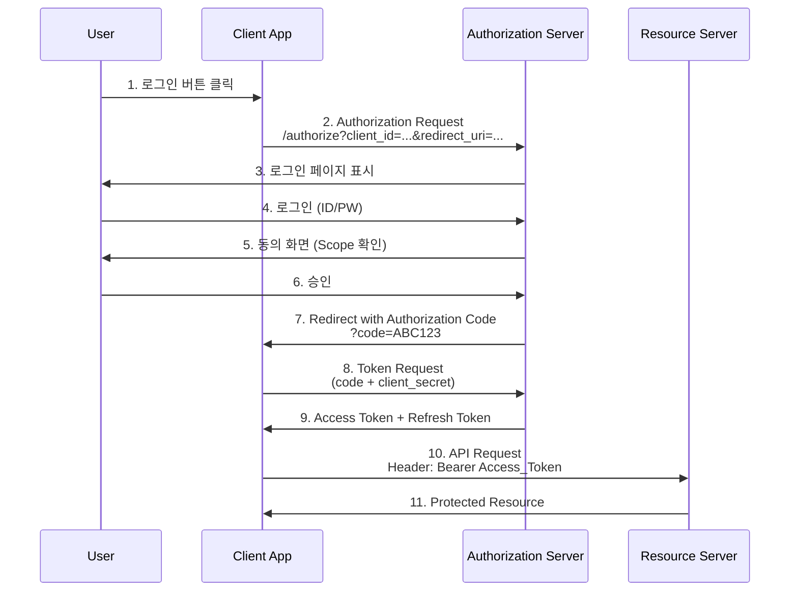
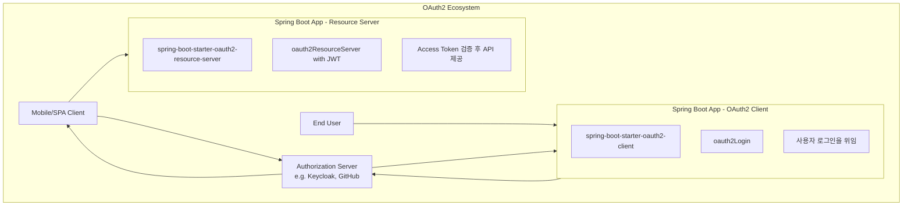
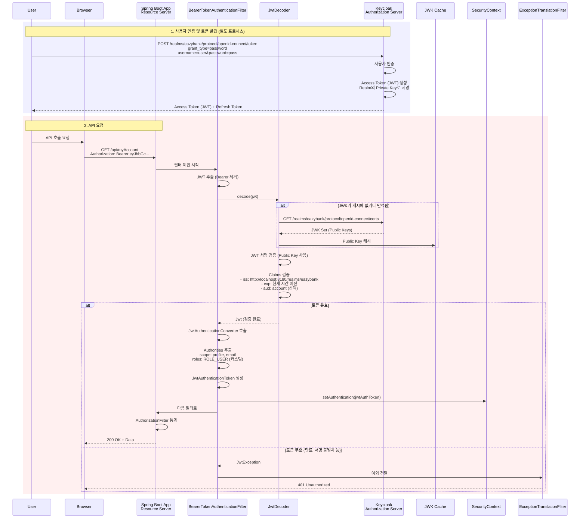
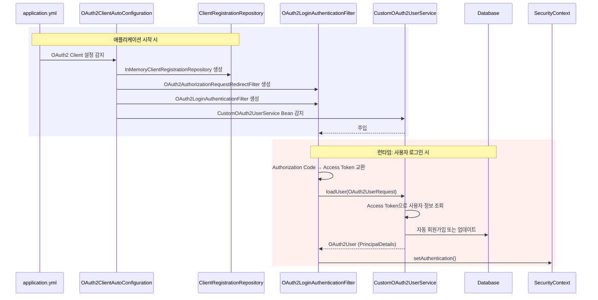

# WEEK 5: OAuth2, OpenID Connect(OIDC)와 인증 서버(Keycloak)

> **호환 버전**: Spring Boot 3.2.x, Spring Security 6.2.x ~ 7.0.x, Keycloak 23.x+

### 학습 목표
- OAuth2 프로토콜의 핵심 용어와 Grant Type별 동작 방식을 이해한다.
- OAuth2(인가)와 OIDC(인증)의 차이점을 명확히 구분한다.
- Spring Boot 애플리케이션을 외부 인증 서버(GitHub)의 OAuth2 클라이언트로 연동한다.
- Keycloak을 이용해 자체 인증 서버를 구축하고, Spring Boot 앱을 리소스 서버로 전환하여 연동하는 방법을 학습한다.

---

지금까지 우리는 단일 애플리케이션 내에서 인증과 인가를 모두 처리했다. Week 5에서는 MSA(마이크로서비스 아키텍처)와 현대적인 웹 생태계의 표준 방식인 **OAuth2**와 **OpenID Connect(OIDC)**에 대해 학습한다. 이를 통해 인증/인가 책임을 애플리케이션에서 분리하여 **별도의 인증 서버(Authorization Server)**에서 중앙 관리하는 방법을 다룬다.

---

### 1. OAuth2 (Open Authorization 2.0) 프로토콜

#### 1.1. OAuth2란?
OAuth2는 특정 애플리케이션(Client)이 사용자의 자격증명(비밀번호 등)을 직접 받지 않고, 다른 애플리케이션(Resource Server)에 있는 사용자 정보에 제한적으로 접근할 수 있도록 허용해주는 **위임(Delegated) 권한 부여를 위한 산업 표준 프로토콜**이다. "Google 계정으로 로그인하기" 기능이 대표적인 예다.

#### 1.2. 핵심 용어
- **Resource Owner**: 리소스의 소유자, 즉 최종 사용자.
- **Client**: 리소스에 접근하려는 제3의 애플리케이션 (e.g., 우리가 개발하는 웹/모바일 앱).
- **Authorization Server (인증 서버)**: Resource Owner를 인증하고, Client에게 Access Token을 발급하는 서버.
- **Resource Server**: 보호된 리소스(사용자 정보, 사진 등)를 가지고 있는 서버.
- **Access Token**: 보호된 리소스에 접근하기 위한 토큰.
- **Refresh Token**: Access Token이 만료되었을 때 새로운 Access Token을 발급받기 위한 토큰.
- **Scope**: Client가 요청하는 접근 권한의 범위 (e.g., `profile_read`, `email`).

#### 1.3. 주요 Grant Types (인증 방식)
Grant Type은 Client가 Access Token을 획득하는 다양한 방법을 정의한다.

- **Authorization Code Grant**: 웹 애플리케이션에서 가장 널리 쓰이는 안전한 방식. 사용자가 인증 서버에 로그인하면 임시 `인증 코드`가 Client에 발급되고, Client는 이 코드를 자신의 `Client ID`, `Client Secret`과 함께 인증 서버에 보내 `Access Token`으로 교환한다.
- **Client Credentials Grant**: 사용자가 개입되지 않는 서버 간(Machine-to-Machine) 통신에 사용된다. Client가 자신의 자격증명만으로 Access Token을 발급받는다.
- **PKCE (Proof Key for Code Exchange)**: `Client Secret`을 안전하게 저장할 수 없는 모바일 앱이나 SPA(Single Page Application) 같은 Public Client를 위한 확장 기능. `Authorization Code` 방식에 `code_challenge`와 `code_verifier`를 추가하여 보안을 강화한다.
- **Implicit Grant** (Deprecated): 이전에 SPA에서 사용되었으나, 보안 취약점으로 인해 Spring Security 7.0에서는 권장하지 않음. PKCE로 대체 사용.
- **Password Grant** (Deprecated): 사용자의 ID/PW를 직접 Client에 제공. 신뢰할 수 있는 앱에만 사용되었으나, 보안상 권장하지 않음.

**Grant Type 요약 비교**

| Grant Type                | 주요 사용 사례                                 | 사용자 개입 | Client Secret 필요 | Spring Security 7.0 지원 |
| ------------------------- | ---------------------------------------------- | ----------- | ------------------ | ----------------------- |
| **Authorization Code**    | 서버 측 웹 애플리케이션 (Confidential Client)  | 필요        | 필요               | ✅ 권장                  |
| **PKCE**                  | 모바일 앱, SPA 등 (Public Client)              | 필요        | 불필요             | ✅ 권장                  |
| **Client Credentials**    | 서버 간 통신 (M2M)                             | 불필요      | 필요               | ✅ 지원                  |
| **Implicit**              | SPA (구식)                                     | 필요        | 불필요             | ⚠️ Deprecated           |
| **Password**              | 신뢰 가능한 앱 (구식)                          | 필요        | 선택               | ⚠️ Deprecated           |

#### 1.4. OAuth2 Authorization Code Flow



---

### 2. OpenID Connect (OIDC) - 인증 계층

#### 2.1. OAuth2 vs. OIDC

- **OAuth2**: **인가(Authorization)**, 즉 "무엇을 할 수 있는가"에 대한 프로토콜이다. 본래 목적은 제3자 앱에 리소스 접근 권한을 위임하는 것.
- **OIDC**: OAuth2 위에 구축된 얇은 **인증(Authentication)** 계층으로, "누구인가"를 확인하는 데 초점을 맞춘다.

**핵심 차이점:**

| 특징 | OAuth2 | OIDC |
|------|--------|------|
| 목적 | 권한 위임 (Authorization) | 사용자 인증 (Authentication) |
| 반환 토큰 | Access Token | Access Token + **ID Token** |
| 사용자 정보 | userinfo 엔드포인트 호출 필요 | ID Token에 포함 (JWT) |
| Scope | 임의 (e.g., read, write) | 반드시 `openid` 포함 |

#### 2.2. ID Token

OIDC의 핵심으로, `scope`에 `openid`를 포함하여 요청하면 인증 서버는 `Access Token`과 함께 `ID Token`을 발급한다. `ID Token`은 JWT 형식이며, 사용자의 신원을 증명하는 표준화된 정보를 담고 있다.

**ID Token 예시 (JWT Payload):**
```json
{
  "iss": "https://accounts.google.com",
  "sub": "110169484474386276334",
  "aud": "your-client-id",
  "exp": 1609545600,
  "iat": 1609459200,
  "email": "user@example.com",
  "email_verified": true,
  "name": "John Doe",
  "picture": "https://..."
}
```

- **`sub`**: Subject, 사용자의 고유 식별자
- **`aud`**: Audience, 이 토큰을 사용할 수 있는 클라이언트
- **`exp`**: Expiration, 토큰 만료 시간
- **`email`, `name`**: 사용자 정보

---

### 3. 외부 인증 서버 연동 (OAuth2 Client)

Spring Boot 애플리케이션을 GitHub, Google 같은 외부 인증 서버와 연동되는 **OAuth2 클라이언트**로 쉽게 구성할 수 있다.

#### 3.1. 구현 단계

**1단계: 의존성 추가**
```gradle
dependencies {
    implementation 'org.springframework.boot:spring-boot-starter-oauth2-client'
    implementation 'org.springframework.boot:spring-boot-starter-web'
    implementation 'org.springframework.boot:spring-boot-starter-security'
}
```

**2단계: `application.properties` 설정**

외부 인증 서버에 등록하고 발급받은 `client-id`와 `client-secret`을 설정 파일에 추가한다.

    ```properties
# GitHub OAuth2 설정
    spring.security.oauth2.client.registration.github.client-id=your-github-client-id
    spring.security.oauth2.client.registration.github.client-secret=your-github-client-secret
spring.security.oauth2.client.registration.github.scope=read:user,user:email

# Google OAuth2 설정
spring.security.oauth2.client.registration.google.client-id=your-google-client-id
spring.security.oauth2.client.registration.google.client-secret=your-google-client-secret
spring.security.oauth2.client.registration.google.scope=openid,profile,email
```

**3단계: `SecurityFilterChain` 설정**

    ```java
import org.springframework.context.annotation.Bean;
import org.springframework.context.annotation.Configuration;
import org.springframework.security.config.annotation.web.builders.HttpSecurity;
import org.springframework.security.web.SecurityFilterChain;

import static org.springframework.security.config.Customizer.withDefaults;

    @Configuration
    public class SecurityConfig {
    
        @Bean
        SecurityFilterChain defaultSecurityFilterChain(HttpSecurity http) throws Exception {
            http
            .authorizeHttpRequests(requests -> requests
                .requestMatchers("/", "/login", "/error").permitAll()
                .anyRequest().authenticated()
            )
                .oauth2Login(withDefaults()); // OAuth2 로그인 기능 활성화
            return http.build();
        }
    }
    ```

**4단계: Controller에서 사용자 정보 접근**

```java
import org.springframework.security.core.annotation.AuthenticationPrincipal;
import org.springframework.security.oauth2.core.user.OAuth2User;
import org.springframework.web.bind.annotation.GetMapping;
import org.springframework.web.bind.annotation.RestController;

import java.util.Map;

@RestController
public class UserController {
    
    @GetMapping("/user")
    public Map<String, Object> user(@AuthenticationPrincipal OAuth2User principal) {
        // OAuth2User에서 사용자 정보 추출
        return principal.getAttributes();
    }
}
```

이제 사용자가 애플리케이션에 접근하면 자동으로 GitHub/Google 로그인 페이지로 리디렉션되며, 인증 성공 후 다시 애플리케이션으로 돌아온다.

---

### 4. Keycloak을 이용한 자체 인증 서버 구축

외부 서비스가 아닌, 우리 조직만의 독립된 인증 서버를 구축하고 싶을 때 **Keycloak** 같은 오픈소스 IAM(Identity and Access Management) 솔루션을 사용할 수 있다.

#### 4.1. 아키텍처 변경



**역할 구분:**
- **Keycloak**: 인증 서버 역할을 전담한다. 사용자 관리, 클라이언트 등록, 토큰 발급을 수행한다.
- **Spring Boot 애플리케이션**: 이제 **리소스 서버(Resource Server)** 역할을 수행한다. 더 이상 자체적으로 사용자를 인증하지 않고, 오직 Keycloak이 발급한 Access Token(JWT)이 유효한지만 검증한다.

#### 4.2. Keycloak 설치 (Docker Compose 사용)

**docker-compose.yml:**
```yaml
version: '3.8'

services:
  keycloak:
    image: quay.io/keycloak/keycloak:23.0
    container_name: keycloak
    environment:
      KEYCLOAK_ADMIN: admin
      KEYCLOAK_ADMIN_PASSWORD: admin
    ports:
      - "8180:8080"
    command:
      - start-dev
    volumes:
      - keycloak_data:/opt/keycloak/data

volumes:
  keycloak_data:
```

**실행:**
```bash
docker-compose up -d
```

**접속:**
- URL: `http://localhost:8180`
- Admin 계정: `admin` / `admin`

#### 4.3. Keycloak 초기 설정

1. **Realm 생성**: 
   - 좌측 상단 드롭다운 → "Create Realm"
   - Name: `eazybank`

2. **Client 생성**:
   - Clients → "Create client"
   - Client ID: `spring-boot-app`
   - Client Protocol: `openid-connect`
   - Access Type: `confidential`
   - Valid Redirect URIs: `http://localhost:8080/*`
   - 저장 후 "Credentials" 탭에서 `Client Secret` 복사

3. **User 생성**:
   - Users → "Add user"
   - Username: `testuser`
   - Email: `testuser@example.com`
   - 저장 후 "Credentials" 탭에서 비밀번호 설정

4. **Role 생성**:
   - Realm Roles → "Create role"
   - Role Name: `USER`, `ADMIN` 등 생성
   - Users 메뉴에서 사용자에게 역할 할당

#### 4.4. 리소스 서버(Resource Server)로 전환

**1단계: 의존성 추가**
```gradle
dependencies {
    implementation 'org.springframework.boot:spring-boot-starter-oauth2-resource-server'
    implementation 'org.springframework.boot:spring-boot-starter-security'
    implementation 'org.springframework.boot:spring-boot-starter-web'
}
```

**2단계: `application.properties` 설정**

```properties
# Keycloak JWT 검증 설정
spring.security.oauth2.resourceserver.jwt.jwk-set-uri=http://localhost:8180/realms/eazybank/protocol/openid-connect/certs

# 또는 issuer-uri 사용 (더 간단)
# spring.security.oauth2.resourceserver.jwt.issuer-uri=http://localhost:8180/realms/eazybank
```

**3단계: `SecurityFilterChain` 설정**

    ```java
import org.springframework.context.annotation.Bean;
import org.springframework.context.annotation.Configuration;
import org.springframework.security.config.annotation.web.builders.HttpSecurity;
import org.springframework.security.config.http.SessionCreationPolicy;
import org.springframework.security.web.SecurityFilterChain;

import static org.springframework.security.config.Customizer.withDefaults;

    @Configuration
    public class SecurityConfig {
    
        @Bean
        SecurityFilterChain defaultSecurityFilterChain(HttpSecurity http) throws Exception {
            http
            .sessionManagement(session -> 
                session.sessionCreationPolicy(SessionCreationPolicy.STATELESS)
            )
            .csrf(csrf -> csrf.disable())
                .authorizeHttpRequests(authorize -> authorize
                    .requestMatchers("/myAccount").hasRole("USER")
                .requestMatchers("/admin/**").hasRole("ADMIN")
                .requestMatchers("/notices", "/contact").permitAll()
                .anyRequest().authenticated()
                )
                // OAuth2 리소스 서버로 동작하도록 설정하고, JWT 검증을 활성화한다.
            .oauth2ResourceServer(oauth2 -> oauth2.jwt(withDefaults()));
        
            return http.build();
        }
    }
    ```

#### 4.5. Keycloak 역할(Role) 매핑

Keycloak이 발급한 JWT 안의 역할 정보를 Spring Security가 이해하는 `GrantedAuthority` 객체로 변환해주어야 한다.

**KeycloakRoleConverter.java:**
```java
import org.springframework.core.convert.converter.Converter;
import org.springframework.security.core.GrantedAuthority;
import org.springframework.security.core.authority.SimpleGrantedAuthority;
import org.springframework.security.oauth2.jwt.Jwt;

import java.util.Collection;
import java.util.List;
import java.util.Map;
import java.util.stream.Collectors;

public class KeycloakRoleConverter implements Converter<Jwt, Collection<GrantedAuthority>> {

    @Override
    public Collection<GrantedAuthority> convert(Jwt jwt) {
        Map<String, Object> realmAccess = (Map<String, Object>) jwt.getClaims().get("realm_access");

        if (realmAccess == null || realmAccess.isEmpty()) {
            return List.of();
        }

        return ((List<String>) realmAccess.get("roles"))
                .stream()
                .map(roleName -> "ROLE_" + roleName) // "USER" -> "ROLE_USER"
                .map(SimpleGrantedAuthority::new)
                .collect(Collectors.toList());
    }
}
```

**SecurityFilterChain에 Converter 등록:**
```java
import org.springframework.security.oauth2.server.resource.authentication.JwtAuthenticationConverter;

@Configuration
public class SecurityConfig {
    
    @Bean
    SecurityFilterChain defaultSecurityFilterChain(HttpSecurity http) throws Exception {
JwtAuthenticationConverter jwtAuthenticationConverter = new JwtAuthenticationConverter();
jwtAuthenticationConverter.setJwtGrantedAuthoritiesConverter(new KeycloakRoleConverter());

        http
            .sessionManagement(session -> 
                session.sessionCreationPolicy(SessionCreationPolicy.STATELESS)
            )
            .csrf(csrf -> csrf.disable())
            .authorizeHttpRequests(authorize -> authorize
                .requestMatchers("/myAccount").hasRole("USER")
                .requestMatchers("/admin/**").hasRole("ADMIN")
                .requestMatchers("/notices", "/contact").permitAll()
                .anyRequest().authenticated()
            )
            .oauth2ResourceServer(oauth2 -> oauth2
                .jwt(jwt -> jwt.jwtAuthenticationConverter(jwtAuthenticationConverter))
            );
        
        return http.build();
    }
}
```

> **전문가 Tip**: `KeycloakRoleConverter`와 같은 커스텀 컨버터가 필수적인 이유는 JWT가 표준 스펙이긴 하지만, 역할(Role)과 같은 세부 클레임의 구조는 인증 서버마다 다르기 때문입니다(예: Keycloak은 `realm_access`, 다른 곳은 `authorities`). 이 컨버터는 특정 인증 서버의 데이터 구조와 Spring Security의 표준 `GrantedAuthority` 사이의 '번역기' 역할을 수행하여 둘을 연결합니다.

#### 4.6. Postman으로 테스트하기

**1. Keycloak에서 Access Token 발급:**
```bash
POST http://localhost:8180/realms/eazybank/protocol/openid-connect/token
Content-Type: application/x-www-form-urlencoded

client_id=spring-boot-app
client_secret=YOUR_CLIENT_SECRET
username=testuser
password=testuser123
grant_type=password
```

**응답:**
```json
{
  "access_token": "eyJhbGc...",
  "expires_in": 300,
  "refresh_token": "eyJhbGc...",
  "token_type": "Bearer"
}
```

**2. Access Token으로 Spring Boot API 호출:**
```bash
GET http://localhost:8080/myAccount
Authorization: Bearer eyJhbGc...
```

---

### 5. Spring Security 7.0 신규 기능: 멀티팩터 인증 (MFA)

Spring Security 7.0부터 멀티팩터 인증(Multi-Factor Authentication)에 대한 지원이 강화되었습니다. 이는 비밀번호만으로는 부족한 보안을 OTP, SMS, 이메일 등 추가 인증 수단으로 보완하는 방식입니다.

**MFA 구현 시나리오:**
1. 사용자가 ID/PW로 1차 인증
2. 서버가 OTP를 생성하여 사용자에게 전송
3. 사용자가 OTP를 입력하여 2차 인증
4. 모든 인증 단계 통과 시 최종 인증 완료

Keycloak은 기본적으로 MFA를 지원하며, "Authentication" → "Required Actions"에서 "Configure OTP"를 활성화할 수 있습니다.

---

### 6. OAuth2 설정이 필터 체인에 미치는 영향

OAuth2를 Spring Security에 통합하면 필터 체인이 어떻게 변하는지 이해하는 것이 매우 중요하다.

#### 6.1. OAuth2 관련 필터 매핑 표

| SecurityFilterChain 설정 | 추가되는 필터 | 역할 | 위치 (순서) |
|-------------------------|--------------|------|------------|
| `.oauth2Login()` | OAuth2AuthorizationRequestRedirectFilter | Authorization Code 요청 생성 및 리디렉션 | 8 |
| | OAuth2LoginAuthenticationFilter | Authorization Code → Access Token 교환 및 사용자 인증 | 13 |
| | DefaultOAuth2UserService | Access Token으로 사용자 정보 조회 | N/A (서비스) |
| `.oauth2ResourceServer(jwt())` | BearerTokenAuthenticationFilter | JWT Access Token 검증 | 인증 필터 사이 |
| `.oauth2Client()` | OAuth2AuthorizationCodeGrantFilter | Access Token 획득 및 관리 (Client 역할) | 18 |

#### 6.2. OAuth2 Client vs Resource Server 필터 체인 비교

```mermaid
graph TD
    subgraph OAuth2Client[OAuth2 Client 필터 체인]
        direction TB
        Request1[사용자가 /oauth2/authorization/google 접근] --> AuthReqFilter[OAuth2AuthorizationRequestRedirectFilter]
        AuthReqFilter --> Generate[Authorization Request 생성]
        Generate --> Redirect[Google Authorization Server로 리디렉션]
        Redirect --> Callback[사용자 로그인 및 동의]
        Callback --> CallbackURL[/login/oauth2/code/google으로 돌아옴]
        CallbackURL --> LoginFilter[OAuth2LoginAuthenticationFilter]
        LoginFilter --> TokenExchange[Authorization Code → Access Token 교환]
        TokenExchange --> LoadUser[DefaultOAuth2UserService.loadUser]
        LoadUser --> UserInfo[/userinfo 엔드포인트 호출]
        UserInfo --> CreateAuth[OAuth2AuthenticationToken 생성]
        CreateAuth --> SetAuth1[SecurityContext에 저장]
        SetAuth1 --> Success1[로그인 완료]
    end
    
    subgraph OAuth2ResourceServer[OAuth2 Resource Server 필터 체인]
        direction TB
        Request2[API 요청 + Bearer Token] --> BearerFilter[BearerTokenAuthenticationFilter]
        BearerFilter --> ExtractJWT[Authorization 헤더에서 JWT 추출]
        ExtractJWT --> JWTDecoder[JwtDecoder 호출]
        JWTDecoder --> FetchJWK[Authorization Server에서 JWK 조회<br/>처음 한 번 또는 갱신 시]
        FetchJWK --> Verify[JWT 서명 검증]
        Verify --> CheckClaims[Claims 검증 iss, exp, aud]
        CheckClaims --> Convert[JwtAuthenticationConverter]
        Convert --> ExtractAuthorities[Authorities 추출 scope, roles]
        ExtractAuthorities --> CreateJwtAuth[JwtAuthenticationToken 생성]
        CreateJwtAuth --> SetAuth2[SecurityContext에 저장]
        SetAuth2 --> Success2[API 요청 처리]
    end
    
    style AuthReqFilter fill:#f0e6ff
    style LoginFilter fill:#f0e6ff
    style BearerFilter fill:#e6f3ff
```

**핵심 차이점:**
- **OAuth2 Client**: 사용자를 외부 인증 서버로 보내고, 돌아온 후 토큰을 교환하여 인증 완료
- **Resource Server**: 이미 발급된 토큰을 검증만 하고, 사용자 정보는 토큰의 Claims에서 추출

#### 6.3. Keycloak 연동 시 전체 필터 플로우



**주요 단계:**
1. **JWK 조회**: 최초 요청 또는 Key Rotation 시 Keycloak에서 Public Key 조회
2. **서명 검증**: JWT가 Keycloak의 Private Key로 서명되었는지 Public Key로 검증
3. **Claims 검증**: `iss` (발급자), `exp` (만료 시간), `aud` (대상) 확인
4. **Authorities 추출**: JWT의 `scope` 또는 커스텀 claim (`realm_access.roles`)에서 권한 추출
5. **Authentication 생성**: `JwtAuthenticationToken` 객체 생성 후 `SecurityContext`에 저장

#### 6.4. OAuth2 설정별 Bean 자동 생성 비교

| 설정 | 자동 생성되는 Bean | 역할 | 커스터마이징 가능 여부 |
|------|-------------------|------|----------------------|
| `oauth2Login()` | `ClientRegistrationRepository` | OAuth2 Provider 정보 관리 (application.yml에서) | ✅ Bean 오버라이드 가능 |
| | `OAuth2AuthorizedClientService` | Access Token 저장/관리 | ✅ 커스텀 구현 가능 |
| | `DefaultOAuth2UserService` | 사용자 정보 조회 (userinfo 엔드포인트) | ✅ 커스텀 구현 권장 |
| | `OAuth2AuthorizedClientRepository` | Access Token 세션 저장소 | ✅ 커스텀 구현 가능 |
| `oauth2ResourceServer(jwt())` | `JwtDecoder` | JWT 검증 및 파싱 | ✅ Bean 오버라이드 가능 |
| | `JwtAuthenticationConverter` | JWT Claims → GrantedAuthority 변환 | ✅ 커스텀 Converter 권장 |
| | `OAuth2ResourceServerProperties` | application.yml 프로퍼티 바인딩 | ❌ 자동 바인딩 |

**커스터마이징 예제:**

```java
// Resource Server: 커스텀 JwtAuthenticationConverter
@Bean
public JwtAuthenticationConverter jwtAuthenticationConverter() {
    JwtGrantedAuthoritiesConverter grantedAuthoritiesConverter = new JwtGrantedAuthoritiesConverter();
    
    // scope 대신 roles claim에서 권한 추출
    grantedAuthoritiesConverter.setAuthoritiesClaimName("realm_access.roles");
    grantedAuthoritiesConverter.setAuthorityPrefix("ROLE_");
    
    JwtAuthenticationConverter converter = new JwtAuthenticationConverter();
    converter.setJwtGrantedAuthoritiesConverter(grantedAuthoritiesConverter);
    return converter;
}

// OAuth2 Client: 커스텀 OAuth2UserService
@Service
public class CustomOAuth2UserService extends DefaultOAuth2UserService {
    @Override
    public OAuth2User loadUser(OAuth2UserRequest userRequest) throws OAuth2AuthenticationException {
        OAuth2User oauth2User = super.loadUser(userRequest);
        
        // DB에 사용자 정보 저장 또는 업데이트
        processOAuth2User(userRequest, oauth2User);
        
        return oauth2User;
    }
}
```

#### 6.5. 다중 OAuth2 Provider 설정 시 필터 동작

```java
// application.yml
spring:
  security:
    oauth2:
      client:
        registration:
          google:
            client-id: YOUR_GOOGLE_CLIENT_ID
            client-secret: YOUR_GOOGLE_SECRET
            scope: profile, email
          github:
            client-id: YOUR_GITHUB_CLIENT_ID
            client-secret: YOUR_GITHUB_SECRET
            scope: read:user
          keycloak:
            client-id: spring-boot-app
            client-secret: YOUR_KEYCLOAK_SECRET
            scope: openid, profile
            authorization-grant-type: authorization_code
        provider:
          keycloak:
            issuer-uri: http://localhost:8180/realms/eazybank
```

**필터 동작:**
- **OAuth2AuthorizationRequestRedirectFilter**: 사용자가 `/oauth2/authorization/{registrationId}` (예: `/oauth2/authorization/google`)로 접근 시, 해당 Provider의 Authorization Endpoint로 리디렉션
- **OAuth2LoginAuthenticationFilter**: 콜백 URL (`/login/oauth2/code/{registrationId}`)로 돌아온 요청을 처리하고, `registrationId`에 맞는 Provider 설정으로 토큰 교환

**하나의 필터가 여러 Provider를 지원**: `ClientRegistrationRepository`에 등록된 모든 Provider 정보를 참조하여 동적으로 처리

#### 6.6. OAuth2 Bean-Filter 완전 매핑 가이드

OAuth2 Client와 Resource Server 모드에서 사용되는 Bean들이 어떤 필터를 생성하고 영향을 주는지 완전히 정리한다.

##### 6.6.1. OAuth2 Client 모드: Bean-Filter 매핑표

| Bean 타입 | 자동 생성 방법 | 생성되는 필터 | 필터 순서 | 역할 |
|----------|------------|------------|----------|------|
| **ClientRegistrationRepository** | `application.yml`의 `spring.security.oauth2.client.registration` 자동 바인딩 | `OAuth2AuthorizationRequestRedirectFilter`<br/>`OAuth2LoginAuthenticationFilter` | 8, 13 | Provider 정보 관리 (Google, Kakao 등) |
| **OAuth2AuthorizedClientService** | `OAuth2 Client` 의존성 추가 시 자동 생성 | N/A (Service 레이어) | N/A | Access Token 저장/관리 (메모리 또는 JDBC) |
| **OAuth2UserService** | `DefaultOAuth2UserService` 자동 생성 또는 커스텀 Bean 등록 | `OAuth2LoginAuthenticationFilter` 내부에서 사용 | 13 | 사용자 정보 조회 (`/userinfo` 엔드포인트) |
| **OAuth2AuthorizedClientRepository** | 자동 생성 | N/A (Repository) | N/A | Access Token 세션 저장소 |

##### 6.6.2. OAuth2 Resource Server 모드: Bean-Filter 매핑표

| Bean 타입 | 등록 방법 | 생성되는 필터 | 필터 위치 | 역할 |
|----------|---------|------------|----------|------|
| **JwtDecoder** | `@Bean` 수동 등록 또는 `issuer-uri`로 자동 생성 | `BearerTokenAuthenticationFilter` | 인증 필터 사이 | JWT 서명 검증 및 디코딩 |
| **JwtAuthenticationConverter** | `@Bean` 수동 등록 (선택) | `BearerTokenAuthenticationFilter` 내부에서 사용 | N/A | JWT Claims → GrantedAuthority 변환 |
| **OAuth2ResourceServerProperties** | `application.yml` 자동 바인딩 | 설정 정보 제공 | N/A | JWK Set URI, Issuer URI 등 |

##### 6.6.3. OAuth2 Client vs Resource Server 필터 비교

```mermaid
graph TB
    subgraph OAuth2Client[OAuth2 Client - oauth2Login]
        Config1[application.yml<br/>client.registration.google]
        Bean1[ClientRegistrationRepository<br/>자동 생성]
        Filter1A[OAuth2AuthorizationRequestRedirectFilter<br/>순서 8]
        Filter1B[OAuth2LoginAuthenticationFilter<br/>순서 13]
        Service1[DefaultOAuth2UserService<br/>또는 CustomOAuth2UserService]
        
        Config1 --> Bean1
        Bean1 --> Filter1A
        Bean1 --> Filter1B
        Filter1B --> Service1
    end
    
    subgraph OAuth2ResourceServer[OAuth2 Resource Server - oauth2ResourceServer]
        Config2[application.yml<br/>resourceserver.jwt.issuer-uri]
        Bean2A[JwtDecoder<br/>@Bean 또는 자동 생성]
        Bean2B[JwtAuthenticationConverter<br/>@Bean 선택]
        Filter2[BearerTokenAuthenticationFilter<br/>자동 배치]
        
        Config2 --> Bean2A
        Bean2A --> Filter2
        Bean2B --> Filter2
    end
    
    style Filter1A fill:#f0e6ff
    style Filter1B fill:#f0e6ff
    style Filter2 fill:#e6f3ff
```

##### 6.6.4. ClientRegistrationRepository Bean의 영향 범위

**Bean 자동 생성 조건:**

```yaml
# application.yml
spring:
  security:
    oauth2:
      client:
        registration:
          google:  # ← 이 설정이 있으면
            client-id: YOUR_CLIENT_ID
            client-secret: YOUR_CLIENT_SECRET
            scope: openid,profile,email
```

**자동으로 생성되는 것들:**

1. **ClientRegistrationRepository Bean**: `InMemoryClientRegistrationRepository` 자동 생성
2. **OAuth2AuthorizationRequestRedirectFilter**: 필터 체인에 자동 추가 (순서 8)
3. **OAuth2LoginAuthenticationFilter**: 필터 체인에 자동 추가 (순서 13)
4. **DefaultOAuth2UserService**: 기본 사용자 정보 조회 서비스 자동 생성

**커스텀 OAuth2UserService Bean 등록 시:**

```java
@Service
public class CustomOAuth2UserService extends DefaultOAuth2UserService {
    // 커스텀 로직
}

@Bean
SecurityFilterChain securityFilterChain(HttpSecurity http) throws Exception {
    http.oauth2Login(oauth2 -> oauth2
        .userInfoEndpoint(userInfo -> userInfo
            .userService(customOAuth2UserService) // ← 여기서 주입
        )
    );
    // → OAuth2LoginAuthenticationFilter가 CustomOAuth2UserService를 사용
    return http.build();
}
```

**Bean 매핑 플로우:**



##### 6.6.5. JwtDecoder Bean의 영향 범위 (Resource Server)

**Bean 등록 방법별 차이:**

| 등록 방법 | 코드 | 자동 생성 | 특징 |
|---------|------|---------|------|
| **수동 등록 (Secret Key)** | `@Bean JwtDecoder jwtDecoder()` | `BearerTokenAuthenticationFilter` | Secret Key로 검증 (대칭키) |
| **자동 생성 (JWK Set URI)** | `jwt.jwk-set-uri=...` | `NimbusJwtDecoder` + `BearerTokenAuthenticationFilter` | Public Key로 검증 (비대칭키) |
| **자동 생성 (Issuer URI)** | `jwt.issuer-uri=...` | `NimbusJwtDecoder` + `BearerTokenAuthenticationFilter` | Issuer에서 JWK 자동 조회 |

**JwtDecoder Bean 미등록 시 에러:**

```java
// oauth2ResourceServer() 설정은 있지만 JwtDecoder Bean이 없으면:
@Bean
SecurityFilterChain securityFilterChain(HttpSecurity http) throws Exception {
    http.oauth2ResourceServer(oauth2 -> oauth2.jwt(withDefaults()));
    return http.build();
}

// 에러 발생:
// BeanCreationException: No qualifying bean of type 'JwtDecoder'
```

**올바른 설정:**

```java
// 방법 1: 수동 Bean 등록
@Bean
public JwtDecoder jwtDecoder() {
    SecretKey key = Keys.hmacShaKeyFor(secretKeyBytes);
    return NimbusJwtDecoder.withSecretKey(key).build();
}

// 방법 2: application.yml로 자동 생성
spring:
  security:
    oauth2:
      resourceserver:
        jwt:
          issuer-uri: http://localhost:8180/realms/eazybank
          # → JwtDecoder Bean 자동 생성
```

##### 6.6.6. 다중 OAuth2 설정 시 Bean-Filter 매핑

**시나리오: Client와 Resource Server 동시 사용**

```java
@Configuration
public class MultiOAuth2Config {
    
    // OAuth2 Client 설정 (소셜 로그인)
    @Bean
    @Order(1)
    SecurityFilterChain oauth2ClientChain(HttpSecurity http) throws Exception {
        http
            .securityMatcher("/login/**", "/oauth2/**")
            .oauth2Login(oauth2 -> oauth2
                .userInfoEndpoint(userInfo -> userInfo
                    .userService(customOAuth2UserService)
                )
            );
        // → OAuth2LoginAuthenticationFilter 생성
        return http.build();
    }
    
    // OAuth2 Resource Server 설정 (API 인증)
    @Bean
    @Order(2)
    SecurityFilterChain oauth2ResourceServerChain(HttpSecurity http) throws Exception {
        http
            .securityMatcher("/api/**")
            .oauth2ResourceServer(oauth2 -> oauth2.jwt(withDefaults()));
        // → BearerTokenAuthenticationFilter 생성
        return http.build();
    }
    
    // JwtDecoder Bean (Resource Server용)
    @Bean
    public JwtDecoder jwtDecoder() {
        return NimbusJwtDecoder.withJwkSetUri(jwkSetUri).build();
    }
}
```

**필터 체인 분리:**

```
경로: /login/oauth2/code/google
  ↓
SecurityFilterChain 1 (OAuth2 Client)
  ↓
OAuth2LoginAuthenticationFilter ← ClientRegistrationRepository 사용
  ↓
CustomOAuth2UserService ← Bean으로 주입됨
---
경로: /api/myAccount
  ↓
SecurityFilterChain 2 (Resource Server)
  ↓
BearerTokenAuthenticationFilter ← JwtDecoder Bean 사용
  ↓
JwtAuthenticationConverter ← Bean으로 주입됨 (선택)
```

##### 6.6.7. Bean 등록 체크리스트

**OAuth2 Client 모드:**
- [필수] `application.yml`에 `spring.security.oauth2.client.registration.{provider}` 설정
- [선택] `CustomOAuth2UserService` Bean 등록 (DB 연동 시)
- [자동] `ClientRegistrationRepository` 자동 생성
- [자동] `OAuth2AuthorizationRequestRedirectFilter`, `OAuth2LoginAuthenticationFilter` 자동 추가

**OAuth2 Resource Server 모드:**
- [필수] `JwtDecoder` Bean 등록 **또는** `application.yml`에 `issuer-uri` 설정
- [선택] `JwtAuthenticationConverter` Bean 등록 (권한 커스터마이징 시)
- [자동] `BearerTokenAuthenticationFilter` 자동 추가

**디버깅 코드:**

```java
@Component
public class OAuth2BeanDebugger implements CommandLineRunner {
    
    @Autowired(required = false)
    private ClientRegistrationRepository clientRegistrationRepository;
    
    @Autowired(required = false)
    private JwtDecoder jwtDecoder;
    
    @Autowired
    private FilterChainProxy filterChainProxy;
    
    @Override
    public void run(String... args) {
        System.out.println("========== OAuth2 Bean 상태 ==========");
        
        // OAuth2 Client Bean 확인
        if (clientRegistrationRepository != null) {
            System.out.println("✅ ClientRegistrationRepository 활성화");
            if (clientRegistrationRepository instanceof Iterable) {
                ((Iterable<?>) clientRegistrationRepository).forEach(reg -> 
                    System.out.println("   - Provider: " + reg.toString())
                );
            }
        } else {
            System.out.println("❌ OAuth2 Client 비활성화");
        }
        
        // OAuth2 Resource Server Bean 확인
        if (jwtDecoder != null) {
            System.out.println("✅ JwtDecoder 활성화: " + jwtDecoder.getClass().getSimpleName());
        } else {
            System.out.println("❌ OAuth2 Resource Server 비활성화");
        }
        
        // 필터 체인 확인
        System.out.println("\n========== 활성화된 OAuth2 필터 ==========");
        filterChainProxy.getFilterChains().forEach(chain -> {
            ((SecurityFilterChain) chain).getFilters().forEach(filter -> {
                String className = filter.getClass().getSimpleName();
                if (className.contains("OAuth2") || className.contains("Bearer")) {
                    System.out.println("✅ " + className);
                }
            });
        });
        System.out.println("========================================");
    }
}
```

> **전문가 Tip**: OAuth2는 Bean 자동 생성이 많이 일어나는 영역입니다. `application.yml` 설정만으로도 `ClientRegistrationRepository`, `JwtDecoder` 등이 자동 생성되어 필터 체인에 연결됩니다. 명시적으로 Bean을 등록하면 자동 생성을 오버라이드할 수 있으므로, 커스터마이징이 필요할 때만 수동 Bean 등록을 하세요. 대부분의 경우 `application.yml` 설정과 `CustomOAuth2UserService` Bean 하나면 충분합니다!

---

## FAQ

**Q: OAuth2 Client와 Resource Server의 차이가 무엇인가요?**  
A:
- **OAuth2 Client**: 사용자를 대신하여 외부 인증 서버에 로그인하고 토큰을 받아 사용. 주로 웹 앱의 "소셜 로그인" 기능.
- **Resource Server**: 이미 발급된 Access Token을 검증하고, 토큰이 유효하면 보호된 API 제공. 주로 백엔드 API 서버.

**Q: Keycloak Admin Console에 접속이 안 됩니다.**  
A:
- Docker 컨테이너가 실행 중인지 확인: `docker ps`
- 포트가 충돌하지 않는지 확인 (8180 포트 사용 중인지)
- `docker logs keycloak`로 에러 확인

**Q: "Invalid token" 에러가 발생합니다.**  
A:
1. JWT의 `iss` (issuer)가 `spring.security.oauth2.resourceserver.jwt.issuer-uri`와 일치하는지 확인
2. 토큰이 만료되지 않았는지 확인
3. `KeycloakRoleConverter`가 제대로 등록되었는지 확인

**Q: Keycloak Realm을 export/import하려면?**  
A: Admin Console → Realm Settings → "Partial export" 또는 Docker 볼륨 백업

**Q: 여러 Realm을 사용할 수 있나요?**  
A: 네! 개발용, 운영용 등 목적에 따라 여러 Realm을 생성하여 독립적으로 관리할 수 있습니다.

**Q: Refresh Token은 어떻게 사용하나요?**  
A:
```bash
POST http://localhost:8180/realms/eazybank/protocol/openid-connect/token
Content-Type: application/x-www-form-urlencoded

grant_type=refresh_token
refresh_token=YOUR_REFRESH_TOKEN
client_id=spring-boot-app
client_secret=YOUR_CLIENT_SECRET
```

**Q: Spring Security 7.0에서 Authorization Server를 직접 구축할 수 있나요?**  
A: 네! `spring-boot-starter-oauth2-authorization-server` 의존성을 사용하면 Keycloak 없이도 자체 인증 서버를 구축할 수 있습니다. 단, Keycloak이 더 많은 기능과 UI를 제공하므로 운영 환경에서는 Keycloak 사용을 권장합니다.

---

**다음 주차 예고**: WEEK 6에서는 카카오, 네이버 등 국내 소셜 로그인을 직접 구현하고, 일반 로그인과 소셜 로그인을 통합 관리하는 실전 프로젝트를 완성합니다!
