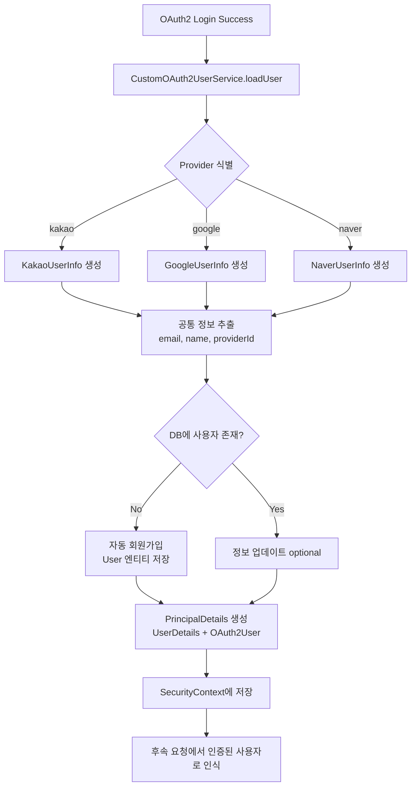
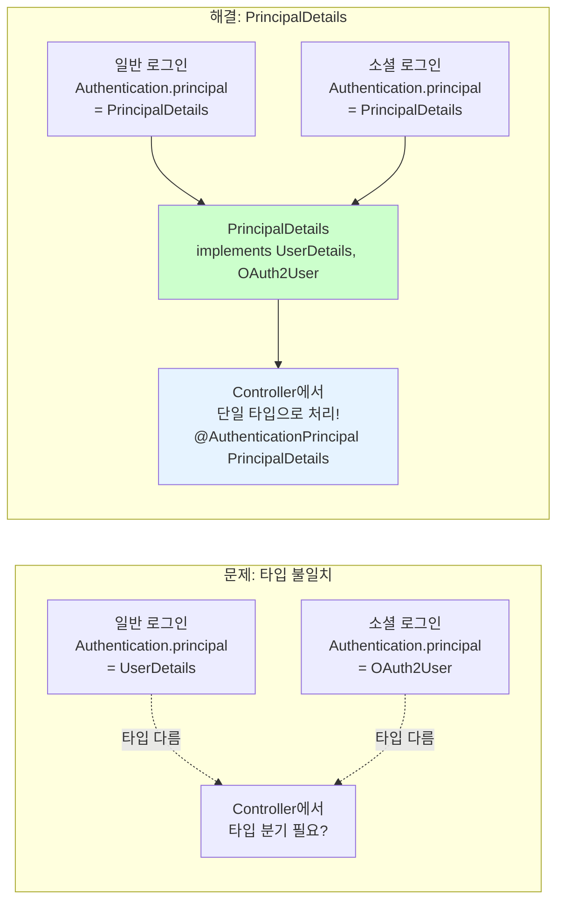
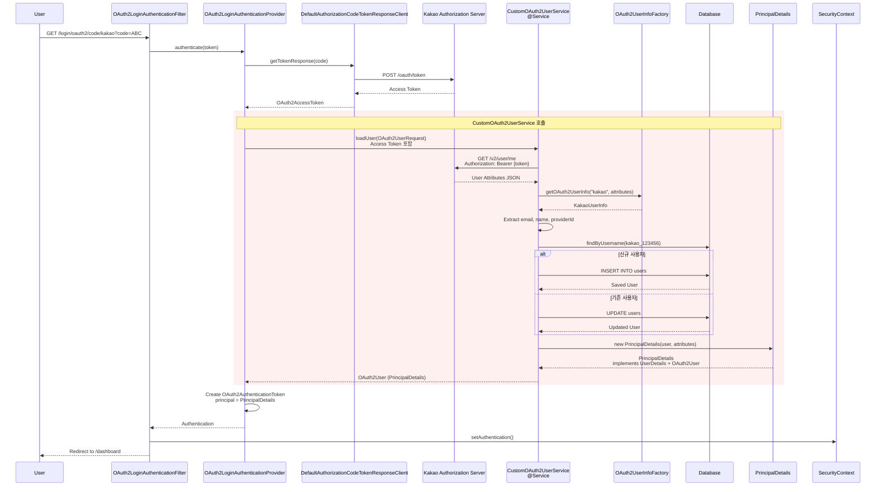
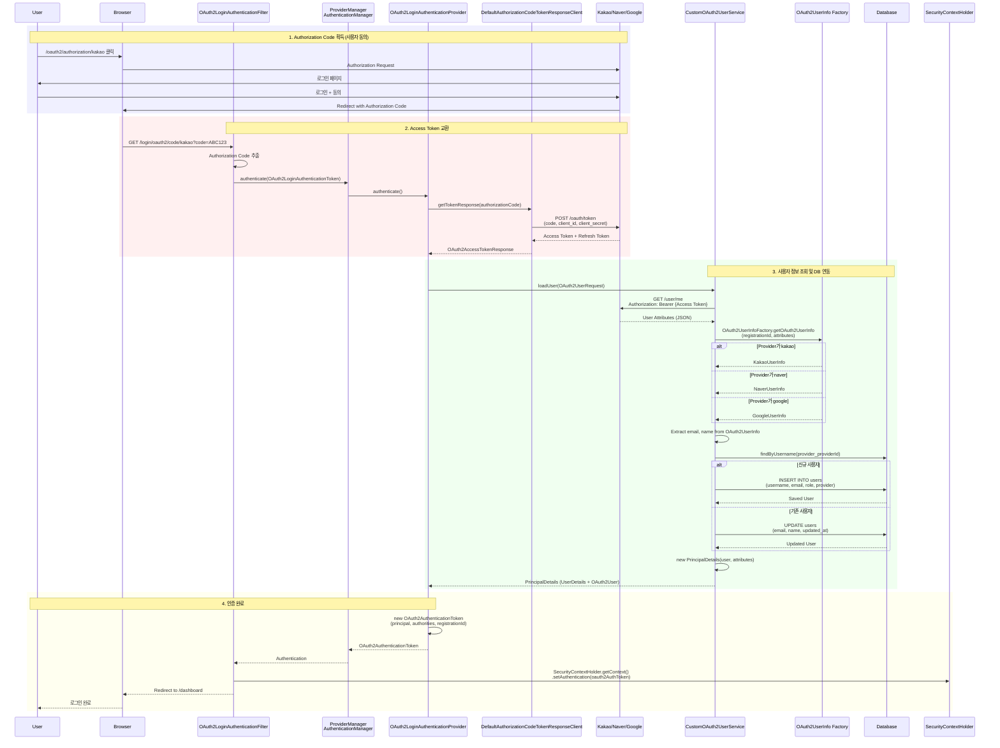
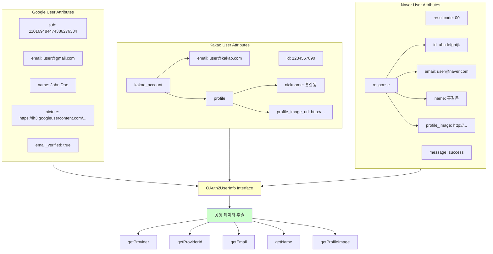
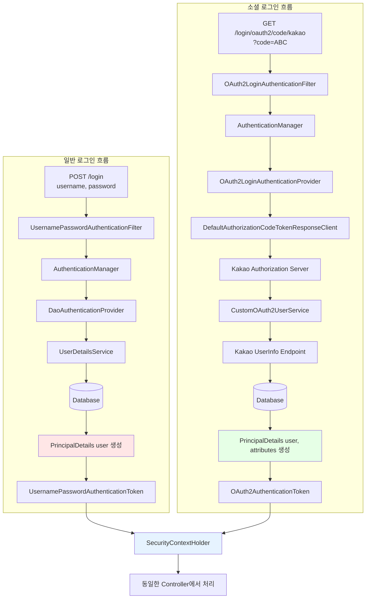

# WEEK 6: 프로젝트 실습 - Custom OAuth2 & 소셜 로그인 구현

> **호환 버전**: Spring Boot 3.2.x, Spring Security 6.2.x ~ 7.0.x

### 학습 목표
- Spring Security의 `CommonOAuth2Provider`에서 지원하지 않는 소셜 로그인(예: 카카오, 네이버) 연동 방법을 학습한다.
- `application.yml`을 통해 커스텀 OAuth2 Provider 정보를 동적으로 등록하고 관리한다.
- `CustomOAuth2UserService`를 구현하여, 소셜 로그인 사용자의 정보를 가져오고 애플리케이션의 회원 정보와 연동(자동 회원가입/업데이트)하는 비즈니스 로직을 처리한다.
- 일반 로그인과 소셜 로그인 사용자를 일관되게 처리할 수 있는 통합 Principal 객체(`UserDetails` + `OAuth2User`)를 설계한다.

---

6주간의 Spring Security 학습을 마무리하며, 이론을 실제 프로젝트에 적용하는 최종 단계다. Week 5에서 OAuth2와 OIDC의 개념을 익혔다면, Week 6에서는 이를 바탕으로 Spring Security가 기본으로 제공하지 않는 **카카오, 네이버 등 국내 소셜 로그인 기능을 직접 구현**하는 방법에 초점을 맞춘다.

이 문서는 커스텀 OAuth2 클라이언트를 구현하는 전체적인 절차와 핵심 코드 구조를 전문가의 시각에서 가이드한다.

---

### 사전 준비: 소셜 서비스 개발자 센터 등록

구현을 시작하기 전, 연동하려는 소셜 서비스(예: 카카오, 네이버)의 개발자 센터에 접속하여 애플리케이션을 등록해야 한다.

#### 카카오 개발자 등록 절차

1.  **Kakao Developers 접속**: https://developers.kakao.com
2.  **애플리케이션 추가**: "내 애플리케이션" → "애플리케이션 추가하기"
3.  **REST API 키 확인**: 생성된 앱 → "앱 키" 탭에서 "REST API 키" 복사 (이것이 `client-id`)
4.  **보안 설정**: "보안" 탭에서 "Client Secret" 활성화 및 생성
5.  **플랫폼 설정**: "플랫폼" 탭에서 "Web" 추가
    - 사이트 도메인: `http://localhost:8080`
6.  **Redirect URI 설정**: "카카오 로그인" 탭 활성화
    - Redirect URI: `http://localhost:8080/login/oauth2/code/kakao`
7.  **동의 항목 설정**: "동의 항목" 탭에서 필요한 정보(닉네임, 이메일 등) 선택

#### 네이버 개발자 등록 절차

1.  **네이버 개발자 센터 접속**: https://developers.naver.com
2.  **애플리케이션 등록**: "Application" → "애플리케이션 등록"
3.  **API 설정**:
    - 사용 API: "네이버 로그인"
    - 서비스 환경: "PC 웹"
    - 서비스 URL: `http://localhost:8080`
    - Callback URL: `http://localhost:8080/login/oauth2/code/naver`
4.  **Client ID, Client Secret 확인**: 등록 후 발급된 정보 저장

> **중요**: Redirect URI는 Spring Security의 기본 형식인 `/login/oauth2/code/{registrationId}`를 정확히 따라야 합니다!

---

### 1. Custom OAuth2 Provider 구현 절차

Spring Security의 `CommonOAuth2Provider`는 Google, Facebook, GitHub 등 몇 가지 글로벌 공급자만 기본으로 제공한다. 카카오, 네이버와 같은 공급자를 연동하려면, 해당 서비스의 OAuth2 명세를 직접 설정에 추가해야 한다.

#### 1단계: `application.yml`에 Provider 정보 등록

먼저, '사전 준비' 단계에서 발급받은 정보를 바탕으로 `application.yml` 파일에 커스텀 Provider 설정을 추가한다.

**`application.yml` 전체 설정 예제:**
```yaml
spring:
  security:
    oauth2:
      client:
        registration:
          # Google (기본 제공)
          google:
            client-id: your-google-client-id
            client-secret: your-google-client-secret
            scope: openid,profile,email
          
          # Kakao (커스텀)
          kakao:
            client-id: your-kakao-rest-api-key
            client-secret: your-kakao-client-secret
            redirect-uri: "{baseUrl}/login/oauth2/code/{registrationId}"
            authorization-grant-type: authorization_code
            scope: profile_nickname,account_email
            client-authentication-method: client_secret_post
            client-name: Kakao
          
          # Naver (커스텀)
          naver:
            client-id: your-naver-client-id
            client-secret: your-naver-client-secret
            redirect-uri: "{baseUrl}/login/oauth2/code/{registrationId}"
            authorization-grant-type: authorization_code
            scope: name,email
            client-name: Naver
        
        provider:
          # Kakao Provider 설정
          kakao:
            authorization-uri: https://kauth.kakao.com/oauth/authorize
            token-uri: https://kauth.kakao.com/oauth/token
            user-info-uri: https://kapi.kakao.com/v2/user/me
            user-name-attribute: id
          
          # Naver Provider 설정
          naver:
            authorization-uri: https://nid.naver.com/oauth2.0/authorize
            token-uri: https://nid.naver.com/oauth2.0/token
            user-info-uri: https://openapi.naver.com/v1/nid/me
            user-name-attribute: response
```

> **참고**: `redirect-uri`의 `{baseUrl}`과 `{registrationId}`는 Spring Security가 실행 환경에 맞게 동적으로 완성해주는 템플릿 변수다. 예를 들어 로컬 환경에서 실행 시 `{baseUrl}`은 `http://localhost:8080`으로, `{registrationId}`는 `kakao`로 치환된다.

#### 2단계: 사용자 정보(Attribute) 매핑

각 소셜 서비스는 사용자 정보를 제각기 다른 JSON 구조로 반환한다. 이를 애플리케이션에서 일관되게 처리하기 위해, 반환된 사용자 정보를 공통된 인터페이스로 변환하는 매핑 과정이 필요하다.

**각 서비스의 사용자 정보 응답 구조:**

**Google:**
```json
{
  "sub": "110169484474386276334",
  "name": "John Doe",
  "email": "john@example.com",
  "picture": "https://..."
}
```

**Kakao:**
```json
{
  "id": 123456789,
  "kakao_account": {
    "profile": {
      "nickname": "홍길동"
    },
    "email": "hong@example.com"
  }
}
```

**Naver:**
```json
{
  "resultcode": "00",
  "message": "success",
  "response": {
    "id": "abcdefg",
    "name": "홍길동",
    "email": "hong@example.com"
  }
}
```

**OAuth2UserInfo.java 인터페이스:**
```java
public interface OAuth2UserInfo {
    String getProvider();    // 공급자 (e.g., "google", "kakao", "naver")
    String getProviderId();  // 공급자 ID
    String getEmail();
    String getName();
}
```

**GoogleUserInfo.java:**
```java
import java.util.Map;

public class GoogleUserInfo implements OAuth2UserInfo {
    
    private Map<String, Object> attributes;
    
    public GoogleUserInfo(Map<String, Object> attributes) {
        this.attributes = attributes;
    }
    
    @Override
    public String getProvider() {
        return "google";
    }
    
    @Override
    public String getProviderId() {
        return (String) attributes.get("sub");
    }
    
    @Override
    public String getEmail() {
        return (String) attributes.get("email");
    }
    
    @Override
    public String getName() {
        return (String) attributes.get("name");
    }
}
```

**KakaoUserInfo.java:**
```java
import java.util.Map;

public class KakaoUserInfo implements OAuth2UserInfo {

    private Map<String, Object> attributes;
    private Map<String, Object> kakaoAccountAttributes;
    private Map<String, Object> profileAttributes;

    @SuppressWarnings("unchecked")
    public KakaoUserInfo(Map<String, Object> attributes) {
        this.attributes = attributes;
        this.kakaoAccountAttributes = (Map<String, Object>) attributes.get("kakao_account");
        this.profileAttributes = (Map<String, Object>) kakaoAccountAttributes.get("profile");
    }

    @Override
    public String getProvider() {
        return "kakao";
    }

    @Override
    public String getProviderId() {
        return attributes.get("id").toString();
    }

    @Override
    public String getEmail() {
        return (String) kakaoAccountAttributes.get("email");
    }

    @Override
    public String getName() {
        return (String) profileAttributes.get("nickname");
    }
}
```

**NaverUserInfo.java:**
```java
import java.util.Map;

public class NaverUserInfo implements OAuth2UserInfo {
    
    private Map<String, Object> attributes;
    private Map<String, Object> responseAttributes;
    
    @SuppressWarnings("unchecked")
    public NaverUserInfo(Map<String, Object> attributes) {
        this.attributes = attributes;
        this.responseAttributes = (Map<String, Object>) attributes.get("response");
    }
    
    @Override
    public String getProvider() {
        return "naver";
    }
    
    @Override
    public String getProviderId() {
        return (String) responseAttributes.get("id");
    }
    
    @Override
    public String getEmail() {
        return (String) responseAttributes.get("email");
    }
    
    @Override
    public String getName() {
        return (String) responseAttributes.get("name");
    }
}
```

#### 3단계: `CustomOAuth2UserService` 구현

이것이 커스텀 소셜 로그인 구현의 핵심이다. `DefaultOAuth2UserService`를 상속받아 `loadUser()` 메소드를 오버라이드하여, 소셜 로그인 성공 후의 비즈니스 로직을 직접 처리한다.



**CustomOAuth2UserService.java:**
```java
import org.springframework.beans.factory.annotation.Autowired;
import org.springframework.security.oauth2.client.userinfo.DefaultOAuth2UserService;
import org.springframework.security.oauth2.client.userinfo.OAuth2UserRequest;
import org.springframework.security.oauth2.core.OAuth2AuthenticationException;
import org.springframework.security.oauth2.core.user.OAuth2User;
import org.springframework.stereotype.Service;

@Service
public class CustomOAuth2UserService extends DefaultOAuth2UserService {

    @Autowired
    private UserRepository userRepository;

    @Override
    public OAuth2User loadUser(OAuth2UserRequest userRequest) throws OAuth2AuthenticationException {
        // 1. 상위 클래스의 loadUser()를 호출하여 OAuth2User 객체를 받아온다
        OAuth2User oAuth2User = super.loadUser(userRequest);
        
        // 2. 어떤 OAuth2 Provider인지 식별한다 (google, kakao, naver 등)
        String registrationId = userRequest.getClientRegistration().getRegistrationId();
        OAuth2UserInfo oAuth2UserInfo = null;

        // 3. Provider에 따라 적절한 OAuth2UserInfo 구현체를 생성한다
        if (registrationId.equals("kakao")) {
            oAuth2UserInfo = new KakaoUserInfo(oAuth2User.getAttributes());
        } else if (registrationId.equals("google")) {
            oAuth2UserInfo = new GoogleUserInfo(oAuth2User.getAttributes());
        } else if (registrationId.equals("naver")) {
            oAuth2UserInfo = new NaverUserInfo(oAuth2User.getAttributes());
        } else {
            throw new OAuth2AuthenticationException("Unsupported provider: " + registrationId);
        }

        // 4. 공통 정보 추출
        String provider = oAuth2UserInfo.getProvider();
        String providerId = oAuth2UserInfo.getProviderId();
        String username = provider + "_" + providerId; // e.g., "kakao_1234567890"
        String email = oAuth2UserInfo.getEmail();
        String name = oAuth2UserInfo.getName();
        String role = "ROLE_USER";

        // 5. DB에서 사용자 조회
        User user = userRepository.findByUsername(username);

        if (user == null) {
            // 6. 최초 소셜 로그인 시, 자동 회원가입
            user = User.builder()
                    .username(username)
                    .email(email)
                    .name(name)
                    .role(role)
                    .provider(provider)
                    .providerId(providerId)
                    .build();
            userRepository.save(user);
            System.out.println("New OAuth2 user registered: " + username);
        } else {
            // 7. 기존 사용자라면 정보 업데이트 (선택사항)
            if (!user.getEmail().equals(email) || !user.getName().equals(name)) {
                user.setEmail(email);
                user.setName(name);
                userRepository.save(user);
                System.out.println("OAuth2 user updated: " + username);
            }
        }

        // 8. PrincipalDetails 객체를 생성하여 반환
        // 이 객체는 UserDetails와 OAuth2User를 모두 구현하여 통합 Principal로 사용됨
        return new PrincipalDetails(user, oAuth2User.getAttributes());
    }
}
```

#### 4단계: PrincipalDetails - 통합 Principal 객체

일반 로그인(`UserDetails`)과 소셜 로그인(`OAuth2User`)을 모두 처리할 수 있는 통합 객체를 설계한다.

**PrincipalDetails.java:**
```java
import org.springframework.security.core.GrantedAuthority;
import org.springframework.security.core.authority.SimpleGrantedAuthority;
import org.springframework.security.core.userdetails.UserDetails;
import org.springframework.security.oauth2.core.user.OAuth2User;

import java.util.Collection;
import java.util.Collections;
import java.util.Map;

/**
 * UserDetails와 OAuth2User를 모두 구현한 통합 Principal 객체
 * 이를 통해 일반 로그인과 소셜 로그인을 동일하게 처리할 수 있다
 */
public class PrincipalDetails implements UserDetails, OAuth2User {
    
    private User user;
    private Map<String, Object> attributes; // OAuth2 로그인 시에만 사용
    
    // 일반 로그인 생성자
    public PrincipalDetails(User user) {
        this.user = user;
    }
    
    // OAuth2 로그인 생성자
    public PrincipalDetails(User user, Map<String, Object> attributes) {
        this.user = user;
        this.attributes = attributes;
    }
    
    // User 객체 getter
    public User getUser() {
        return user;
    }
    
    // UserDetails 인터페이스 구현
    @Override
    public Collection<? extends GrantedAuthority> getAuthorities() {
        return Collections.singletonList(new SimpleGrantedAuthority(user.getRole()));
    }
    
    @Override
    public String getPassword() {
        return user.getPassword(); // OAuth2 로그인 시 null일 수 있음
    }
    
    @Override
    public String getUsername() {
        return user.getUsername();
    }
    
    @Override
    public boolean isAccountNonExpired() {
        return true;
    }
    
    @Override
    public boolean isAccountNonLocked() {
        return true;
    }
    
    @Override
    public boolean isCredentialsNonExpired() {
        return true;
    }
    
    @Override
    public boolean isEnabled() {
        return true;
    }
    
    // OAuth2User 인터페이스 구현
    @Override
    public Map<String, Object> getAttributes() {
        return attributes;
    }
    
    @Override
    public String getName() {
        return user.getName();
    }
}
```

#### 5단계: User Entity 설계

**User.java:**
```java
import jakarta.persistence.*;
import lombok.*;

@Entity
@Table(name = "users")
@Getter
@Setter
@NoArgsConstructor
@AllArgsConstructor
@Builder
public class User {
    
    @Id
    @GeneratedValue(strategy = GenerationType.IDENTITY)
    private Long id;
    
    @Column(nullable = false, unique = true)
    private String username; // 일반: 이메일, OAuth2: provider_providerId
    
    private String password; // 일반 로그인용 (OAuth2는 null)
    
    @Column(nullable = false)
    private String email;
    
    private String name;
    
    @Column(nullable = false)
    private String role; // ROLE_USER, ROLE_ADMIN
    
    private String provider; // google, kakao, naver (일반 로그인은 null)
    
    private String providerId; // OAuth2 Provider의 사용자 ID
    
    @Column(name = "created_at")
    private java.time.LocalDateTime createdAt;
    
    @PrePersist
    public void prePersist() {
        this.createdAt = java.time.LocalDateTime.now();
    }
}
```

#### 6단계: Bean과 Filter 매핑 - CustomOAuth2UserService의 역할

커스텀 OAuth2 구현에서 핵심 Bean들이 어떤 필터에 영향을 주는지, 그리고 `PrincipalDetails`가 왜 두 인터페이스를 모두 구현하는지 이해한다.

##### 6.1. CustomOAuth2UserService Bean-Filter 매핑

```mermaid
graph TB
    subgraph Beans[개발자가 구현하는 Bean]
        COUS[CustomOAuth2UserService<br/>@Service<br/>extends DefaultOAuth2UserService]
        PD[PrincipalDetails<br/>implements UserDetails + OAuth2User]
        UDS[UserDetailsService<br/>일반 로그인용 선택]
    end
    
    subgraph Config[SecurityFilterChain 설정]
        O2Login[oauth2Login oauth2 -> oauth2.userInfoEndpoint...]
        FormLogin[formLogin]
    end
    
    subgraph Filters[필터 체인]
        O2Filter[OAuth2LoginAuthenticationFilter<br/>순서 13]
        FormFilter[UsernamePasswordAuthenticationFilter<br/>순서 9]
    end
    
    subgraph Runtime[런타임 Principal]
        O2Principal[OAuth2AuthenticationToken<br/>principal = PrincipalDetails]
        FormPrincipal[UsernamePasswordAuthenticationToken<br/>principal = PrincipalDetails]
    end
    
    COUS --> O2Login
    O2Login --> O2Filter
    O2Filter --> COUS
    COUS --> PD
    PD --> O2Principal
    
    UDS --> FormLogin
    FormLogin --> FormFilter
    FormFilter --> UDS
    UDS --> PD
    PD --> FormPrincipal
    
    O2Principal --> Controller[Controller에서 동일하게 처리<br/>@AuthenticationPrincipal PrincipalDetails]
    FormPrincipal --> Controller
    
    style COUS fill:#ffe6cc
    style PD fill:#ccffe6
    style Controller fill:#e6f3ff
```

**핵심 포인트:**
- `CustomOAuth2UserService` Bean → `OAuth2LoginAuthenticationFilter`에서 사용
- `PrincipalDetails`가 두 인터페이스 구현 → 일반/소셜 로그인 통합 처리

##### 6.2. PrincipalDetails가 이중 인터페이스를 구현하는 이유



**문제 상황 (PrincipalDetails 없을 때):**

```java
@GetMapping("/user/info")
public String getUserInfo(@AuthenticationPrincipal Object principal) {
    if (principal instanceof UserDetails) {
        // 일반 로그인 처리
        UserDetails user = (UserDetails) principal;
        return "Username: " + user.getUsername();
    } else if (principal instanceof OAuth2User) {
        // 소셜 로그인 처리
        OAuth2User oauth2User = (OAuth2User) principal;
        return "Username: " + oauth2User.getAttribute("email");
    }
    return "Unknown";
}
```

**해결 (PrincipalDetails 사용):**

```java
@GetMapping("/user/info")
public String getUserInfo(@AuthenticationPrincipal PrincipalDetails principal) {
    // 일반/소셜 로그인 상관없이 동일하게 처리!
    User user = principal.getUser();
    return "Username: " + user.getUsername() + 
           "\nEmail: " + user.getEmail() +
           "\nProvider: " + (user.getProvider() != null ? user.getProvider() : "일반");
}
```

##### 6.3. Bean 등록에 따른 필터 동작 변화

| Bean 등록 상태 | OAuth2LoginAuthenticationFilter | UsernamePasswordAuthenticationFilter | Principal 타입 |
|-------------|-------------------------------|-----------------------------------|--------------|
| **CustomOAuth2UserService만** | ✅ CustomOAuth2UserService 사용 | ❌ 비활성화 (formLogin 설정 없음) | PrincipalDetails (OAuth2User) |
| **UserDetailsService만** | ❌ 비활성화 (oauth2Login 설정 없음) | ✅ UserDetailsService 사용 | UserDetails |
| **둘 다 등록** | ✅ CustomOAuth2UserService 사용 | ✅ UserDetailsService 사용 | PrincipalDetails (통합) |

##### 6.4. CustomOAuth2UserService 내부 동작 시퀀스



##### 6.5. Bean 등록 위치와 영향 범위

**시나리오 1: CustomOAuth2UserService만 등록 (소셜 로그인 전용)**

```java
@Service
public class CustomOAuth2UserService extends DefaultOAuth2UserService {
    // 소셜 로그인 로직
}

@Bean
SecurityFilterChain securityFilterChain(HttpSecurity http) throws Exception {
    http
        .oauth2Login(oauth2 -> oauth2
            .userInfoEndpoint(userInfo -> userInfo
                .userService(customOAuth2UserService) // ← 여기서 주입
            )
        )
        .authorizeHttpRequests(auth -> auth.anyRequest().authenticated());
    // formLogin() 설정 없음 → 일반 로그인 불가
    return http.build();
}
```

**결과:**
- `OAuth2LoginAuthenticationFilter` 활성화 ✅
- `UsernamePasswordAuthenticationFilter` 비활성화 ❌
- 소셜 로그인만 가능

**시나리오 2: CustomOAuth2UserService + UserDetailsService 동시 등록**

```java
@Service
public class CustomUserDetailsService implements UserDetailsService {
    // 일반 로그인 로직
}

@Service
public class CustomOAuth2UserService extends DefaultOAuth2UserService {
    // 소셜 로그인 로직
}

@Bean
SecurityFilterChain securityFilterChain(HttpSecurity http) throws Exception {
    http
        .formLogin(withDefaults()) // ← UserDetailsService 사용
        .oauth2Login(oauth2 -> oauth2
            .userInfoEndpoint(userInfo -> userInfo
                .userService(customOAuth2UserService) // ← CustomOAuth2UserService 사용
            )
        )
        .authorizeHttpRequests(auth -> auth.anyRequest().authenticated());
    return http.build();
}
```

**결과:**
- `OAuth2LoginAuthenticationFilter` 활성화 ✅
- `UsernamePasswordAuthenticationFilter` 활성화 ✅
- 일반 로그인 + 소셜 로그인 모두 가능
- 두 방식 모두 `PrincipalDetails` 반환 → Controller에서 통합 처리

##### 6.6. PrincipalDetails의 속성 활용

```java
public class PrincipalDetails implements UserDetails, OAuth2User {
    
    private User user; // DB 엔티티
    private Map<String, Object> attributes; // OAuth2 attributes
    
    // 일반 로그인: attributes = null
    public PrincipalDetails(User user) {
        this.user = user;
        this.attributes = null;
    }
    
    // 소셜 로그인: attributes = OAuth2 Provider의 응답
    public PrincipalDetails(User user, Map<String, Object> attributes) {
        this.user = user;
        this.attributes = attributes;
    }
    
    // Controller에서 구분 가능
    public boolean isOAuth2Login() {
        return attributes != null;
    }
}
```

**Controller에서 활용:**

```java
@RestController
public class UserController {
    
    @GetMapping("/user/type")
    public String getLoginType(@AuthenticationPrincipal PrincipalDetails principal) {
        if (principal.isOAuth2Login()) {
            // 소셜 로그인
            return "OAuth2 Login - Provider: " + principal.getUser().getProvider();
        } else {
            // 일반 로그인
            return "Form Login";
        }
    }
    
    @GetMapping("/user/oauth2-details")
    public Map<String, Object> getOAuth2Details(@AuthenticationPrincipal PrincipalDetails principal) {
        if (principal.isOAuth2Login()) {
            // 소셜 로그인 시에만 OAuth2 원본 attributes 접근 가능
            return principal.getAttributes();
        }
        return Map.of("error", "Not an OAuth2 login");
    }
}
```

##### 6.7. 실전 팁: Bean 등록 체크리스트

**커스텀 소셜 로그인 구현 시:**

- [ ] `application.yml`에 Provider 설정 (Kakao, Naver 등)
- [ ] `OAuth2UserInfo` 인터페이스 및 구현체 (KakaoUserInfo, NaverUserInfo)
- [ ] `CustomOAuth2UserService` Bean 등록 (`@Service`)
- [ ] `PrincipalDetails` 클래스 (UserDetails + OAuth2User 구현)
- [ ] `User` 엔티티 (provider, providerId 필드 포함)
- [ ] `UserRepository` (findByUsername 메소드)
- [ ] `SecurityFilterChain`에서 `.oauth2Login()` 설정
- [ ] `SecurityFilterChain`에서 `customOAuth2UserService` 주입

**디버깅 코드:**

```java
@Component
public class OAuth2DebugInterceptor implements CommandLineRunner {
    
    @Autowired
    private FilterChainProxy filterChainProxy;
    
    @Autowired(required = false)
    private CustomOAuth2UserService customOAuth2UserService;
    
    @Override
    public void run(String... args) {
        System.out.println("========== OAuth2 Bean 상태 ==========");
        
        if (customOAuth2UserService != null) {
            System.out.println("✅ CustomOAuth2UserService 활성화: " + 
                              customOAuth2UserService.getClass().getName());
        } else {
            System.out.println("⚠️ CustomOAuth2UserService 미등록 (DefaultOAuth2UserService 사용)");
        }
        
        System.out.println("\n========== OAuth2 필터 ==========");
        filterChainProxy.getFilterChains().forEach(chain -> {
            ((SecurityFilterChain) chain).getFilters().forEach(filter -> {
                if (filter instanceof OAuth2LoginAuthenticationFilter) {
                    System.out.println("✅ OAuth2LoginAuthenticationFilter 활성화");
                }
                if (filter instanceof OAuth2AuthorizationRequestRedirectFilter) {
                    System.out.println("✅ OAuth2AuthorizationRequestRedirectFilter 활성화");
                }
            });
        });
        System.out.println("=====================================");
    }
}
```

> **전문가 Tip**: `PrincipalDetails`가 `UserDetails`와 `OAuth2User`를 모두 구현하는 것은 **필수 패턴**입니다. 이를 통해 일반 로그인과 소셜 로그인을 Controller에서 동일하게 처리할 수 있어, 코드 중복을 제거하고 유지보수성을 크게 향상시킵니다. `CustomOAuth2UserService` Bean이 `OAuth2LoginAuthenticationFilter`에 주입되어, 소셜 로그인 성공 후 자동으로 DB 연동 및 `PrincipalDetails` 생성을 처리합니다. 이 구조를 이해하면 어떤 소셜 Provider(Kakao, Naver, Google 등)도 쉽게 추가할 수 있습니다!

---

### 2. `SecurityFilterChain`에 연동하기

마지막으로, 위에서 만든 `CustomOAuth2UserService`를 `SecurityFilterChain` 설정에 연결한다.

**SecurityConfig.java:**
```java
import org.springframework.beans.factory.annotation.Autowired;
import org.springframework.context.annotation.Bean;
import org.springframework.context.annotation.Configuration;
import org.springframework.security.config.annotation.web.builders.HttpSecurity;
import org.springframework.security.crypto.bcrypt.BCryptPasswordEncoder;
import org.springframework.security.crypto.password.PasswordEncoder;
import org.springframework.security.web.SecurityFilterChain;

import static org.springframework.security.config.Customizer.withDefaults;

@Configuration
public class SecurityConfig {

    @Autowired
    private CustomOAuth2UserService customOAuth2UserService;

    @Bean
    SecurityFilterChain defaultSecurityFilterChain(HttpSecurity http) throws Exception {
        http
            .csrf(csrf -> csrf
                .ignoringRequestMatchers("/api/register") // 회원가입 API는 CSRF 제외
            )
            .authorizeHttpRequests(authorize -> authorize
                .requestMatchers("/", "/login", "/register", "/api/register").permitAll()
                .requestMatchers("/user/**").authenticated()
                .requestMatchers("/manager/**").hasAnyRole("ADMIN", "MANAGER")
                .requestMatchers("/admin/**").hasRole("ADMIN")
                .anyRequest().permitAll()
            )
            // 일반 로그인 설정
            .formLogin(form -> form
                .loginPage("/login")
                .defaultSuccessUrl("/dashboard", true)
            )
            // OAuth2 로그인 설정
            .oauth2Login(oauth2 -> oauth2
                .loginPage("/login") // 소셜 로그인도 동일한 로그인 페이지에서 시작
                // 소셜 로그인 성공 후 customOAuth2UserService에서 처리를 시작하도록 지정
                .userInfoEndpoint(userInfo -> userInfo
                    .userService(customOAuth2UserService)
                )
                .defaultSuccessUrl("/dashboard", true)
            );

        return http.build();
    }
    
    @Bean
    public PasswordEncoder passwordEncoder() {
        return new BCryptPasswordEncoder();
    }
}
```

**로그인 페이지 예제 (Thymeleaf):**
```html
<!DOCTYPE html>
<html xmlns:th="http://www.thymeleaf.org">
<head>
    <title>로그인</title>
</head>
<body>
    <h2>로그인</h2>
    
    <!-- 일반 로그인 폼 -->
    <form th:action="@{/login}" method="post">
        <input type="email" name="username" placeholder="이메일" required />
        <input type="password" name="password" placeholder="비밀번호" required />
        <button type="submit">로그인</button>
    </form>
    
    <hr/>
    
    <!-- 소셜 로그인 버튼들 -->
    <h3>소셜 계정으로 로그인</h3>
    <a th:href="@{/oauth2/authorization/google}">
        <button>Google 로그인</button>
    </a>
    <a th:href="@{/oauth2/authorization/kakao}">
        <button>Kakao 로그인</button>
    </a>
    <a th:href="@{/oauth2/authorization/naver}">
        <button>Naver 로그인</button>
    </a>
</body>
</html>
```

**Controller에서 사용:**
```java
import org.springframework.security.core.annotation.AuthenticationPrincipal;
import org.springframework.web.bind.annotation.GetMapping;
import org.springframework.web.bind.annotation.RestController;

@RestController
public class UserController {
    
    // 일반 로그인과 소셜 로그인 모두 PrincipalDetails로 받을 수 있음!
    @GetMapping("/user/info")
    public String getUserInfo(@AuthenticationPrincipal PrincipalDetails principal) {
        User user = principal.getUser();
        
        String loginType = user.getProvider() != null ? 
            "소셜 로그인 (" + user.getProvider() + ")" : 
            "일반 로그인";
        
        return "Username: " + user.getUsername() + 
               "\nEmail: " + user.getEmail() + 
               "\nName: " + user.getName() + 
               "\nRole: " + user.getRole() + 
               "\nLogin Type: " + loginType;
    }
}
```

> **전문가 Tip**: `PrincipalDetails`와 같이 `UserDetails`와 `OAuth2User`를 모두 구현한 통합 Principal 객체를 설계하는 것이 핵심입니다. 이렇게 하면 컨트롤러 단에서 `@AuthenticationPrincipal` 어노테이션을 통해 일반 로그인 사용자와 소셜 로그인 사용자를 동일한 타입으로 주입받아 일관되게 처리할 수 있습니다. 이는 코드의 중복을 줄이고 유지보수성을 크게 향상시킵니다.

---

### 3. 에러 디버깅 가이드

OAuth2 연동 시 자주 발생하는 에러와 해결 방법:

#### 3.1. `invalid_client` 에러
```
[invalid_client] Client authentication failed
```
**원인:**
- Client ID 또는 Client Secret이 잘못되었음
- `application.yml`의 값이 개발자 센터와 일치하지 않음

**해결:**
1. 개발자 센터에서 발급받은 Client ID, Secret 재확인
2. `application.yml`에 공백 없이 정확히 입력되었는지 확인
3. Client Secret이 활성화되어 있는지 확인 (카카오의 경우)

#### 3.2. `redirect_uri_mismatch` 에러
```
redirect_uri_mismatch: Redirect URI mismatch
```
**원인:**
- 개발자 센터에 등록한 Redirect URI와 실제 요청의 URI가 다름

**해결:**
1. 개발자 센터의 Redirect URI: `http://localhost:8080/login/oauth2/code/kakao`
2. `application.yml`의 redirect-uri도 동일하게 설정
3. 프로토콜(http/https), 포트, 경로 모두 정확히 일치해야 함

#### 3.3. CORS 에러
```
Access to XMLHttpRequest has been blocked by CORS policy
```
**원인:**
- 프론트엔드와 백엔드가 다른 포트에서 실행 중

**해결:**
Week 3에서 학습한 CORS 설정 추가:
```java
http.cors(corsCustomizer -> corsCustomizer.configurationSource(request -> {
    CorsConfiguration config = new CorsConfiguration();
    config.setAllowedOrigins(Collections.singletonList("http://localhost:3000"));
    config.setAllowedMethods(Collections.singletonList("*"));
    config.setAllowCredentials(true);
    config.setAllowedHeaders(Collections.singletonList("*"));
    return config;
}));
```

#### 3.4. NullPointerException in CustomOAuth2UserService
**원인:**
- OAuth2UserInfo 구현체에서 중첩된 속성 접근 시 null 체크 부족

**해결:**
```java
@SuppressWarnings("unchecked")
public KakaoUserInfo(Map<String, Object> attributes) {
    this.attributes = attributes;
    this.kakaoAccountAttributes = (Map<String, Object>) attributes.get("kakao_account");
    
    // null 체크 추가
    if (this.kakaoAccountAttributes != null) {
        this.profileAttributes = (Map<String, Object>) kakaoAccountAttributes.get("profile");
    }
}

@Override
public String getEmail() {
    if (kakaoAccountAttributes == null) return null;
    return (String) kakaoAccountAttributes.get("email");
}
```

#### 3.5. 일반 로그인 사용자가 OAuth2User로 캐스팅 실패
**원인:**
- Controller에서 `@AuthenticationPrincipal OAuth2User`로 받으려 함

**해결:**
항상 `PrincipalDetails`로 받아서 처리:
```java
@GetMapping("/user/info")
public String getUserInfo(@AuthenticationPrincipal PrincipalDetails principal) {
    // principal.getUser()로 접근
}
```

---

### 4. CustomOAuth2UserService 처리 플로우 상세 분석

OAuth2 로그인의 전체 흐름과 `CustomOAuth2UserService`가 어떻게 동작하는지 깊이 있게 이해하는 것이 중요하다.

#### 4.1. OAuth2LoginAuthenticationFilter 내부 동작 순서



**핵심 단계별 설명:**
1. **Authorization Code 획득**: 사용자가 소셜 로그인 버튼 클릭 → Authorization Server로 리디렉션 → 로그인 및 동의 → Authorization Code 반환
2. **Access Token 교환**: `OAuth2LoginAuthenticationProvider`가 Authorization Code를 Access Token으로 교환
3. **사용자 정보 조회**: `CustomOAuth2UserService`가 Access Token으로 UserInfo Endpoint 호출 → DB 저장/업데이트
4. **인증 완료**: `PrincipalDetails` 객체를 `SecurityContext`에 저장 → 로그인 완료

#### 4.2. Provider별 Attribute 구조 비교 다이어그램

각 OAuth2 Provider는 사용자 정보를 다른 JSON 구조로 반환한다. 이를 통일된 인터페이스로 처리하는 것이 `OAuth2UserInfo`의 역할이다.



**Attribute 구조 비교:**

| Provider | ID 필드 | 이메일 경로 | 이름 경로 | 특징 |
|----------|---------|-----------|----------|------|
| **Google** | `sub` | `email` | `name` | 평탄한 구조, 직접 접근 가능 |
| **Kakao** | `id` | `kakao_account.email` | `kakao_account.profile.nickname` | 중첩 구조, null 체크 필수 |
| **Naver** | `response.id` | `response.email` | `response.name` | `response` 객체로 감싸져 있음 |

**OAuth2UserInfo 구현 예제 (Kakao):**

```java
public class KakaoUserInfo implements OAuth2UserInfo {
    private Map<String, Object> attributes;
    private Map<String, Object> kakaoAccountAttributes;
    private Map<String, Object> profileAttributes;
    
    @SuppressWarnings("unchecked")
    public KakaoUserInfo(Map<String, Object> attributes) {
        this.attributes = attributes;
        this.kakaoAccountAttributes = (Map<String, Object>) attributes.get("kakao_account");
        if (this.kakaoAccountAttributes != null) {
            this.profileAttributes = (Map<String, Object>) kakaoAccountAttributes.get("profile");
        }
    }
    
    @Override
    public String getProvider() {
        return "kakao";
    }
    
    @Override
    public String getProviderId() {
        return String.valueOf(attributes.get("id"));
    }
    
    @Override
    public String getEmail() {
        if (kakaoAccountAttributes == null) return null;
        return (String) kakaoAccountAttributes.get("email");
    }
    
    @Override
    public String getName() {
        if (profileAttributes == null) return null;
        return (String) profileAttributes.get("nickname");
    }
}
```

#### 4.3. PrincipalDetails의 이중 인터페이스 구현 장점

`PrincipalDetails`는 `UserDetails`와 `OAuth2User` 두 인터페이스를 모두 구현하여, 일반 로그인과 소셜 로그인을 통합적으로 처리한다.

**구조:**

```java
public class PrincipalDetails implements UserDetails, OAuth2User {
    
    private User user; // DB 엔티티
    private Map<String, Object> attributes; // OAuth2 attributes (소셜 로그인 시에만)
    
    // 일반 로그인 생성자
    public PrincipalDetails(User user) {
        this.user = user;
    }
    
    // OAuth2 로그인 생성자
    public PrincipalDetails(User user, Map<String, Object> attributes) {
        this.user = user;
        this.attributes = attributes;
    }
    
    // UserDetails 구현
    @Override
    public String getUsername() {
        return user.getUsername();
    }
    
    @Override
    public String getPassword() {
        return user.getPassword(); // OAuth2 사용자는 null
    }
    
    @Override
    public Collection<? extends GrantedAuthority> getAuthorities() {
        return Collections.singletonList(new SimpleGrantedAuthority("ROLE_" + user.getRole()));
    }
    
    // OAuth2User 구현
    @Override
    public Map<String, Object> getAttributes() {
        return attributes;
    }
    
    @Override
    public String getName() {
        return user.getUsername();
    }
    
    // 공통 getter
    public User getUser() {
        return user;
    }
}
```

**장점:**

| 측면 | 장점 | 설명 |
|------|------|------|
| **통합 처리** | 컨트롤러에서 단일 타입으로 처리 | `@AuthenticationPrincipal PrincipalDetails`로 일반/소셜 모두 수용 |
| **타입 안정성** | ClassCastException 방지 | 조건 분기 없이 `principal.getUser()` 호출 |
| **확장성** | 추가 Provider 통합 용이 | 새로운 소셜 로그인 추가 시 기존 코드 수정 불필요 |
| **보안** | SecurityContext에서 일관된 타입 보장 | Spring Security 필터 체인 전체에서 동일하게 처리 |

**실전 사용 예제:**

```java
@RestController
@RequestMapping("/api")
public class UserController {
    
    @GetMapping("/user/info")
    public ResponseEntity<UserInfoDto> getUserInfo(@AuthenticationPrincipal PrincipalDetails principal) {
        User user = principal.getUser();
        
        UserInfoDto dto = UserInfoDto.builder()
            .username(user.getUsername())
            .email(user.getEmail())
            .role(user.getRole())
            .provider(user.getProvider()) // "kakao", "naver", "google" 또는 null
            .build();
        
        // 소셜 로그인 여부 체크
        if (principal.getAttributes() != null) {
            // OAuth2 특화 로직
            dto.setAuthType("OAUTH2");
        } else {
            // 일반 로그인 로직
            dto.setAuthType("FORM");
        }
        
        return ResponseEntity.ok(dto);
    }
    
    @GetMapping("/admin/dashboard")
    @PreAuthorize("hasRole('ADMIN')")
    public String adminDashboard(@AuthenticationPrincipal PrincipalDetails principal) {
        // 일반/소셜 로그인 상관없이 ADMIN 권한만 체크
        return "Admin Dashboard for " + principal.getUser().getUsername();
    }
}
```

#### 4.4. 일반 로그인 vs 소셜 로그인 필터 비교



**핵심 차이점:**
- **일반 로그인**: `UserDetailsService` → DB 직접 조회 → 비밀번호 검증 → `PrincipalDetails(user)` 생성
- **소셜 로그인**: Authorization Server → Access Token → UserInfo Endpoint → DB 저장/업데이트 → `PrincipalDetails(user, attributes)` 생성
- **공통점**: 최종적으로 `SecurityContext`에 `PrincipalDetails` 저장 → Controller에서 동일하게 처리

---

## FAQ

**Q: 카카오 로그인 시 "동의 항목 설정을 확인해주세요" 에러가 발생합니다.**  
A: 카카오 개발자 센터 → "동의 항목" 탭에서 사용하려는 정보(이메일, 닉네임 등)를 "필수 동의" 또는 "선택 동의"로 활성화해야 합니다.

**Q: 소셜 로그인 사용자는 비밀번호가 없는데 일반 로그인도 할 수 있나요?**  
A: 아니오. OAuth2로 가입한 사용자는 `password` 필드가 null이므로 일반 로그인 불가능합니다. 만약 통합하려면 "비밀번호 설정" 기능을 별도로 구현해야 합니다.

**Q: 같은 이메일로 일반 가입과 소셜 가입을 모두 하면 어떻게 되나요?**  
A: 현재 구현에서는 `username`이 다르므로 별도의 계정으로 생성됩니다. 이메일 기반 통합을 원한다면:
```java
User user = userRepository.findByEmail(email);
if (user != null && user.getProvider() == null) {
    // 이미 일반 가입한 사용자 → OAuth2 정보 추가
    user.setProvider(provider);
    user.setProviderId(providerId);
}
```

**Q: 네이버 로그인 시 프로필 이미지도 가져오고 싶습니다.**  
A: `NaverUserInfo`에 메소드 추가:
```java
public String getProfileImage() {
    return (String) responseAttributes.get("profile_image");
}
```

**Q: 로그아웃 시 소셜 로그인 세션도 함께 종료되나요?**  
A: 아니오. Spring Security의 로그아웃은 우리 앱의 세션만 종료합니다. 카카오/네이버의 세션은 유지되므로, 다음 로그인 시 별도의 ID/PW 입력 없이 바로 로그인됩니다.

**Q: 프로덕션 환경에서 `redirect-uri`를 어떻게 설정하나요?**  
A: 환경별로 다르게 설정:
```yaml
spring:
  profiles:
    active: ${SPRING_PROFILES_ACTIVE:dev}
  
---
spring:
  config:
    activate:
      on-profile: dev
  security:
    oauth2:
      client:
        registration:
          kakao:
            redirect-uri: "http://localhost:8080/login/oauth2/code/kakao"

---
spring:
  config:
    activate:
      on-profile: prod
  security:
    oauth2:
      client:
        registration:
          kakao:
            redirect-uri: "https://myapp.com/login/oauth2/code/kakao"
```

**Q: 소셜 로그인 버튼 디자인을 각 서비스의 가이드에 맞추려면?**  
A: 각 서비스의 디자인 가이드를 참고하세요:
- 카카오: https://developers.kakao.com/docs/latest/ko/reference/design-guide
- 네이버: https://developers.naver.com/docs/login/bi/bi.md

---

## 6주간의 학습을 마치며

축하합니다! 🎉 6주간의 Spring Security 여정을 완주하셨습니다.

**여러분이 배운 것:**
- ✅ Week 1: Spring Security 기본 아키텍처와 인증 흐름
- ✅ Week 2: DB 연동 인증과 안전한 비밀번호 관리
- ✅ Week 3: CORS, CSRF 방어와 권한 부여(Authorization)
- ✅ Week 4: 커스텀 필터, JWT 무상태 인증, 메소드 레벨 보안
- ✅ Week 5: OAuth2, OIDC, Keycloak 인증 서버
- ✅ Week 6: 커스텀 소셜 로그인 구현 (카카오, 네이버)

**다음 단계:**
1. **실전 프로젝트 적용**: 학습한 내용을 실제 프로젝트에 적용해보세요
2. **Spring Security 7.0 신규 기능**: Authorization Server, MFA 등 심화 학습
3. **보안 테스트**: `@WithMockUser`, `@WithUserDetails`를 사용한 단위 테스트 작성
4. **성능 최적화**: Redis를 이용한 토큰 블랙리스트, 세션 클러스터링 등

**추천 리소스:**
- Spring Security 공식 문서: https://docs.spring.io/spring-security/reference/
- OWASP Top 10: https://owasp.org/www-project-top-ten/
- JWT Best Practices: https://datatracker.ietf.org/doc/html/rfc8725

여러분의 애플리케이션이 안전하고 견고하게 발전하기를 바랍니다! 🚀🔒
