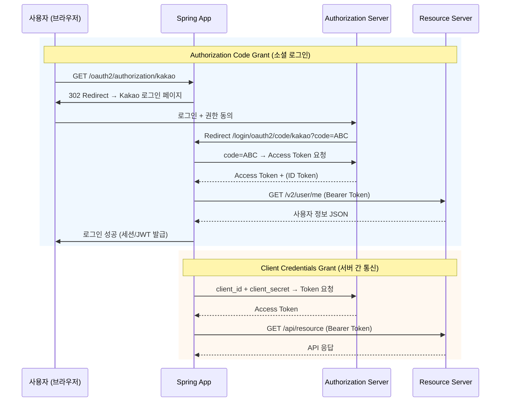
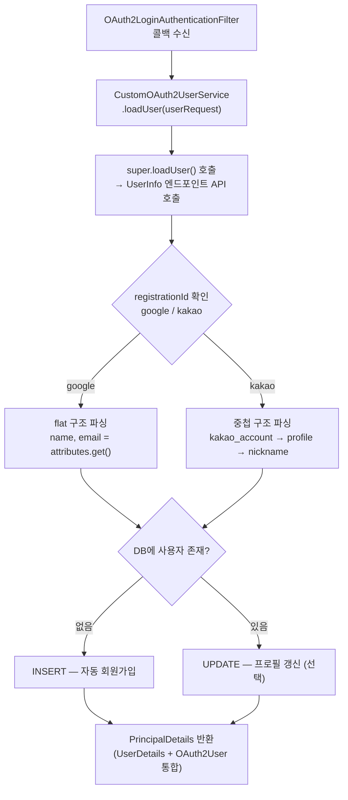
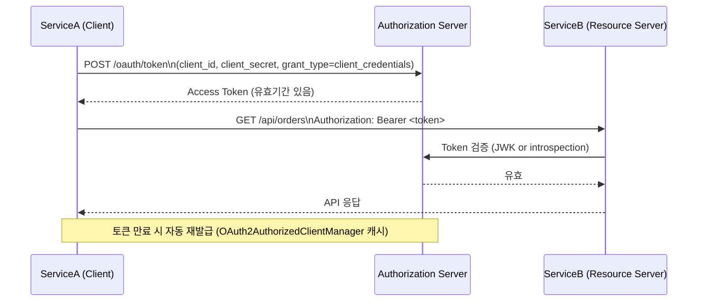
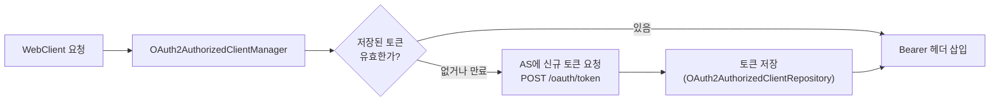
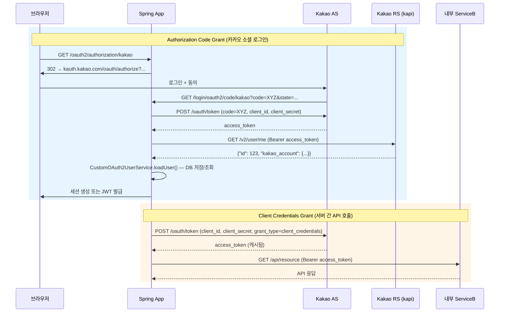

# WEEK 7: OAuth 2.0 소셜 로그인 & 서버 간 인증 (Google · Kakao · Client Credentials)

> **호환 버전**: Spring Boot 3.2.x, Spring Security 6.2.x ~ 7.0.x, spring-boot-starter-oauth2-client
>
> **전제 지식**: WEEK 5 (OAuth2 기본 개념, Authorization Code Grant, OIDC), WEEK 6 (Kakao/Google 커스텀 Provider 설정)

### 학습 목표

- OAuth 2.0의 두 가지 핵심 Grant Type(Authorization Code, Client Credentials)을 구분하고 언제 사용할지 판단할 수 있다.
- Spring Security `oauth2Login()`으로 Google/Kakao SSO를 최소 설정으로 구성할 수 있다.
- `OAuth2AuthorizedClientManager` + `WebClient`를 이용한 Client Credentials 서버 간 인증을 구현할 수 있다.
- `CustomOAuth2UserService`로 여러 Provider의 사용자 정보를 통합 처리할 수 있다.

---

WEEK 5에서 OAuth 2.0의 개념과 Grant Type을 배웠다. 이번 주차는 **실전**이다. 가장 많이 쓰이는 두 가지 Grant Type을 Spring Security로 직접 연결한다.

첫 번째는 **Authorization Code Grant**: 사용자가 Google이나 Kakao 버튼을 누르고 소셜 로그인을 완료하는 일반적인 SSO 시나리오다. 두 번째는 **Client Credentials Grant**: 사용자가 개입하지 않고 서버끼리 client-id, client-secret만으로 토큰을 발급받아 API를 호출하는 MSA 서비스 간 인증 시나리오다.

---

### 1. OAuth 2.0 Grant Type 비교

#### 1.1 언제 무엇을 써야 하는가

**판단 기준**: 이 흐름에 **실제 사용자(Resource Owner)** 가 개입하는가?

| 구분 | Authorization Code Grant | Client Credentials Grant |
|---|---|---|
| 사용자 개입 | **있음** — 사용자가 직접 로그인 동의 | **없음** — 서버끼리 통신 |
| 토큰 주체 | 사용자를 대리하는 Client | Client 자체 |
| 대표 사례 | 소셜 로그인 (Google, Kakao) | MSA 내부 API 호출, 배치 서버 |
| Spring 진입점 | `oauth2Login()` | `oauth2Client()` + `WebClient` |
| `application.yml` grant-type | `authorization_code` | `client_credentials` |

#### 1.2 두 흐름 비교 다이어그램



> **초보자 Tip**: Authorization Code에서 사용자가 보는 "카카오로 로그인" 버튼은 `/oauth2/authorization/kakao` URL로 연결됩니다. 이 URL을 Spring Security가 자동으로 처리합니다.

---

### 2. Spring Security OAuth2 Client 최소 설정 원리

#### 2.1 의존성

```gradle
dependencies {
    implementation 'org.springframework.boot:spring-boot-starter-oauth2-client'
    implementation 'org.springframework.boot:spring-boot-starter-web'
    implementation 'org.springframework.boot:spring-boot-starter-security'
    // Client Credentials + WebClient 사용 시 추가
    implementation 'org.springframework.boot:spring-boot-starter-webflux'
}
```

#### 2.2 `application.yml` 구조

OAuth2 Client 설정은 두 블록으로 나뉜다.

```
spring.security.oauth2.client
  ├── registration    ← "나(Client)의 등록 정보"
  │     ├── client-id
  │     ├── client-secret
  │     ├── authorization-grant-type   ← Grant Type 분기 키
  │     └── scope
  └── provider        ← "상대방(Authorization Server)의 엔드포인트"
        ├── authorization-uri
        ├── token-uri
        └── user-info-uri
```

Google / GitHub / Facebook은 **`CommonOAuth2Provider`** enum에 provider 정보가 내장되어 있어 `provider` 블록을 작성하지 않아도 된다. Kakao, Naver 등 국내 서비스는 `provider` 블록을 직접 작성해야 한다.

#### 2.3 자동 생성되는 Bean

`spring-boot-starter-oauth2-client` 의존성만 추가하면 Spring Boot Auto-configuration이 다음 Bean을 자동 등록한다.

| Bean | 역할 |
|---|---|
| `ClientRegistrationRepository` | `application.yml`의 registration 정보 보관소 |
| `OAuth2AuthorizedClientRepository` | 인가된 Client(Access Token 포함) 저장소 |
| `OAuth2AuthorizedClientManager` | 토큰 발급/갱신 전체 조율 |
| `OAuth2LoginConfigurer` | `oauth2Login()` DSL 활성화 시 필터 등록 |

`oauth2Login()`을 활성화하면 추가로 두 필터가 `SecurityFilterChain`에 등록된다.

```
OAuth2AuthorizationRequestRedirectFilter
  → /oauth2/authorization/{registrationId} 요청을 가로채
    Authorization Server로 리다이렉트

OAuth2LoginAuthenticationFilter
  → /login/oauth2/code/{registrationId} 콜백을 처리
    code를 Access Token으로 교환하고 인증 완료
```

---

### 3. [Authorization Code] Google SSO

#### 3.1 GCP Console 앱 등록 절차

1. [Google Cloud Console](https://console.cloud.google.com/) 접속
2. 새 프로젝트 생성 (또는 기존 프로젝트 선택)
3. **APIs & Services → OAuth consent screen** 설정
   - User Type: External (외부 사용자 허용)
   - App 이름, 지원 이메일 입력
4. **APIs & Services → Credentials → Create Credentials → OAuth 2.0 Client ID**
   - Application type: **Web application**
   - Authorized redirect URIs: `http://localhost:8080/login/oauth2/code/google`
5. 생성 후 `client-id`, `client-secret` 복사

#### 3.2 `application.yml` 최소 설정

```yaml
spring:
  security:
    oauth2:
      client:
        registration:
          google:
            client-id: ${GOOGLE_CLIENT_ID}
            client-secret: ${GOOGLE_CLIENT_SECRET}
            scope:
              - openid
              - profile
              - email
            # authorization-grant-type: authorization_code  ← CommonOAuth2Provider 기본값이라 생략 가능
            # redirect-uri: "{baseUrl}/login/oauth2/code/{registrationId}"  ← 기본값이라 생략 가능
```

`provider.google` 블록은 `CommonOAuth2Provider.GOOGLE`에 다음 값이 이미 설정되어 있어 생략한다.

| 항목 | 값 |
|---|---|
| authorization-uri | `https://accounts.google.com/o/oauth2/v2/auth` |
| token-uri | `https://www.googleapis.com/oauth2/v4/token` |
| user-info-uri | `https://www.googleapis.com/oauth2/v3/userinfo` |
| user-name-attribute | `sub` |

#### 3.3 Google UserInfo 응답 구조

```json
{
  "sub": "1234567890",
  "name": "홍길동",
  "given_name": "길동",
  "family_name": "홍",
  "picture": "https://lh3.googleusercontent.com/...",
  "email": "user@gmail.com",
  "email_verified": true
}
```

Google은 **flat 구조**이며 `sub`이 고유 식별자(user-name-attribute)다.

> **주의**: `scope`에 `openid`를 포함하면 OIDC 흐름으로 동작하며 `id_token`도 함께 발급됩니다. Spring Security는 `id_token`의 서명을 자동 검증합니다.

---

### 4. [Authorization Code] Kakao SSO

#### 4.1 Kakao Developers 앱 등록 절차

1. [Kakao Developers](https://developers.kakao.com/) 접속 → 내 애플리케이션 → 애플리케이션 추가
2. **앱 이름** 입력 후 저장
3. **앱 설정 → 앱 키** 에서 **REST API 키** 확인 (= `client-id`)
4. **제품 설정 → 카카오 로그인** 활성화
   - Redirect URI 등록: `http://localhost:8080/login/oauth2/code/kakao`
5. **제품 설정 → 카카오 로그인 → 보안** 에서 Client Secret 생성 (= `client-secret`)
6. **제품 설정 → 카카오 로그인 → 동의항목** 에서 `profile_nickname`, `account_email` 활성화

#### 4.2 `application.yml` 설정

Kakao는 `CommonOAuth2Provider`에 내장 설정이 없으므로 `provider` 블록을 직접 작성한다.

```yaml
spring:
  security:
    oauth2:
      client:
        registration:
          kakao:
            client-id: ${KAKAO_CLIENT_ID}          # REST API 키
            client-secret: ${KAKAO_CLIENT_SECRET}
            authorization-grant-type: authorization_code
            client-authentication-method: client_secret_post  # Kakao는 POST body 방식 사용
            redirect-uri: "{baseUrl}/login/oauth2/code/{registrationId}"
            scope:
              - profile_nickname
              - account_email
        provider:
          kakao:
            authorization-uri: https://kauth.kakao.com/oauth/authorize
            token-uri: https://kauth.kakao.com/oauth/token
            user-info-uri: https://kapi.kakao.com/v2/user/me
            user-name-attribute: id
```

> **주의**: Kakao는 Access Token 요청 시 `client_secret_basic`(HTTP Basic Auth 헤더)이 아닌 `client_secret_post`(요청 바디에 포함)를 사용합니다. `client-authentication-method: client_secret_post`를 반드시 명시하세요. Google은 `client_secret_basic`이 기본값입니다.

#### 4.3 Kakao UserInfo 응답 구조의 특이점

Kakao의 UserInfo 응답은 Google과 달리 **중첩 구조**다.

```json
{
  "id": 1234567890,
  "kakao_account": {
    "email": "user@kakao.com",
    "email_verified": true,
    "profile": {
      "nickname": "홍길동",
      "thumbnail_image_url": "https://...",
      "profile_image_url": "https://...",
      "is_default_image": false
    }
  }
}
```

`email`에 접근하려면 `attributes.get("kakao_account")` → `Map.get("email")`, `nickname`에 접근하려면 한 단계 더 깊이 `profile` Map을 꺼내야 한다. 이 파싱 로직을 5번 섹션의 `CustomOAuth2UserService`에서 처리한다.

---

### 5. [Authorization Code] CustomOAuth2UserService — Provider 통합 처리

#### 5.1 왜 커스텀 서비스가 필요한가

Spring Security의 기본 `DefaultOAuth2UserService`는 UserInfo 엔드포인트에서 사용자 정보를 가져오기만 하고, DB 저장이나 Provider별 응답 파싱은 하지 않는다. 다음 두 가지를 직접 구현해야 한다.

1. Provider(Google vs Kakao)별로 다른 응답 구조 파싱
2. 최초 로그인 시 자동 회원가입 (DB INSERT)

#### 5.2 처리 흐름



#### 5.3 `PrincipalDetails` 통합 구조

`oauth2Login()`으로 인증된 사용자는 `OAuth2User` 타입이고, 일반 폼 로그인 사용자는 `UserDetails` 타입이다. 두 인터페이스를 모두 구현하면 `@AuthenticationPrincipal`로 어디서든 동일하게 사용자 정보에 접근할 수 있다.

```java
public class PrincipalDetails implements UserDetails, OAuth2User {
    private User user;                         // DB Entity
    private Map<String, Object> attributes;    // OAuth2 Provider 응답 (소셜 로그인 시)

    // UserDetails 구현
    @Override
    public String getUsername() { return user.getEmail(); }

    @Override
    public Collection<? extends GrantedAuthority> getAuthorities() {
        return List.of(new SimpleGrantedAuthority(user.getRole()));
    }

    // OAuth2User 구현
    @Override
    public Map<String, Object> getAttributes() { return attributes; }

    @Override
    public String getName() { return String.valueOf(user.getId()); }
}
```

> **전문가 Tip**: `PrincipalDetails`에 두 인터페이스를 모두 구현하면, JWT 발급 시 `Authentication`이 `OAuth2AuthenticationToken`이든 `UsernamePasswordAuthenticationToken`이든 동일한 방식으로 `PrincipalDetails`를 캐스팅할 수 있습니다.

---

### 6. [Authorization Code] SecurityFilterChain 연결

```java
@Bean
public SecurityFilterChain filterChain(HttpSecurity http,
                                        CustomOAuth2UserService customOAuth2UserService) throws Exception {
    http
        .authorizeHttpRequests(auth -> auth
            .requestMatchers("/", "/login", "/oauth2/**").permitAll()
            .anyRequest().authenticated()
        )
        .oauth2Login(oauth2 -> oauth2
            .loginPage("/login")                             // 커스텀 로그인 페이지
            .defaultSuccessUrl("/dashboard", true)          // 로그인 성공 후 이동
            .failureUrl("/login?error=true")                // 로그인 실패 시
            .userInfoEndpoint(userInfo -> userInfo
                .userService(customOAuth2UserService)       // 커스텀 UserService 등록
            )
        );
    return http.build();
}
```

#### 6.1 세션 기반 vs Stateless 선택 기준

| | 세션 기반 | Stateless (JWT) |
|---|---|---|
| 기본 설정 | `oauth2Login()` 기본값 | `sessionCreationPolicy(STATELESS)` 추가 |
| 토큰 저장 | 서버 세션에 `OAuth2AuthorizedClient` 저장 | 로그인 성공 후 JWT 발급 필요 |
| 적합한 경우 | 단일 서버, SSR(서버 사이드 렌더링) | REST API 서버, MSA, SPA |
| 구현 복잡도 | 낮음 | 성공 핸들러에서 JWT 발급 로직 추가 필요 |

Stateless 방식에서는 `successHandler`에서 JWT를 생성해 응답 헤더나 쿠키에 담아야 한다.

> **초보자 Tip**: 처음 구현할 때는 세션 기반으로 시작하세요. 소셜 로그인 흐름이 정상 동작하는 걸 확인한 후 JWT로 전환하는 게 훨씬 디버깅하기 쉽습니다.

---

### 7. [Client Credentials] 서버 간 인증 구현

#### 7.1 사용 시나리오

Client Credentials Grant는 **사용자가 없는 서버 간 통신**에 사용한다.

- MSA에서 Order Service → Payment Service API 호출
- 야간 배치 서버가 외부 API 호출
- 내부 Admin 도구가 Backend API 호출
- 사내 Authorization Server(Keycloak 등)로 마이크로서비스 인증



#### 7.2 `application.yml` 설정

```yaml
spring:
  security:
    oauth2:
      client:
        registration:
          my-service:
            client-id: ${SERVICE_CLIENT_ID}
            client-secret: ${SERVICE_CLIENT_SECRET}
            authorization-grant-type: client_credentials
            scope: read, write
        provider:
          my-service:
            token-uri: https://auth.example.com/oauth/token
            # Keycloak 사용 시:
            # token-uri: http://localhost:9090/realms/myrealm/protocol/openid-connect/token
```

Authorization Code와 가장 큰 차이점:
- `authorization-uri`, `user-info-uri`가 없다 (사용자 리다이렉트, UserInfo 조회가 없기 때문)
- `token-uri`만 있으면 된다

#### 7.3 `OAuth2AuthorizedClientManager` + `WebClient` 연동

Spring Security가 토큰 발급과 캐시/갱신을 자동으로 처리하도록 `WebClient`에 OAuth2 필터를 연결한다.

```java
@Configuration
public class WebClientConfig {

    @Bean
    public WebClient webClient(OAuth2AuthorizedClientManager authorizedClientManager) {
        // OAuth2 토큰을 자동으로 Authorization 헤더에 삽입하는 필터
        ServletOAuth2AuthorizedClientExchangeFilterFunction oauth2 =
            new ServletOAuth2AuthorizedClientExchangeFilterFunction(authorizedClientManager);

        oauth2.setDefaultClientRegistrationId("my-service"); // 기본 client registration 지정

        return WebClient.builder()
            .filter(oauth2)
            .baseUrl("https://api.example.com")
            .build();
    }
}
```

```java
@Service
public class ExternalApiService {

    private final WebClient webClient;

    public ExternalApiService(WebClient webClient) {
        this.webClient = webClient;
    }

    public Mono<String> fetchData() {
        return webClient.get()
            .uri("/api/resource")
            // 토큰 발급, 헤더 삽입, 만료 시 자동 재발급은 WebClient 필터가 처리
            .retrieve()
            .bodyToMono(String.class);
    }
}
```

#### 7.4 토큰 자동 갱신(캐시) 동작 원리

`OAuth2AuthorizedClientManager`는 내부적으로 `OAuth2AuthorizedClientProvider`에 위임한다. Client Credentials의 경우 `ClientCredentialsOAuth2AuthorizedClientProvider`가 다음 로직을 수행한다.



> **전문가 Tip**: 기본 `OAuth2AuthorizedClientRepository`는 `HttpSession` 기반입니다. 서버 간 통신에는 사용자 세션이 없으므로, `InMemoryOAuth2AuthorizedClientService`를 사용하거나 직접 `AuthorizedClientServiceOAuth2AuthorizedClientManager`를 Bean으로 등록해야 합니다.

```java
@Bean
public OAuth2AuthorizedClientManager authorizedClientManager(
    ClientRegistrationRepository clientRegistrationRepository,
    OAuth2AuthorizedClientService authorizedClientService) {

    OAuth2AuthorizedClientProvider provider =
        OAuth2AuthorizedClientProviderBuilder.builder()
            .clientCredentials()
            .build();

    AuthorizedClientServiceOAuth2AuthorizedClientManager manager =
        new AuthorizedClientServiceOAuth2AuthorizedClientManager(
            clientRegistrationRepository, authorizedClientService);
    manager.setAuthorizedClientProvider(provider);
    return manager;
}
```

---

### 8. Grant Type별 전체 흐름 비교 다이어그램



---

### 9. Authorization Code vs Client Credentials 설정 비교

| 항목 | Authorization Code | Client Credentials |
|---|---|---|
| `authorization-grant-type` | `authorization_code` | `client_credentials` |
| `redirect-uri` 필요 | **필요** | **불필요** |
| `authorization-uri` 필요 | **필요** | **불필요** |
| `user-info-uri` 필요 | **필요** | **불필요** |
| `token-uri` 필요 | **필요** | **필요** |
| Spring 설정 메서드 | `http.oauth2Login()` | `http.oauth2Client()` + `WebClient` |
| 자동 Bean | `OAuth2LoginConfigurer` → 필터 2개 | `OAuth2AuthorizedClientManager` |
| 토큰 저장소 | `HttpSessionOAuth2AuthorizedClientRepository` | `InMemoryOAuth2AuthorizedClientService` 권장 |
| 사용자 정보 | `OAuth2User` (`loadUser()` 콜백) | 없음 |
| 적용 대상 | 웹 애플리케이션, 사용자 SSO | MSA, 배치, 서버 간 통신 |

---

## FAQ

**Q: `oauth2Login()` 설정만 하면 `/oauth2/authorization/kakao` URL이 자동으로 생기나요?**

A: 네. `oauth2Login()`을 활성화하면 `OAuth2AuthorizationRequestRedirectFilter`가 자동 등록되며 `/oauth2/authorization/{registrationId}` 패턴의 모든 요청을 처리합니다. HTML에서 `<a href="/oauth2/authorization/kakao">카카오로 로그인</a>`만 링크하면 됩니다.

**Q: `application.yml`에 client-secret을 직접 쓰면 안전한가요?**

A: 개발 환경에서는 `${KAKAO_CLIENT_SECRET}` 형태로 환경 변수를 참조하세요. 운영 환경에서는 AWS Secrets Manager, Vault, Kubernetes Secret 등 비밀 관리 서비스를 사용해야 합니다. `.yml` 파일에 직접 하드코딩하면 Git에 올라갈 위험이 있습니다.

**Q: Google SSO에서 `openid` scope를 포함했는데 OIDC와 OAuth2 무엇으로 동작하나요?**

A: `openid` scope가 포함되면 **OIDC(OpenID Connect)** 흐름으로 동작합니다. Spring Security는 `id_token`(JWT)을 수신하고 서명을 검증합니다. 이 경우 `OidcUserService`가 `DefaultOAuth2UserService` 대신 호출됩니다. `customOAuth2UserService`를 등록했다면 `.userService()` 대신 `.oidcUserService()`에도 커스텀 서비스를 등록해야 Google OIDC 흐름도 처리됩니다.

**Q: Client Credentials에서 토큰이 만료되면 어떻게 되나요?**

A: `OAuth2AuthorizedClientManager`가 자동으로 처리합니다. 토큰 만료 감지 시 즉시 `POST /oauth/token`으로 새 토큰을 요청하고 캐시합니다. 개발자는 이 과정을 신경 쓸 필요가 없습니다. 단, `InMemoryOAuth2AuthorizedClientService`를 사용하면 서버 재시작 시 캐시가 초기화됩니다. 운영 환경에서는 Redis 등 외부 저장소를 사용하는 커스텀 `OAuth2AuthorizedClientService` 구현을 고려하세요.

**Q: Kakao 외에 Naver도 같은 방식으로 연결할 수 있나요?**

A: 네. Naver도 `provider` 블록을 직접 작성하는 방식으로 연결합니다. 차이점은 UserInfo 응답 구조가 다르다는 점입니다. Naver는 응답을 `response` 객체로 한 번 더 감싸므로 `attributes.get("response")` 후에 `name`, `email`을 꺼내야 합니다. `user-name-attribute: response`로 설정하면 `response` Map이 최상위 속성으로 처리됩니다.

---

## 7주간의 학습을 마치며

7주에 걸쳐 Spring Security의 기초부터 OAuth 2.0 실전까지 다뤘다.

| 주차 | 핵심 내용 |
|---|---|
| WEEK 0 | Spring Security를 이해하기 위한 디자인 패턴 (Proxy, Strategy, Template Method) |
| WEEK 1 | SecurityFilterChain 아키텍처, 인증 흐름, UserDetailsService |
| WEEK 2 | DB 연동 인증, 커스텀 AuthenticationProvider |
| WEEK 3 | CORS, CSRF, 역할과 권한, URL 기반 인가 |
| WEEK 4 | JWT 필터, OncePerRequestFilter, 메서드 보안 (@PreAuthorize) |
| WEEK 5 | OAuth 2.0 개념, Grant Type, OIDC, Keycloak Resource Server |
| WEEK 6 | 카카오/네이버/구글 커스텀 Provider, CustomOAuth2UserService, 실전 연동 |
| WEEK 7 | Authorization Code SSO (Google, Kakao) + Client Credentials 서버 간 인증 |

보안은 완성이 없다. WEEK 0에서 배운 Proxy 패턴이 실제로 `DelegatingFilterProxy`로 구현되어 있고, Strategy 패턴이 `PasswordEncoder`와 `AuthenticationProvider` 교체로 이어지는 것을 직접 확인했을 것이다. 패턴을 알면 모르는 코드도 읽힌다. 이것이 디자인 패턴을 먼저 배운 이유다.

---

## 참고 자료

- [Spring Security 공식 문서 — OAuth2 Login](https://docs.spring.io/spring-security/reference/servlet/oauth2/login/index.html)
- [Spring Security 공식 문서 — OAuth2 Client (Client Credentials)](https://docs.spring.io/spring-security/reference/servlet/oauth2/client/index.html)
- [Spring Security — CommonOAuth2Provider 소스](https://github.com/spring-projects/spring-security/blob/main/config/src/main/java/org/springframework/security/config/oauth2/client/CommonOAuth2Provider.java)
- [RFC 6749 — The OAuth 2.0 Authorization Framework](https://datatracker.ietf.org/doc/html/rfc6749)
- [OpenID Connect Core 1.0](https://openid.net/specs/openid-connect-core-1_0.html)
- [Google Identity — OAuth 2.0 for Web Server Applications](https://developers.google.com/identity/protocols/oauth2/web-server)
- [Kakao Developers — 카카오 로그인 REST API](https://developers.kakao.com/docs/latest/ko/kakaologin/rest-api)
- [Spring Blog — RestClient Support for OAuth2 in Spring Security 6.4](https://spring.io/blog/2024/10/28/restclient-support-for-oauth2-in-spring-security-6-4)
